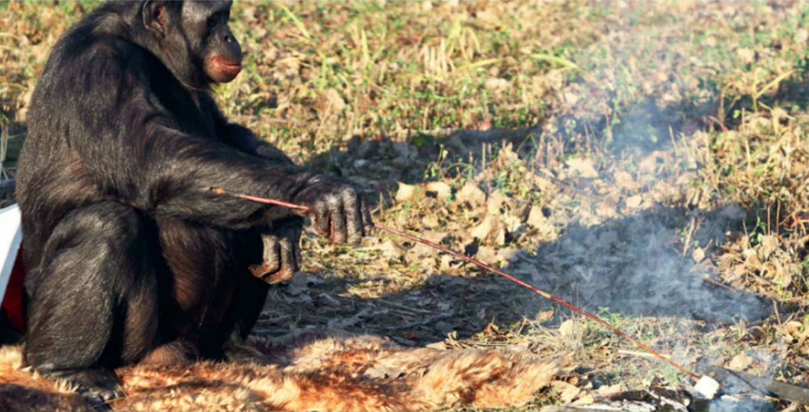

# Animals and Human Language

## 1 概述

虽然动物像人一样说话的场景或许只出现在幻想和影视中，但我们仍然相信它们一定能通过某种方式交流。那么动物是否能够学习用语言和人类交流呢？又或者说人类语言有着某些特性以至于动物无法学会？本章将着重介绍人类语言的特性。

以下是本章中出现的部分语言学术语。

| 英文                  | 中文     | 英文          | 中文       |
| --------------------- | -------- | ------------- | ---------- |
| communicative         | 交流的   | informative   | 提供信息的 |
| glossolalia           | 语义不清 | reflexivity   | 自反性     |
| displacement          | 移位性   | arbitrariness | 任意性     |
| cultural transmission | 文化传承 | productivity  | 生产性     |
| duality               | 二元性   | congenitally  | 先天的     |

## 2 交流

首先，我们需要区分有意识的**交流信号 (communicative signals)** 和无意识的**信息传递信号 (informative signals)** 。前者是使用某种语言与其他个体交流。例如你直接对朋友说"我最喜欢的动漫角色是御坂美琴"。相反，后者则重在"提供信息"。例如你感冒了。即便你不直接告诉朋友，朋友也能够通过你无意识传达的信号 (如流鼻涕) 得知此事。

人类是能够在不带交流目的 (communication purpose) 的情况下发出**音素和音节 (sounds and syllables)** 并形成某种**语流 (speech stream)** 。这种语流听起来像语言，但由于由于没有话语控制 (speaker control) ，它并不是有意识的交流。通俗的理解就是"它不是讲给人听的"。

动物也有类似的情况。例如鸟在唱歌时就在产生上面提到的无意识"语流"。但是，如果鸟因为发现附近有只猫而发出警惕的尖叫，那么我们认为它在产生某种有意识的交流信号。

因此，在讨论人类语言和动物交流 (animal communication) 时，我们考虑的是二者**进行有意识交流的潜力**。

## 3 人类语言的特性

尽管我们倾向于认为交流是人类语言的首要功能 (primary function) ，但它并不是人类语言的唯一特征。

### 3.1 自反性

所有生物都会通过某种方式交流，即便不是通过发声 (vocalization) 。但是，它们似乎并不会思考建立交流的方式和审视这种方式会不会奏效。例如，一只狗在叫的时候并不会向另一只狗提意见说"你应该叫得更凶狠一点"。也就是它们并不会barking about barking。

相反，人类则可以很清晰地思考语言本身和其用法。这便是人类语言的**自反性 (reflexivity, reflexiveness)** 。实际上，正是有了自反性，我们才得以进一步探讨人类语言的其它特性。

### 3.2 移位性

动物地交流似乎只能表达此时此地 (here and now) 。例如此时你家的猫走到身旁以某种方式"喵"了一下，你或许就能明白它现在想吃东西。但是如果你"问"它之前去干嘛了，它依旧只能以同样的方式"喵"。又或者说两只猫无法通过"喵"来谈论昨天晚上在公园发出的"喵"。

相反，人类可以谈论过去和将来，即人类语言的**移位性 (displacement)** 。我们可以讨论现在没有发生的事情，甚至是诸如天使这种未知的事物。

### 3.3 任意性

**任意性 (arbitrariness)** 指的是人类语言的语言形式 (linguistic form) 与其含义并没有天然的联系。例如我们并不能从"dog"这个单词的形状来判断其意思是"狗"。当然，我们完全可以调整单词的形状来适应 (fit) 其含义，但正是因为我们想方设法建立语言形式与含义的某种联系，更加说明了大多数情况下二者的关系是任意的。

> **【思考】**
> 如何解释以汉字为代表的象形文字？

### 3.4 传承性

**文化传承 (cultural transmission)** 指的是人类语言需要代代相传 (passed on from one generation to the next) 。人类先天就具备通用的 (general) 习得语言的能力，并在特定的文化环境中习得特定的语言。

而动物则先天能够本能地发出某些特定的信号 (a set of specific signals) 。有实验发现即便将刚出生的雏鸟放在没有其它鸟的环境下成长，它依然能够发出某种"歌声"，只是会听起来比较奇怪。相反，人类婴儿并不具备这种"本能的语言" (instinctive language) 。

### 3.5 生产性

人类能够使用现有与语言资源 (linguistic resources) 来创造表达方式以描述新的事物或情形。这便是人类语言的**生产性 (productivity)** 。这意味着人类语言的潜在话语 (utterances) 数量是无限的。

但动物交流并非如此。例如在一个实验中，实验者将食物放在塔顶并将10只蜜蜂带到塔顶品尝，接着再将这些蜜蜂带回地面的蜂巢。可是之后蜜蜂们并不能找到食物，因为在它们的交流系统中，只有描述水平方向的信号，而它们又无法创造一种新的信号来描述垂直方向。这种现象称为**固定引用 (fixed reference)** 。

### 3.6 二元性

**二元性 (duality)** 指的是人类语言同时包含两个层次。其一是我们能够发出$b$、$i$和$n$这种不具备任何含义的音素 (sounds) ；其二是我们能通过组合这些音素来创造不同含义的单词，例如$bin$和$nib$。这使得我们能够使用有限的音素组合出大量不同含义的单词。

相反，动物的交流信号并不能如此分解。例如狗发出的$woof$并不能重新组合成$foow$来表示其它含义。

## 4 总结

本章主要介绍了人类语言有别于动物交流的一些特性。尤其是自反性，它意味着我们能够不局限于使用语言，而能够用语言来进一步研究语言本身，从而引出其它特性以至于整个语言学。

## 参考

[Yule, G. (2020). *The Study of Language* (7th ed.). Cambridge: Cambridge University Press. doi:10.1017/9781108582889](https://www.cambridge.org/highereducation/books/study-of-language/433B949839A5A6F915EC185657564B16#overview)

