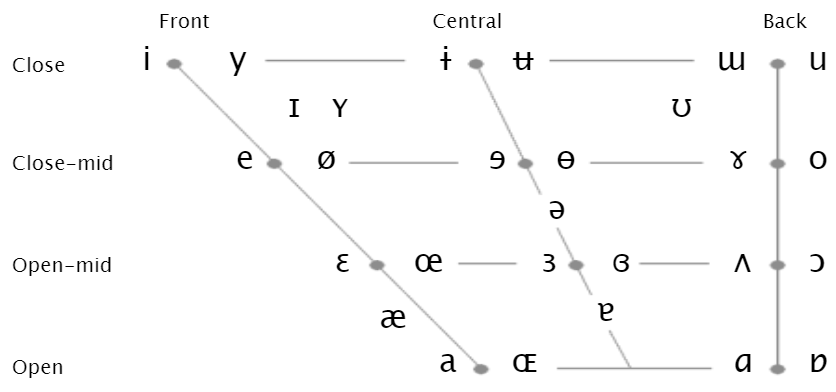

# The Sounds of Language

## 1 概述

第1章提到过人类有着独特的声道结构以及复杂的嘴部肌肉。这些特性使得我们能够快速发出很多声音。但在实际的交流中，只有其中的一小部分会被经常用到。为了区分和描述这些声音，我们需要关注语流中独立的**音段 (sound segment)** 。

以下是本章中出现的部分语言学术语。

| 英文                   | 中文       | 英文                     | 中文       |
| ---------------------- | ---------- | ------------------------ | ---------- |
| articulatory phonetics | 发音语音学 | acoustic phonetics       | 声学语音学 |
| auditory phonetics     | 听觉语音学 | consonant                | 辅音       |
| vowel                  | 元音       | vocal cords, vocal folds | 声带       |
| voiced sound           | 浊音       | voiceless sound          | 清音       |
| bilabial               | 双唇音     | labiodental              | 唇齿音     |
| dental                 | 齿龈       | interdental              | 舌齿音     |
| glotal                 | 声门的     |                          |            |

## 2 语音学

经过百余年的发展和修正，语言学已经有一套用于分析语音片段 (speech segments) 框架，即**国际音标 (International Phonetics Alphabet，IPA)** 。广义上，对语音声音 (speech sounds) 的的研究就称为**语音学 (phonetics)** ，这也对应了本章标题"The Sounds of Language"。语音学又可以继续细分为如下几个分支：

- **发音语言学 (articulatory phonetics)** ：研究语音声音是如何产生的；
- **声学语言学 (acoustic phonetics)** ：研究语音声波的物理性质；
- **听觉语言学 (auditory phonetics)** ：研究人对语音声音的感知。

本章中我们将着重介绍发音语言学。

## 3 辅音

### 3.1 清音和浊音

在发福音 (consonant) 时，气流从肺 (lungs) 发出，经过气管 (windpipe) 来到喉 (larynx) 。位于喉中的声带 (vocal cords) 在遇到气流时会有两种状态：

- 声带舒张，气流能畅通无阻地通过。声带不振动，产生**清音 (voiceless sounds)** ；
- 声道收缩，在气流地反复冲击下周期性地打开和关闭。声带振动，产生**浊音 (voiced sounds)** 。

声道开关的频率也就是语音信号的基频 (fundamental frequency) 。有的人将音高 (pitch) 和基频等同，也有人认为音高是基频的倒数。从清浊音发音的方式可以知道：浊音具有基频，而清音没有。

进一步，具有一定频率的气流经过唇齿舌的一些列处理后会得到不同的浊音。而没有一定频率的气流经过唇齿舌的一些列处理后也会得到不同的清音。此外，浊音的不同声调 (tone) 的产生机理是基频随时间变化不同。如下图，降调时基频随时间越来越低，而升调时基频随时间越来越高。

### 3.2 发音部位

气流从喉出来后便进入了声道 (vocal tract) ，然后经过咽 (pharynx) 进入口道 (oral tract) 或鼻道 (nasal tract) 。多数的辅音是通过收缩 (constrict) 舌头以及口腔中的某些部位来改变口道的形状。下图展示了人类声道的构造。

上图中出现的术语翻译如下表。

| 英文         | 中文 | 英文           | 中文   |
| ------------ | ---- | -------------- | ------ |
| larynx       | 喉   | vocal folds    | 声带   |
| pharynx      | 咽   | uvula          | 小舌   |
| velum        | 软腭 | palate         | 腭     |
| tongue       | 舌   | alveolar ridge | 牙槽嵴 |
| nasal cavity | 鼻腔 |                |        |

依据发音位置的不同，我们可以将辅音归类。

| 辅音类型               | 清音               | 浊音                                    | 发音部位        |
| ---------------------- | ------------------ | --------------------------------------- | --------------- |
| 双唇音 (bilabials)     | [p]                | [b], [m], [w]                           | 双唇            |
|                        | **p**et, ta**pe**  | bet, **m**et, wet                       |                 |
| 唇齿音 (labiodentals)  | [f]                | [v]                                     | 上齿和下唇      |
|                        | **f**at, sa**fe**  | vat, sa**ve**                           |                 |
| 齿音 (dentals)         | [θ]                | [ð]                                     | 舌尖在上齿后    |
|                        | **th**in, bath     | **th**en, ba**the**                     |                 |
| 齿槽音 (alveolars)     | [t], [s]           | [d], [z], [n], [l], [r]                 | 舌尖抵住齿槽    |
|                        | **t**op, sit       | **d**og, zoo, **n**ut, **l**ap, **r**ap |                 |
| 上腭音 (palatals)      | [ʃ], [tʃ]          | [ʒ], [dʒ], [j]                          | 舌头和上颚      |
|                        | **sh**ip, **ch**ip | ca**s**ual, **g**em, **y**et            |                 |
| 软腭音 (velars)        | [k]                | [ɡ], [ŋ]                                | 舌后根和软腭    |
|                        | **c**at, back      | **g**un, ba**ng**                       |                 |
| 声门音 (glottals)      | [h]                |                                         | 声门 (glottis)  |
|                        | **h**at, who       |                                         |                 |

> **NOTE**
>
> 类似使用[ʧ]表示[tʃ]的单个符号已经被IPA移除。

### 3.3 发音方式

在讨论发音部位时，我们发现[t]和[s]都属于清音和齿槽音。但显然，它们是不同的音。区别就在于它们的发音方式 (manner of articulation) 不同。

| 辅音类型             | 清音                              | 浊音                             | 发音方式                         |
| -------------------- | --------------------------------- | -------------------------------- | -------------------------------- |
| 爆破音 (stops)       | [p], [t], [k]                     | [b], [d], [g]                    | 先完全阻塞气流，然后突然释放     |
|                      | **p**et, **t**alk                 | **b**ed, **d**og                 |                                  |
| 摩擦音 (fricatives)  | [f], [θ], [s], [ʃ], [h]           | [v], [ð], [z], [ʒ]               | 几乎阻塞气流，然后通过小缝释放   |
|                      | **f**ai**th**, hou**se**, **sh**e | **v**a**se**, **th**e, rou**ge** |                                  |
| 破擦音 (affricates)  |                                   |                                  | 将一个爆破音和摩擦音结合         |
|                      | **ch**eap, ri**ch**               | **j**eep, ra**ge**               |                                  |
| 鼻音 (nasals)        |                                   | [m], [n], [ŋ]                    | 压低软腭，然后让气流从鼻腔中通过 |
|                      |                                   | **m**orni**ng**, **n**a**me**    |                                  |
| 流音 (liquids)       |                                   | [l], [r]                         | 抬高并卷起舌头，让气流从两侧通过 |
|                      |                                   | **l**oad, **r**oad               |                                  |
| 滑音 (glides)        |                                   | [w], [j]                         | 移动舌头，做出将要发出元音的动作 |
|                      |                                   | **w**ant, **y**es                |                                  |

注意，其中滑音也称为半元音 (semi-vowels) 。

除此之外，英语中还还有声门爆破音 (glottal stops) 和闪音 (flaps) 。

| 辅音类型                    | 符号                   | 发音方式               |
| --------------------------- | ---------------------- | ---------------------- |
| 声门爆破音 (glottal stops)  | [ʔ]                    | 声门快速关闭，然后打开 |
|                             | bo**tt**le, wa**t**er  |                        |
| 闪音 (flaps)                | [ɾ]                    | 舌尖快速拍击牙槽嵴     |
|                             | la**tt**er, la**dd**er |                        |

## 4 元音

大多数辅音的发音依靠的是气流在声道中的阻塞，而元音发音时气流通常是通畅的。同时，所有的元音都时浊音。

不同元音的产生是由于舌头位于口腔中的不同位置。我们可以将舌头的位置分成前后上下几个区域。例如在读单词$heat$时，嘴巴闭合，舌头抬起并位于口腔的前部；相反，在读单词$hot$时，嘴巴张开，舌头压低并位于口腔的后部。下表展示了各个元音发音时的嘴型和舌位。

此外，在许多语言中还存在双元音 (diphthongs) ，即两个元音的组合。在发音时，实际上就是嘴巴开合与舌头位置在发生变化。例如发[aɪ]时，嘴巴由打开"滑"向闭合，舌头由中部"滑"向前部。

## 5 总结

本章主要介绍了声道的结构、辅音和元音各自的发音特点。其中，辅音可以按是否存在一定频率分为浊音和清音；按照发音位置分为双唇音、齿唇音等；按照发音方式分为爆破音、摩擦音等。而元音都是浊音。不同元音的产生受到嘴巴开合与舌头位置的影响。

## 参考

[Yule, G. (2020). *The Study of Language* (7th ed.). Cambridge: Cambridge University Press. doi:10.1017/9781108582889](https://www.cambridge.org/highereducation/books/study-of-language/433B949839A5A6F915EC185657564B16#overview)

[數位語音處理概論2021Autumn-week06 - YouTube](https://www.youtube.com/watch?v=tQwTxju3QbM)

[ipa - /t͡ʃ/ vs. /ʧ/ vs. /tʃ/ - Linguistics Stack Exchange](https://linguistics.stackexchange.com/questions/42956/t͡ʃ-vs-ʧ-vs-tʃ#:~:text=%2Fʧ%2F%2C the single character%2C is obsolete and no,rather than a stop followed by a fricative.)
