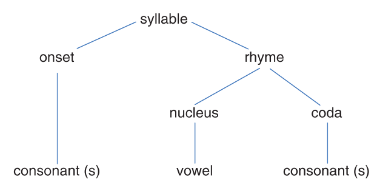

# The Sound Patterns of Language

## 1 概述

在之前的章节中，我们从人类声道发音的机理上探究了语音的产生。不同人的声道有着不同的物理结构，进而导致即使是读同一个词也会有各式各样的发音，甚至连同一个人也不能保证每次发音都相同。但是，我们依然可以用一种普适的视角来研究发音。

| 英文           | 中文       | 英文         | 中文   |
| -------------- | ---------- | ------------ | ------ |
| phonology      | 音系学     | phonemes     | 音位   |
| phone          | 音         | allophones   | 同位音 |
| phonotatics    | 音位结构学 | syllable     | 音节   |
| onset          | 开始       | rhyme        | 韵脚   |
| nucleus        | 发音核     | coda         | 结尾   |
| coarticulation | 协同发音   | assimilation | 同化   |
| nasalization   | 鼻音化     | elision      | 省音   |

> **NOTE**
>
> 网上对*allophone*的翻译有很多版本，常见的包括"音位变体"、"同位音"、"同位异音"等等。个人比较喜欢"同位音"。以"音"结尾，指明了这个对象的本质是一个音 (phone ) 。以"同位"修饰，表示它们对应到同一个音位 (phoneme ) 。此外，该翻译与化学中的同位素 (isotope ) 在形式上一致，简洁明了。

## 2 音系学

**音系学 (phonology)** 是对一种语言的发音系统和音的模式的描述。

> Phonology is essentially the description of the systems and patterns of speech sounds in a language.

音系学关心的是该语言中语音的**抽象表征 (abstract representation)** ，而不是其物理实现 (physical realization ) 。例如对于下面这句话，我们可以用各种各样的方式来拼读它，但最后一行的音系学表征 (phonological representation ) 是不变的。

| 文本                | Once a upon a time was three bears |
| ------------------- | ---------------------------------- |
| 拼写1               | Uans appona taim uas tri berres    |
| 拼写2               | Ones up on atam waz theree bars    |
| 拼写3 (音系学表征 )  | /wʌns ə əpan ə taɪm wəz θriː berz/ |

音系学研究的是不同音的底层设计 (underlying design ) ，而这些音会依据语境 (context ) 有着不同的物理实现。例如，我们认为tab, star, writer, eighth中的[t]在英语的音系学层面上是一样的。而在实际的发音中，这些单词中的[t]会受到周围其它音的影响而有着不同的物理实现。

但这些[t]的不同物理发音的重要性远不及[t]与[k]、[f]、[b]等音之间的不同，因为它们能够影响到单词的含义 (meaning ) 。这些音是具有不同含义的音，与实际的物理发音无关。它们使得tar、car、 far、bar等单词有不同的含义。从这一角度来看，音系学关心的是我们头脑中那些抽象的音。这些抽象的音允许我们可以从实际的发音中辨识出不同含义的单词。

## 3 音位

一种语言中具有不同含义的 (meaning-distinct ) 音称**为音位 (phonemes)** 。在先前的例子中，各式各样的[t]对应同一个音位/t/。要注意的是，音位用斜杠括起来，而实际的音段则用方括号括起来。

音位的一项重要特性是具有区分功能 (function contrastively ) 。例如fine和vine含义不同仅仅是因为二者开头的音位/f/和/v/不同。这一性质能够决定一种语言中有哪些音位。如果改变某个单词中的一个音导致了其含义发生变化，那么这个音是一个音位。

### 3.1 自然类

在前一章中，我们探究了音的特征 (features ) 。辅音可以按是否存在一定频率分为浊音和清音；按照发音位置分为双唇音、齿唇音等；按照发音方式分为爆破音、摩擦音等。元音都是浊音。不同元音的产生受到嘴巴开合与舌头位置的影响。

我们可以使用加减号来表示某个音位是否有某种特征。例如/p/可以表示为[-voice, +bilabial, +stop]，意味着它是一个双唇爆破清音；/k/可以表示为[-voice, -velar, +stop]，意味着它是一个软腭爆破清音。可以看到，二者有着一些共同特征，即都是爆破清音。因此，我们可以认为它们属于同一个**自然类 (natural class)** 。这些有着共同特征的音位在发音时行为也会比较相似。相反，/v/可以表示为[+voice, +labiodental, fricative]，意味着它是一个唇齿摩擦浊音。因此，它和/p/与/k/不属于同一个自然类。

分析这些特征不仅有助于我们研究单个的音位，还可以帮助我们研究某种语言中可能的音位序列。例如在英语中，以/pl-/或/kl-/开头的单词比较常见；而以/vl/或/nl/开头的单词则很少。

## 4 音与同位音

如果说音位(phonemes)是我们头脑中抽象单位 (abstract unit ) ，那么**音(phones)** 则是我们嘴巴中实际说出的语音单位 (phonetic units ) 。如果我们有一个音的集合，它们都是某个音位的不同版本，那么它们称为该音位的**同位音(allophones)** 。

例如，音位/t/有多种物理实现的音，如下表所示。其中区别音符 (diacritics ) [ʰ]表示呼气 (aspirated ) ，[◌̪]表示齿音 (dentals ) 。这些同位音在严式标音 (narrow phonetic transcription ) 还能够进一步区分。

| 音位 | 同位音 | 示例   |
| ---- | ------ | ------ |
| [t]  | [tʰ]   | tar    |
|      | [r]    | writer |
|      | [ʔ]    | butter |
|      | [t̪]    | eighth |

区分音位和同位音的关键就是看改变它们是否会影响单词的含义。如果改变了音位，单词的含义一定会发生变化。如果一个同位音替换成另一个，只会改变单词实际的发音，其含义不变。

### 4.1 互补分布

某个音位的同为音往往出现在单词的不同位置。这一现象称为互补分布 (complementary distribution ) 。例如/t/的同位音[tʰ]只会出现在单词的开头，而不会接在另一个辅音后面。也就是说呼气与不呼气的的/t/的出现位置一定不会重合。

### 4.2 最小对与最小集

如果两个单词在形式上一致而仅在同一位置有一个音位不同，那么它们称为一个最小对 (minimal pair ) 。进一步，如果一些单词仅需改变相同位置的一个音位就可以互相区分，那么它们属于同一个**最小集 (minimal set)** 。或者说，互为最小对的单词属于同一个最小集。

| 最小对           |                   | 最小集                                                |
| ---------------- | ----------------- | ----------------------------------------------------- |
| **f**an-van      | **b**ath-**m**ath | **b**ig-**p**ig-**r**ig-**f**ig-**d**ig-**w**ig       |
| b**a**t-b**ea**t | m**a**th-m**y**th | f**a**t-f**i**t-f**ee**t-f**e**te-f**oo**t-f**oug**ht |
| si**t**-si**ng** | my**th**-Mi**ck** | ca**t**-ca**n**-ca**p**-ca**b**-ca**sh**-ca**dge**    |

## 5 音位结构学

透过最小集我们可以隐约感受到，一种语言中一定是存在一些合理的音位模式的，即多个音位组合成的序列。例如在第七版的《语言研究》中，作者提到自己手头的英语词典中lig和vig。但这些"词"在形式上是合理的，因此它们很有可能在将来成为英语单词。现在，在欧陆词典上查询二者，已经可以能够搜到许多相关的词条了。相反，fsig这样的单词几乎不会出现，音位它没有遵行英语音位的限制。这些限制属于**音位结构学 (phonotatics)** 范畴，即一些被允许的音的组合 (permitted arrangement of sounds ) 。这些限制是在一个比单个音位更大的音系学单位上运作的，也就是下面要介绍的**音节 (syllables)** 。

## 6 音节

一个**音节 (syllable)** 必须要包含一个元音 (包括双元音 ) 或者类似元音的音 (如英语中的如/l/，/n/ ) 。英语中，最常见的音节结构是CV，即一个辅音 (**c**onsonant ) 接一个元音 (**v**owel ) 。一个音节的基本结构如下。

- 开始 (onset ) ：一个或多个辅音；
- 韵脚 (rhyme, rime ) 
  - 发音核 (nucleus ) ：一个或多个元音；
  - 结尾 (coda ) ：一个或多个辅音。

像me、to和no这样的单词只有onset和nucleus但没有coda，称为**开音节 (open syllables)** ；而up、cup和at这样的单词有coda，则称为**闭音节 (closed syllables)** 。

英语中常见的音节结构如下表所示。

| 音节结构 | 示例  | 音节结构 | 示例 |
| -------- | ----- | -------- | ---- |
| CCVC     | green | VCC      | eggs |
| VC       | am    | CVC      | ham  |
| V        | I     | CV       | do   |

### 6.1 辅音群

Onset和coda都可能由多个辅音构成，即**辅音群 (consonant clusters)** 。例如CC结构的/st/可以在stop中作为onset，也可以在post中作为coda。甚至还会有CCC结构的/spl/可以出现在splendid作为onset。但要注意，前一个音节的coda可以会与下一个音节的onset相连。例如exclaim的标音为/ɛk-skleɪm/，而不是/ɛ-kskleɪm/，因为/kskl/并不是一个合法的medial onset。

## 7 协同发音

在之前的章节中，我们研究的是独立的音位或者音节，就好像是以一种很慢很饱满的速度来发音。但在实际的语音中，一方面，鲜有语言会有很大的辅音群；另一方面，人在说话时是快速而无意识的，这就要求我们的发音器官能够流畅地从前一个音"滑"向后一个音。我们将几乎在发前一个音的同时发后一个音的过程称为**协同发音 (coarticulation)** 。

### 7.1 同化

当两个音段连续出现时，其中一个音段的某些特征被另一个音段所"复制"的过程称为**同化 (assimilation)** 。这种现象的出现是由于它能够使得我们发音更快更简单。

例如在英语中，单词have单独发音时为/hæv/。但如果将其放在短语have\ to中时，由于/t/是清音，我们在发其前一个音是也会倾向于发它的清音版本。这就导致/v/变成了/f/，整个短语就变成了/hæftə/。这也就是为什么在一些非正式场合下，have\ to会被写成hafta。

### 7.2 鼻音化

元音也存在同化现象。当元音出现在鼻音 (nasals ) 之前，它会被**鼻音化 (nasalization)** 。例如在and中，由于/æ/后紧跟着/n/，发音器官会提前将/æ/鼻音化从而方便发音。IPA中使用tilde表示鼻音化，即[◌̃]。

### 7.3 省音

以短语you\ and\ me为例，在实际语音中，它通常会发成[juənmi]。可以发现在[n]和[m]之间的[d]被省去了，因为这样发音会更加省力。我们将省去单词中某个音段，而不按照单独刻意的方式去发音的过程称为**省音 (elision)** 。特别地，/t/经常成为省音的"受害者"。

| 文本       | 不省音     | 省音      |
| ---------- | ---------- | --------- |
| aspect     | /æspɛkts/  | [æspɛks]  |
| he must be | /himʌstbi/ | [himəsbi] |
| every      | /ɛvəri/    | [ɛvri]    |
| camera     | /kæmərə/   | [kæmrə]   |
| prisoner   | /prɪzənər/ | [prɪznər] |

### 7.4 正常的语音

在正常的语音中 (normal speech ) ，上面提到的各种协同发音现象都不应该被视为发音的草率或懒惰。相反，有意地去避免协同发音反而让语音听起来不真实 (artificial-sounding ) 。

研究这些音系学过程的关键不是去弄出一套规则来规定一门语言该如何发音，而是试图去理解其中的音在实际使用中的规律与模式。

> The point of investigating these phonological processes is not to arrive at a set of rules about how a language should be pronounced, but to try to come up an understanding of the regularities and patterns that underlie the actual use of sounds in language.

## 8 总结

本章首先介绍了音系学的概念。它研究的是一门语言中音的抽象表征而非物理实现。进而，音位的概念得以引出。它是具有区分单词含义功能的音系学单位。接着介绍了与音位相对的音的概念，它是某个音位的物理实现。而某些音位可能会对应多个音，这些音的集合构成该音位的同位音。然后，我们引入音位结构学的概念并开始研究多个音位相连所形成的模式与发音规则。这其中包括了比音位更大的音系学单位音节和同化、鼻音化以及省音等协同发音现象。最后，原书作者强调音系学的目的不是去规定语言的发音，而是去理解其中的规律。这与陆俭明教授的一句话不谋而合。

> 语言学家对语言没有规定的权力，只有解释的义务。

## 参考

[Yule, G. (2020). *The Study of Language* (7th ed.). Cambridge: Cambridge University Press. doi:10.1017/9781108582889](https://www.cambridge.org/highereducation/books/study-of-language/433B949839A5A6F915EC185657564B16#overview)