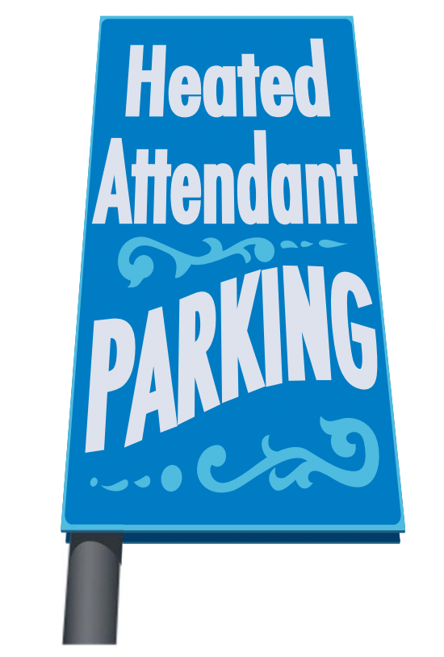
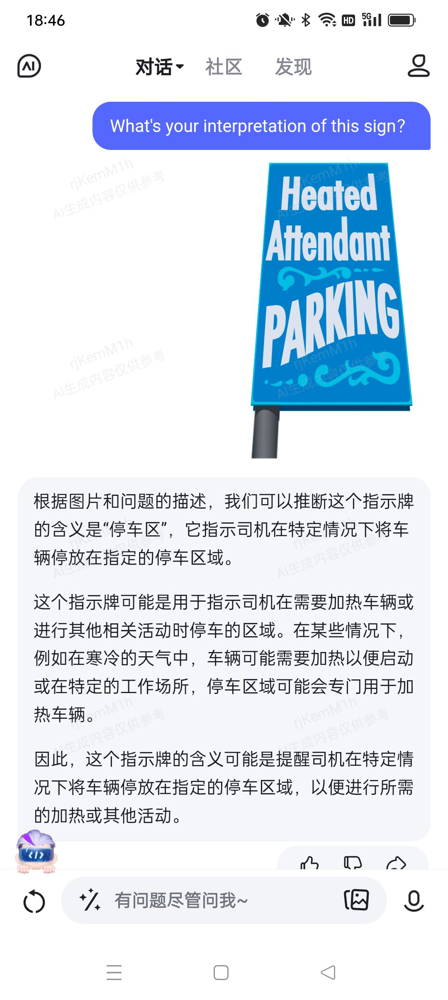
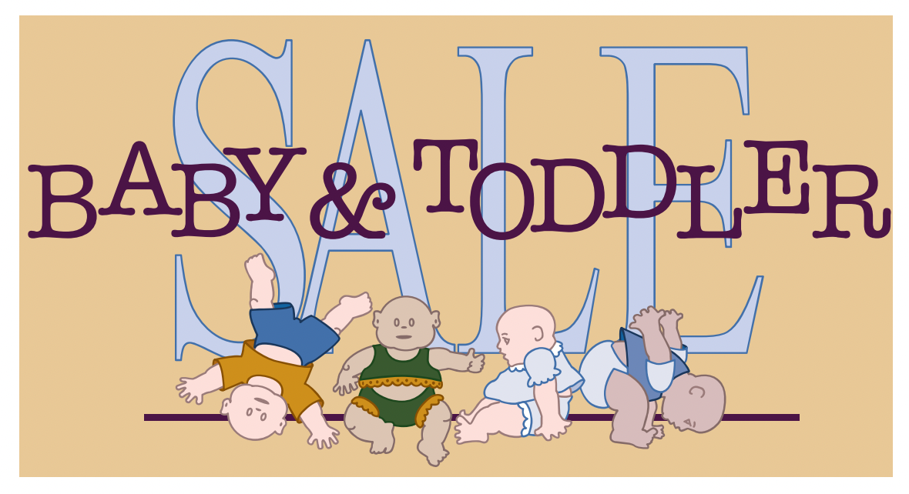
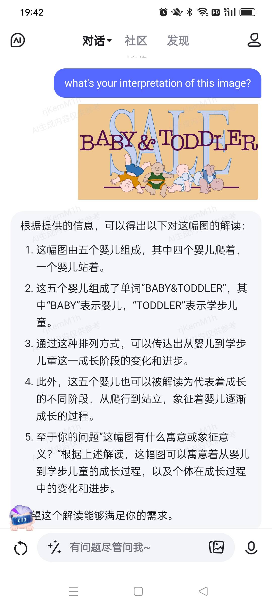

# Pragmatics

## 1 概述

在第9章中，我们的目光聚焦于单词的参考意义和词汇之间的关系。本章中，我们将从语境和语者的意图等视角出发来研究单词的意义。对语者意图的研究称为**语用学 (pragmatics)** 。

以下是本章中出现的部分语言学术语。

| 英文              | 中文     | 英文           | 中文     |
| ----------------- | -------- | -------------- | -------- |
| invisible meaning | 隐含意义 | context        | 语境     |
| deixis            | 指示语   | reference      | 指称     |
| inference         | 推断     | anaphora       | 回指     |
| cataphora         | 下指     | presupposition | 预设     |
| pragmatic marker  | 语用标记 | politeness     | 礼貌     |
| face              | 面子     | speech act     | 言语行为 |

## 2 隐含意义

在多数情况下，语用学研究的是**隐含意义 (invisible meaning)** ，即我们是如何在语者没有明说的情况下理解话里实际的意义。要能做到这一点，彼此之间一定有某些共享的假设 (assumptions) 和期望 (expectations) ，即传达的信息要多于所说的 (more is communicated than said) 。

例如在下面的图片中，单从这几个词来看可能会有许多种解读的方法。比如"we can park our heated attendants here"或"parking will be carried out by attendants who are heated"。但实际上我们会更倾向于理解为"we can park a car here, in a heated area"。那么我们是如何在牌子上没有写car这个单词的情况下理解其含义的呢？

> **NOTE**
>
> 文心一言的解读。
>
> 

## 3 语境

我们在理解文本 (text) 时，一定处于某个特定的**语境 (context)** 且拥有一些已有的假设。文本的意义不仅仅体现在单词本身，还取决于我们对作者在特定语境下意图的理解。

例如下图被用在了一个Furniture Sale中。看起来似乎是有人在卖小孩。但实际上我们并不会这么解读，而是认为这里在促销一些小孩用的衣服。虽然clothes并没有出现在图片上，但我们依旧可以根据语境理解其中的含义。

在上面两个例子中，可以说我们是在某个特定的物理情境下看到了文本 (如在停车场附近、在家具城) 。此时的语境称为**物理语境 (physical context)** 。又比如看到一栋建筑上写着Bank，我们会很自然地知道这是一个金融机构。但当读到an overgrown steep bank by the river时，我们又会知道这里的bank是指河岸。此时的语境称为**语言语境 (linguistic context)** ，即由周围其他文本构成的语境。这些周围的文本称为**连文本 (co-text)** 。

> **NOTE**
>
> 文心一言的解读。
>
> 

### 3.1 指示语

英语中常常会有一些词，在不知道具体语境时是无法正确解读的，例如here和there、this和that、now和then、yesterday和tomorrow以及代词you和me等等。甚至如果没有语境，有些句子都是无法理解的，如You'll have to bring it back tomorrow because she isn't here today。

像tomorrow这样的表达方式称为**指示语 (deixis)** 或指示性表达 (deictic expressions) 。我们可以用它们指示头脑中的人、地点和时间。进一步，这些指示语又可以按与语者的距离分为两类。

| 类型 | 接近语者                | 远离语者                            |
| ----------------------------- | ------------------------- | ------------------------------------- |
| 人称指示语 (person deixis)    | me, us, our, this girl    | him, them, that woman, those idiots   |
| 空间指示语 (spatial deixis)   | here, this bed, behind me | there, those hills, over yonder       |
| 时间指示语 (temporal deixis)  | now, today, this morning  | then, yesterday, last week, next year |

指示语的远近之分还可以用于表达情感。如果有东西物理上离得很近，但并不喜欢它，我们就可以用表示远离的指示语，形成一种要将其推开的感觉。例如面前有一大碗你不喜欢的西红柿汤，你或许就会说I don't eat **that**。

## 4 指称

上面在讨论指示语时，我们已经假定了单词会指向人、地点或时间。但实际上，单词本身没有任何指向，其指向是由人赋予的。语者使用语言来让听者识别某个事物的动作称为**指称 (reference)** 。要执行指称动作，我们可以使用专有名词、代词和名词短语。这些词拥有一定的指称范围。例如Jenifer、she、that girl可以指向许多实体。

我们还可以指向不知道如何称呼的事物。例如the blue thing。甚至还可以创造表达方式。如使用Mr. Kawazaki (一个摩托车品牌) 来指向一个经常在街区骑着摩托车飞驰的人。

> **NOTE**
>
> 百度百科对"鬼火少年"一词的解释如下。
>
> 鬼火少年，指喜欢成群结队驾乘以"鬼火"摩托车为代表的摩托车招摇过市而时常发生事故的青少年。

### 4.1 推断

成功的指称很大程度上依赖于听者对辨识语者意图的能力。例如在两个学习语言学的人的对话中，其中一人可能会说Can I look at your [Chomsky](https://en.wikipedia.org/wiki/Noam_Chomsky)?；另一人则可能会回答Sure, it's on the shelf over there，而不是认为对方想看Chomsky这个人。可见，我们能够使用人名来指向事物，也可以用事物指向人。这其中关键的过程就是**推断 (inference)** ，即听者使用额外的信息来建立语者的话与其意图之间的联系。在上例中，听者就进行了如下推断："如果X是某本书作者的名字，那么X可以用来指该作者的一本书。"类似地，我们可以理解Picasso is in the museum和We saw shakespear in London等等。

### 4.2 回指

在英语中，介绍新的指称对象 (referent) 和在后文中指称它时会使用不同的表达方式。

- We saw a funny home video about a boy washing **a puppy** in a small bath.
- **The puppy** started struggling and shaking and the boy got really wet.
- When he let go, **it** jumped out of the bath and ran away.

在上面的例子中，第一句话中首次出现的指称对象a puppy称为先行语 (antecedent) ，第二、三句话中使用the puppy和it来指称它的现象称为**回指 (anaphora)** 。

先行语和回指表达 (anaphoric expression) 之间的联系可以通过以下方式建立。

- 代词 (it) 
- 冠词the和先行语中的名词组成的短语 (the puppy) 
- 冠词the和另一个先行语有关的名词组成的短语 (the little dog) 

此外，这种联系还通常基于推断。

| 话语                                                         | 推断                             |
| ------------------------------------------------------------ | -------------------------------- |
| We found a house to rent, but the kitchen was very small.    | 如果X是房子，那么X有厨房。       |
| I got on a bus and asked the driver if it went near the downtown area. | 如果X是公交车，那么X有司机。     |
| The victim was shot twice, but the gun was never recovered.  | 如果X表示射杀、那么枪会出现在X中 |

### 4.3 下指

相较于回指，**下指 (cataphora)** 要少见许多。它颠倒了回指中先行语和回指表达之间的关系。

- In **their** free time, **the boys** play video games.
- Because **he** was very cold, **David** put on his coat.
- **It** suddenly appeared on a path a little ahead of me, starring in my direction and sniffing the air. **An enormous grizzly bear** was checking me out.

## 5 预设

**预设 (presupposition)** 是语者假定听者已经知道的信息。

| 话语                             | 预设                       |
| -------------------------------- | -------------------------- |
| Your brother is looking for you. | 你有一个兄弟。             |
| When did you stop smoking?       | 你之前抽烟，但现在不抽了。 |

可以使用一种检验来找到句子中的预设。句子和其否定中都为真的信息就是预设，这一现象称为否定稳定性 (constancy under negation) 。例如My car is a wreck和My car is not a wreck都蕴含着I have a car这一预设。

## 6 语用标记

语者可以使用**语用标记 (pragmatic markers)** 来指示他们的话语应该如何解读。例如使用You know来表示某些信息是语者和听者共享的；使用I mean来修正自己的话或者试图澄清什么。

- They had been reading something by Charles Wright, **you know**, the famous poet and **well**, **I mean**, he's famous in America at least, but they really didn't understand it.

在上例中，语者首先陈述Charles Wright是有名的，并用you know表明听者也应该知道这一信息。然后通过well过渡，开始发表对这一信息的评论，并用I mean来阐明自己的观点。

又比如I don't know也逐渐成为一个语用标记。它从表示对某些知识的缺乏演化为表示犹豫、不确定或不认同的标记。

- I'm not very fond of Edinburgh. it's so drab and it's always cold there.
- **Oh, I don't know**. I really enjoyed going to the Festival there last year.

> **NOTE**
>
> - [Quora](https://www.quora.com/Why-do-people-say-you-know-what-Im-saying-Is-this-an-actual-phrase-that-can-be-used-in-a-conversation-or-is-it-just-something-some-people-say-because-they-think-it-sounds-cool)上有对you know what I'm saying的讨论。
> - 汉语中的"你说的对"和日语中的「そうですね」似乎也有着语用标记的功能，表示不太同意对方观点，但碍于礼貌没有直接否定。

## 7 礼貌

**礼貌 (politeness)** 在广义上可以理解为圆滑、谦逊、对他人好等等。而语言学研究的礼貌则关注的是**面子 (face)** 。在语用学中，面子指的是在公众中的自我形象 (public self-image) ，这是每个人都具有且期望他人认可的情感和社交自我意识。礼貌则可以定义为注意和考虑他人的面子。

对他人面子造成威胁的行为称为**面子威胁行为 (face-threatening act)** ，与之相反的则是**面子保全行为 (face-saving act)** 。例如使用命令Give me that pape!蕴含着你的社会地位比对方高。如果你实际上并没有这样的社会地位却仍使用了该表达，那么就对对方的面子构成了威胁。相反，使用含蓄的请求Could you pass me that paper? 则没有蕴含社会地位高低的信息，对面子构成的威胁也就减少了。

许多语言行为在本质上都具有面子的威胁性，礼貌就是要减轻对面子的威胁。

### 7.1 积极和消极面子

我们的面子还分为**积极面子 (positive face)** 和**消极面子 (negative face)** 。此处的消极没有坏的含义，而是与积极的对立。消极面子是对独立自由和摆脱施加于自己事物的需求；而积极面子则是对联系、归属和集体的需求。

下面的表达可以保全对方的消极面子。

- I'm sorry to bother you.
- I know you're busy, but...

而下面的表达可以保全对方的积极面子。

- Then same thing happened to me.
- Let's do this toghether.

## 8 言语行为

我们用**言语行为 (speech acts)** 来描述表达请求 (requesting) 、命令 (commanding) 、疑问 (questioning) 和告知 (informing) 等动作的语言。例如在说I'll be there at six时，我们不仅仅是在说这句话，还完成了承诺 (promising) 的动作。言语行为可以定义为语者通过话语所执行的动作。

> We can define a speech act as the action performed by the speaker with an utterance.

下表展示了一些话语的结构与其通常的功能。

| 话语                    | 结构                    | 功能       |
| ----------------------- | ----------------------- | ---------- |
| Did you eat the pizza?  | 疑问句 (interrogative)  | 疑问       |
| Eat the pizza (please)! | 祈使句 (imperative)     | 命令或请求 |
| You ate the pizza.      | 陈述句 (declarative)    | 陈述       |

### 8.1 直接和间接言语行为

当使用Can you...?等疑问句来表达疑问时，我们就在执行**直接言语行为 (direct speech act)** 。例如Can you ride a bicycle?就是在问对方是否具备某种能力。

相对地，当使用上面表格中的某种结构和与之不对应的功能时，我们就在执行**间接言语行为 (indirect speech act)** 。例如Can you pass me the salt?使用了疑问句结构但表达的是请求；You left the door open使用了陈述句结构但表达的是请求 (please close the door) 。

间接语言行为很好地印证了语用学的原则，即交流不仅仅依赖于识别出话语的结构和单词的含义，还依赖于语者说这句话时的语境。

## 9 总结

本章中主要介绍了语用学。它研究的是在某个语境下话语的意义。而大多数时候，语用学关注的是话语中的隐含意义。我们不仅要知道句中单词本身的意义，还需要借助语境才能正确理解话语中完整的实际意义。接着我们介绍了指称动作以及推断、回指和下指。其中回指还常常基于推理。然后我们介绍了部分语用标记，它们多用于指示语者的意图。最后我们着重探讨了语用学中的礼貌和言语行为。很多言语行为都会对面子有潜在威胁，礼貌就是要尽可能减轻威胁。

## 参考

[Yule, G. (2020). **The Study of Language** (7th ed.). Cambridge: Cambridge University Press. doi:10.1017/9781108582889](https://www.cambridge.org/highereducation/books/study-of-language/433B949839A5A6F915EC185657564B16#overview)

[(2009, January 1). 礼貌策略在委婉语使用中的体现. CORE.](https://core.ac.uk/display/41456580)

