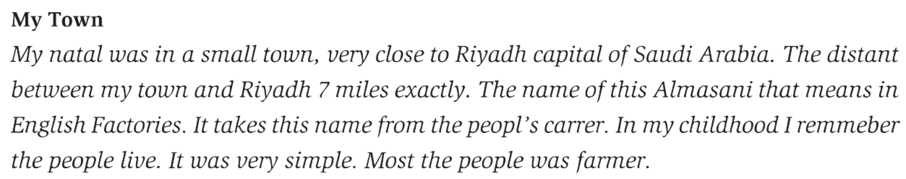
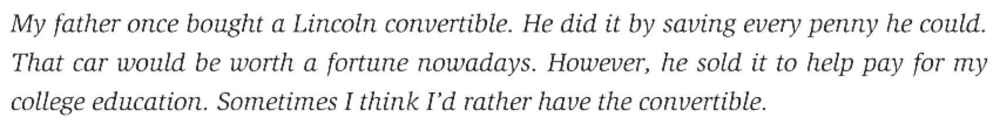
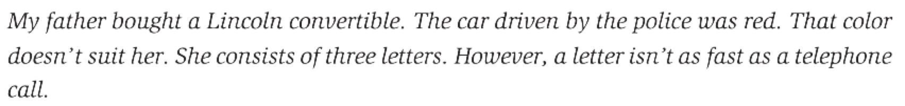
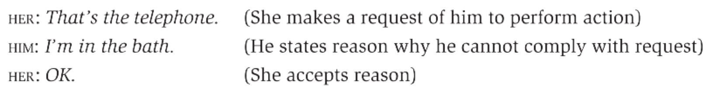
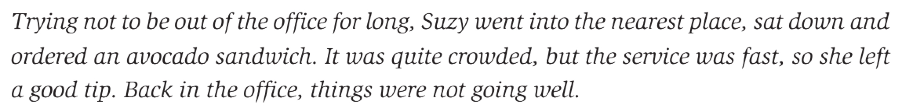

# Discourse Analysis

## 1 概述

在第10章中，我们学习了语用学。它主要关注的是单词在特定语境下的意义以及语者的意图。本章要介绍的**话语分析 (discourse analysis) **同样会涉及语言的使用，但它是在社会语境 (social context) 下研究范围更大的话语 (discourse) 。

这里引用[Lingustics Stack Exchange](https://linguistics.stackexchange.com/questions/6731/difference-between-discourse-analysis-and-pragmatics/6732#6732)上的一个回答来简单展示语用学与话语分析的区别。

> A: Would you like to go for a drink?
>
> B: Great! What time?

从语用学的角度出发，B能够明白go for a drink的含义 (或者说A的意图) 是去酒吧。而话语分析则研究的是这段对话是如何运作的。例如What time?可以问各种情境下的时间。但在这段对话中，我们可以通过A说的话知道time指的是去酒吧的时间。

以下是本章中出现的部分语言学术语。

| 英文               | 中文       | 英文                   | 中文     |
| ------------------ | ---------- | ---------------------- | -------- |
| discourse analysis | 话语分析   | discourse              | 话语     |
| cohesion           | 衔接       | coherence              | 连贯     |
| filled pauses      | 填声停顿   | adjacency pair         | 相邻语对 |
| insertion sequence | 插入序列   | co-operative principle | 合作原则 |
| hedge              | 模糊限制语 | implicature            | 言外之意 |
| schema             | 图式       | script                 | 脚本     |

## 2 话语

**话语 (discourse) **一词通常可以定义为超越句子的语言 (langauge beyond the sentence) 。因此对它的分析关注的是文本 (texts) 和对话 (conversations) 中的语言。在先前的章节中，我们关注的是各种形 (forms) 和结构 (structures) 的准确表征。然而，作为语言的使用者，我们不仅能够分辨形和结构的对错，还能对一些碎片化的信息做出复杂的话语解读。

例如看到报纸头版上写着Trains collide, two die，我们可以知道前者是后者的起因；看到商店橱窗上写着No shoes, no service，我们能明白二者的关系 (If you are wearing no shoes, you will receive no service) 。我们甚至可以解读那些破坏了许多语言规则的文本。

如果顺利读完了上面的文本，就会发现在对待这种含有许多语法错误的语言时，我们并不会因为它不合乎语法规范就拒绝它，而是会尝试解读作者想要传达的内容。

话语研究的关键部分就是如何尝试和完成对话语的解读。在此过程中，我们当然会依赖对正确的形和结构的了解。但作为语言的使用者，我们还会运用更多的知识和手段。

## 3 衔接与连贯

### 3.1 衔接

影响文本结构和单句结构的因素 (factors) 是截然不同的。

> Texts must have a certain structure that depends on factors quite different from those required in the structure of a single sentence.

例如单句会受到句法规则的约束，而文本之间的结构则可以从**衔接 (cohesion) **体现。

上文中可以看到许多**衔接手段 (cohesive ties**) 。例如使用My father和he来维持对同一个人的指称 (reference) ；使用money和time这样有着相关联意义的词汇；使用过去时态建立与过去发生的事情的联系，而在最后一句使用现在时态表示时间和关注点的变化。

| 对象           | 衔接手段                                                     |
| -------------- | ------------------------------------------------------------ |
| 人 (people)    | My father - He - he - he; My - my - I - I                    |
| 物 (things)    | A Lincoln convertible - That car - it - the convertible      |
| 金钱 (money)   | ought - saving every penny - worth a fortune - sold - pay    |
| 时间 (time)    | once - nowadays - sometimes                                  |
| 时态 (tenses)  | past (bought) - past (did) - past (could) - past (sold) - present (think) |

对这些衔接手段的分析可以帮助我们理解作者是如何组织语言的。然而，仅有衔接手段还不足以让我们理解 (make sense) 所读的文本。下面展示了一段使用了许多衔接手段但难以理解的文本。

### 3.2 连贯

**连贯 (coherence) **即一切都互相契合 (everything fitting together well) 。它不像衔接那样存在于文本的单词或结构之间，而存在于我们的头脑中。所谓理解 (make sense) 这一行为是由人完成的。当看到一段文本时，我们会依据自身的经验尽可能的建立一个场景来囊括其中的所有细节。之所以难以理解上面的文本，是因为我们很难构思出一个合理的场景。

例如看到报纸上写着Woman robs bank with sandwich，当你试图理解它时，你大概率会更关注sandwich这一比较奇怪 (odd) 对部分。你可能会有很多解读方案：

- She is carrying a sandwich.
- She is eating a sandwich.
- She is acting as if the sandwich is a weapon.

可见，仅仅通过报纸上这行文字并不能得到合理的答案。此时就需要引入自身的经验作为额外的信息来建立一个可能的场景。例如一个可行的解释是这个女人从包里拿三明治的动作很像在掏枪，从而被银行误认为她要抢劫。

此外，在日常对话中我们也经常依赖连贯来互相理解。在很多对话互动中，真正传达的意义并不能仅在所说的话中找到。

> What is meant or communicated cannot be found in what is said.

例如下面的对话中没有任何衔接手段，我们必须借助其它手段来理解它。其中一种方法是关注每句话的言语行为 (speech acts) 。

## 4 对话分析

英语的对话 (conversations) 简单而言是两个及以上的人轮流 (take turns) 说话。通常一次只会有一个人说话并且语者们会倾向于避免对话轮转时出现沉默。如果多人试图同时说话，一般会有人停下来，直到对方说完。其中方括号[表示语者们开始同时说话。

- A: Didn't you [know wh-
- B:                    [But he must've been there by two
- A: Yes but you knew where he was going

多数情况下，语者们会使用**结束点 (completion point) **作为自己发言结束的信号。例如向对方提问或者在一个完整的句法结构后停顿。同样地，其它语者也能使用一些方法来表示他们希望发言。例如使用肢体动作或面部表情。

> **NOTE**
>
> 原书中作者对对话的描述如下。
>
> Typically, only the person speaks at a time and there tends to be an avoidance of silence between speaking turns. (This is not true in all situations or societies.)
>
> 我比较好奇括号中的补充信息是对整句话有效还是后半部分，于是在[Linguistics Stack Exchange](https://linguistics.stackexchange.com/questions/47898/in-which-situations-or-societies-do-people-not-take-turns-to-speak-in-conversati)上提问并收获了许多评论。大家给出了很多people don't take turns in conversations的案例。

### 4.1 话语轮转

对不同对话风格的期望和不同的对话参与策略会导致人们在话语轮转中有不同的习惯。

> There are different expectations of conversational style and different strategies of participation in conversation, which may result in slightly different conventions of turn-taking. 

例如有些人经常会保持发言 (holding the floor) ，则其采取的策略可能会是避免使用常规的结束点。具体而言，之前提到的正常的结束点一般是在句末的停顿。那么为了能让自己继续发言，则可以：

- 不在句末停顿；
- 在句中停顿；
- 使用and、and then、so、but等用于衔接的表达；
- 使用er、em、uh、ah等表示犹豫的表达。

### 4.2 停顿与填声停顿

在下例中，语者在动词前后插入**停顿 (pauses) **，使得听者必须听完停顿之后的内容才能明白其要传达的信息。

- A: that's their favorite restaurant because they ... enjoy French food and when they were ... in France they couldn't believe it that ... you know that they had .. that they had had better meals back home

而在下例中，语者X先在动词后插入了停顿表示犹豫，然后使用了em、er、you know等**填声停顿 (filled pauses) **。

- X: well that file really was ... [wasn't what he was good at
- Y:                                              [when di-
- X: I mean his other ... em his later films were much more ... er really more in the romantic style and that was more what what he was ... you know ... em best at doing
- Y: so when did he make that one

### 4.3 相邻语对

从上面的例子可以知道，在许多对话中我们需要时刻关注语者说话的内容。但在某些情境的对话中却有着一些既定的模式。例如打招呼时，对方说Hi我们会下意识地回答Hello。像这样由两部分组成的，几乎是自动的序列称为**相邻语对 (adjacency pair) **。它们常常出现于打招呼 (greetings) 、问答 (question-answering) 、致谢 (thanking) 和告别 (leave-taking) 中。

| 第一部分                        | 第二部分               |
| ------------------------------- | ---------------------- |
| Good mornin'.                   | Good mornin'.          |
| Where's Mary?                   | She's at work already. |
| Thanks for your help yesterday. | Oh, you're welcome.    |
| Okay, talk to you later.        | Bye                    |

> **NOTE**
>
> 比较好奇玩梗的对话能否算作相邻语对。一些知名的梗应该也是某种既定的模式，而我们在接梗时也几乎是下意识地回复。
>
> - A：原神。
> - B：启动！

### 4.4 插入序列

在对话中，相邻语对中的第二部分不一定会紧接着第一部分。在下例中，Q2-A2就插入到了Q1和A1之间。这里Q2-A2属于**插入序列 (inisertion sequence) **，即一个相邻语对插入到另一个相邻语对之间。

| 语者 | 语句                   | 部分 |
| ---- | ---------------------- | ---- |
| You  | Do you want some milk? | Q1   |
| Me   | Is it soy milk?        | Q2   |
| You  | Of course.             | A2   |
| Me   | Okay, thanks.          | A1   |

实际生活中，虽然我们并不会刻意关注对话结构，但当遇到相邻语对的第一部分时，会下意识去关注第二部分。在下例中，当有人和Annie打招呼 (第一部分) 时，妈妈马上就注意到Annie没有口头回应 (第二部分) 。

- Woman: Hi, Annie.
- Mother: Annie, don't you hear someone say hello to you?
- Woman: Oh, that's okay, she smiled hello.
- Mother: You know you're supposed to greet someone, don't you?
- Annie: Hello.

> **NOTE**
>
> 作为I人，这段对话认我想起了过年走亲访友时爸妈总是让我给那些叫不出称呼的亲戚们打招呼的场景……

## 5 合作原则

在大多数对话中，一个基本的假设是语者们在相互合作 (co-operate) 。这一原则加上四条准则由哲学家[Paul Grice](https://en.wikipedia.org/wiki/Paul_Grice)提出，故也称为Gricean Maxims。

| 原则/准则                              | 描述                                                         |
| -------------------------------------- | ------------------------------------------------------------ |
| 合作原则 (the co-operative principle)  | Make your conversational contribution such as is required, at the stage at which it occurs, by the accepted purpose or direction of the talk exchange in which you are engaged. |
| 量的准则 (the quantity maxim)          | Make your contribution as informative as is required, but not more, or less, than is required. |
| 质的准则 (the quality maxim)           | Do not say that which you believe to be false or for which you lack adequate evidence. |
| 关系准则 (the relation maxim)          | Be relevant.                                                 |
| 方法准则 (the manner maxim)            | Be clear, brief and orderly.                                 |

简而言之，我们都期待对话的参与者说话能够简洁、诚实、相关和清晰。尽管在某些场景中合作原则似乎并没有起作用。但它很好地描述了我们对对话的期望，因此可以帮助解释一些交谈的特点。例如两位女士在午饭时有如下对话。

- A: Do you like the sandwich?
- B: Oh, a sandwich is a sandwich.

逻辑上，B回复的内容是很显然的事实，似乎是没有提供任何交流价值的**赘余 (tautology) **。但从合作原则的角度出发，可以认为B遵循了量的准则，即仅提供交流所需的信息。因此A能知道B对自己的提问并没有判断，认为没有讨论的价值。三明治就是三明治，还能怎么样？

### 5.1 模糊限制语

我们可以使用**模糊限制语 (hedges) **来展示我们关心和遵循合作原则及其准则。模糊限制语是一些能表示对自己发言不确定的单词或短语。例如下面的模糊限制语通常适用于质的准则。虽然没有十足的把握，但我们希望通过使用这些模糊限制语来告诉听者我们在尽可能地遵守质的准则。

- His hair was **kind of** long.
- The book cover is **sort of** yellow.
- As far as I know, ...
- Correct me if I'm wrong, but ...
- I'm not absolutely sure, but ...
- I think ...
- I feel ...

### 5.2 言外之意

我们使用模糊限制语时，实际上是在暗示对方自己对发言没有充足把握。在先前三明治的例子中，B的回复也是在暗示她觉得三明治不值得讨论。从合作原则及其准则的视角来看，我们可以明白对话中的**言外之意 (implicatures)** 。

- Carol: Are you coming to the party tonight?
- Lara: I've got an exam tomorrow.

字面上，Lara的话并不是对Carol问题的回复，即Lara没有说Yes或No。但Carol可以将Lara的话理解为No或Probably not。之所以如此，是因为Carol认为Lara遵循了关系准则和量的准则，即Lara说的话与提问有关且提供了足够的信息。在这一过程中，Carol能够知道exam tomorrow需要study tonight，而study tonight又与party tonight冲突。于是Lara的回答不仅是对明天活动的陈述，还包含了与今晚活动有关的言外之意。

> **NOTE**
>
> 阴阳怪气或许是现在言外之意比较常用的情形。具体例子见[日本人也会yygq吗？当然会！嘲讽模式全开的京都人！](https://b23.tv/vcN0rqf)。

## 6 背景知识

值得注意的是，Carol能够分析和理解Lara的言外之意，是因为二人都有一些关于考试、学习和开派对的**背景知识 (background knowledge) **。在话语分析中，一个关键部分就是使用我们的背景知识来理解读到或听到的东西。

- John was on his way to shool last Friday. He was really worried about the math lesson.

只看上面两句话，具有不同背景知识的人会做出不同的推断。大部分人会认为John是学生。有人会认为他走路或者骑车上学，而有人会认为他划船上学。

- Last week, he had been unable to control the class.

继续看到这句话时，大多数读者会很快排除John是学生的推断，而认为他是开车上班的数学老师。

- It was unfair of the math teacher to leave him in charge.

此时，读者对John身份对推断又回到了学生。

- After all, it is not a normal part of a janitor's duties.

最终，许多读者会发现自己的推断一直都是错的。

虽然这样一句一句提供信息的文本呈现方式在实际生活中并不常见，但我们可以发现自己在解读它们时会用到文本中没有的信息，即背景信息。这些背景信息一般基于我们对通常发生的事情的期望。

### 6.1 图式和脚本

**图示 (schema) **是指存在于记忆中的常规知识结构。在上面的例子中，我们就使用了有关教室的常规知识，即教室一般是什么样。又如听到超市里发生的事情时，并不需要别人告诉我们超市里有什么，因为我们记忆中有超市的图式。

**脚本 (script) **本质上是一种动态的图式。图式包含的是一些静态的特征，如超市里有货架、推车、收银台。而脚本则包括了某个场景中的一系列常规动作。例如我们有看电影的脚本、看牙医的脚本、在餐厅吃饭的脚本。

基于在餐厅吃饭的脚本，我们在试图理解文本的过程中，会"脑补"出一些文本中的信息。

- Suzy must have opened a door to get into the restaurant.
- There must have been tables there.
- She must have ate the sandwich and paid for it.

可见，我们在理解读到的文本时，并不单靠这些文本，还依赖脑海中的其它知识。

> **NOTE**
>
> 我理解图式就像照片，而脚本就像动画。例如脑海中超市的图式就是超市里各个角落的照片，涵盖了超市里都有的事物，如储物柜、推车、电子秤、收银台等；而逛超市的脚本则是逛超市的整个流程，包括寄存随身物品、拿推车、选购、称量、结账等。也就是说，我们可以在脑海中想象出逛超市的全流程。

### 6.2 文生图模型

> **NOTE**
>
> 该部分是我自己的想法和理解 (运用了模糊限制语来表达我对质的准则的关心) 。

文生图 (text-to-image) 是近年AIGC领域很火的分支。之前的模型其实只知道文本prompt里的概念，但不能很好地理解文本。而近期的一些模型可以准确理解prompt中的语义，或许正是其具备和运用了足够的背景知识。

- Two cups of coffee, one with latte art of the Eiffel tower. The other has latte art of the Statue of Liberty.

较早的模型生成的图片如下。可以看到图片里有咖啡，有埃尔菲铁塔，缺失了自由女神像。而且模型没有真正理解文本的意思，只做到了概念的堆砌。

而较新的模型可以比较好的理解文本。它知道这里的埃尔菲铁塔和自由女神像是点缀在咖啡上的图案。

## 7 总结

本章主要介绍了话语分析。话语是比文本范围更大的文本，例如段落、对话。为了让话语能被理解，语者或作者通常会使用衔接和连贯的手段。前者的穿插让话语有了一定的结构；后者则存在于我们的脑海中，依赖于我们的经历和知识。接着我们重点学习了对话分析。在对话中，语者们是轮转发言的。语者们使用合适的停顿既可以结束自己的发言，也可以维持发言状态。生活中会有许多几乎是下意识的对话，称为相邻语对，常常出现于打招呼中。然后，我们探讨了对话中的合作原则及其四大准则。我们可以使用模糊限制语来告诉听者自己有在努力遵循合作原则及其准则。有些字面上看似"牛头不对马嘴"的回答实际上暗含言外之意。而这一切，都离不开背景知识。我们的脑海中储存着许多常规知识结构，有静态的图式和动态的脚本。它们作为额外的信息帮助我们解读各种文本。

## 参考

[Yule, G. (2020). *The Study of Language* (7th ed.). Cambridge: Cambridge University Press. doi:10.1017/9781108582889](https://www.cambridge.org/highereducation/books/study-of-language/433B949839A5A6F915EC185657564B16#overview)

