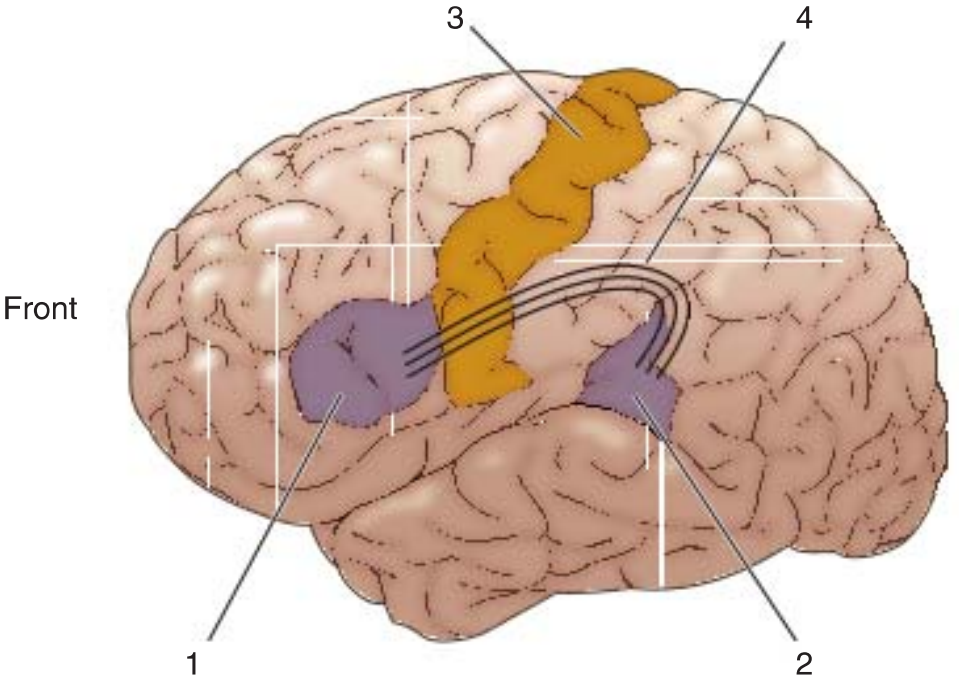
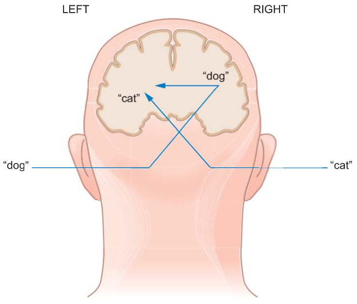

# Language and the Brain

## 1 概述

在前面的章节中，我们见识了人们在产生和理解语言信息时的使用的各种手段。那么，语言能力究竟位于身体的哪个部位呢？本章，我们将探究大脑和语言功能的关系。

以下是本章中出现的部分语言学术语。

| 英文               | 中文         | 英文                | 中文         |
| ------------------ | ------------ | ------------------- | ------------ |
| neurolinguistics   | 神经语言学   | left hemisphere     | 左半球       |
| Broca's area       | 布洛卡区     | Wernicke's area     | 韦尼克区     |
| motor cortex       | 运动皮层     | arcuate fasciculus  | 弓状束       |
| Broca's aphasia    | 布洛卡失语症 | Wernicke's aphasia  | 韦尼克失语症 |
| anomia             | 失名症       | conduction aphasia  | 传导性失语症 |
| dichotic listening | 双耳分听     | right ear advantage | 右耳优势     |
| literalization     | 偏侧优势     | critical period     | 关键时期     |

## 2 大脑中的语言区域

**神经语言学 (neurolinguistics)** 是对语言和大脑之间关系的研究。虽然这是一门新兴的学科，但该领域的研究能够追溯到19世纪。早期，如何定位大脑中和语言相关部分的位置是个难题，但[Phineas Gage的故事](https://baike.baidu.com/item/菲尼斯·盖奇/1769471)多少提供了一定线索：和语言相关的部位一定不会在大脑的正前方。

> 当他被铁撬击倒后，尽管**颅骨的左前部几乎完全被损毁了**，但他并未失去知觉。
>
> 盖奇在10周后出院了。此后，他的体力逐渐恢复，又可以工作了。然而工友发现他虽然头上有个洞，但**话语如常**，思维清晰，而且没有疼痛的感觉。

自此以后涌现了许多关于大脑的某个部位与某种语言功能之间联系的发现。我们现在知道，最重要的部分在靠近左耳的位置。下面的内容也将围绕大脑的**左半球 (left hemisphere)** 展开。

> **NOTE**
>
> 准确地说，最重要的部分位于大脑的优势半球 (dominant hemisphere) ，而绝大多数人是左半球。详见[维基百科](https://zh.wikipedia.org/wiki/%E5%B8%83%E8%8B%A5%E5%8D%A1%E6%B0%8F%E5%8C%BA)。

### 2.1 布洛卡区

上图中 (1) 所示的部分称为**布洛卡区 (Broca's area)** ，术语为前言语皮层 (anterior speech cortex) 。该区域和言语的产生 (production) 密切相关。  

### 2.2 韦尼克区

上图中 (2) 所示的部分称为**韦尼克区 (Wernicke's area)** ，术语为后言语皮层 (posterior speech cortex) 。该区域和言语的理解 (comprehension) 密切相关。此外，它还靠近听觉皮层 (auditory cortex) 。

### 2.3 运动皮层

上图中 (3) 所示的部分是**运动皮层 (motor cortex)** 。该区域主要控制身体各种肌肉的运动。其中靠近布洛卡区的部分则能控制脸、下巴、舌头、喉等与发声 (articulation) 有关的肌肉，控制着言语的物理发声。

### 2.4 弓状束

上图中 (4) 所示的部分是**弓状束 (arcuate fasciculus)** 。它是一捆连接布洛卡区和韦尼克区的神经纤维。

### 2.5 定位观

认识了上面的四个部分后，我们会倾向于认为语言能力的某个方面能对应到大脑的某个部位，即**定位观 (the localization view)** 。这表明大脑活动在"听-理解-说"的过程中会遵循特定的模式：我们听到某个词后经韦尼克区的处理理解了它。信号通过弓状束传导至布洛卡区并做好产生言语的准备。随后信号再被送到运动皮层完成物理发声。

## 3 Tongue Tips and Slips

我们都经历过诸如嘴瓢的脑子和嘴巴不协调的情形。它们其实也为我们研究大脑中语言知识 (linguistic knowledge) 的组织方式提供了一定线索。

### 3.1 Tips of the Tongue

我们学过用短语on the tip of my tongue来表达"话到嘴边，但就是说不出来"的情形。这类言语的错误也称为malapropisims。我们称想要说出的词为target word。研究表明，在遇到这种情况时我们其实能够准确地知道target word的大概音系结构、以哪个音开头、有多少个音节等等。该现象通常出现在我们想说一些不太常用的词时。这暗示着大脑的"词汇存储系统"可能在一定程度上按照音系规则组织信息。某些词会比其它词更容易检索 (retrieve) 。

我们想说的词和实际说出的词通常有着相似的音系结构。下面展示了一些的例子。

| 想说的                                         | 实际说的                                      |
| ---------------------------------------------- | --------------------------------------------- |
| sextant                                        | secant / sextet / sexton                      |
| fire extinguisher                              | fire distinguisher                            |
| transcendental meditation                      | transcendental medication                     |
| we need a few laughs to break up the monogamy. | We need a few laughs to break up the monotony |

> **NOTE**
>
> 原书作者提到tips of the tongue常出现在喜剧表演中。
>
> 中文互联网上也不乏故意运用类似tips of the tongue的方式来达到"梗"的效果。例如达利园效应 (丁达尔效应) 、欢乐谷效应 (恐怖谷效应) 。

### 3.2 Slips of the Tongue

另一种言语的错误是slips of the tongue，也称为spoonerisms。这种情形中，我们可能会发错单词的某个音节，会互换前后单词的首音节、甚至互换前后单词的位置。

| 想说的                                   | 实际说的                                 |
| ---------------------------------------- | ---------------------------------------- |
| make a long story short                  | make a long story stort                  |
| You have missed all my history lectures. | You have hissed all my mystery lectures. |
| use the key to open the door             | use the door to open the key             |

通常，slips of the tongue有三类。

- perseveration：前一个词的音带到了后一个词。
- anticipation：后一个词的音用在了前一个词。
- exchange：首音或尾音位置交换。

| 类型          | 想说的               | 实际说的             |
| ------------- | -------------------- | -------------------- |
| perseveration | black boxes          | black bloxes         |
|               | my favorite song     | my favorite fong     |
| anticipation  | roman numeral        | noman numeral        |
|               | a cup of tea         | a tup of tea         |
| exchange      | feel better          | beel fetter          |
|               | look before you leap | loop before you leak |

尽管这些slips大多被视为发音错误，但它们也许实际来源于slips of brain，因为大脑负责了组织和生成语言消息 (linguistic messages) 。

> **NOTE**
>
> 念绕口令时很容易观察到这些现象。
>
> 四是四，十是十；十四是十四，四十是四十；别把四十说“细席”，别把十四说“适时”。要想说好四和十，全靠舌头和牙齿。要想说对四，舌头碰牙齿；要想说对十，舌头别伸直。认真学，常练习，十四、四十、四十四。

### 3.3 Slips of the Ear

Slips of the ear或许能为研究大脑如何理解 (make sense of) 听觉信号提供一定线索。下面展示了一些例子。

| 以为听到的                | 实际别人说的              |
| ------------------------- | ------------------------- |
| great ape                 | great tape                |
| pimple                    | pit bull                  |
| gladly cross-eyed bear    | gladly cross I'd bear     |
| transcendental medication | transcendental meditation |

> **NOTE**
>
> 经典笑话之中国人在拥挤的日本电车上吐槽"你挤妈挤"。一旁的日本人听成了「いま何時」并看表说出了时间。
>
> 又如佛教六字大明咒"唵嘛呢叭咪吽"被误听为all money back my home。

## 4 失语症

**失语症 (aphasia)** 是指后天获得性大脑皮层语言功能区病变或创伤导致的言语交流能力障碍或丧失。失语症患者通常伴有相关的语言障碍。对言语的理解 (comprehension) 困难容易导致语言的产生 (production) 困难。因此，对失语症分类通常基于患者主要症状 (primary symptoms) 。

### 4.1 布洛卡失语症

**布洛卡失语症 (Broca's aphasia)** 也称为表达性失语症 (expressive aphasia) ，其特点是患者言语量显著减少，发音扭曲，说话缓慢费力。其言语主要由词汇形位 (lexical morpheme) 组成，如名词、动词和形容词。而其中常常缺失功能形位 (functional morpheme)，如冠词和介词，以及曲折形位 (inflectional morpheme) ，如复数和时态。这种因丢失语法标记 (grammatic marker) 而不完整的言语称为失语法言语 (agrammatic speech) 。下面展示了一些例子。

不算严重的症状：

> I eggs and eat and drink coffee breakfast.

严重的症状 (言语中充斥着大量的犹豫和停顿) ：

> My cheek...very annoyance...main is my shoulder...achin' all round here.

也有的患者会难以发某些词的音，如无法说出steamship，只能勉强发出stail...。

通常，布洛卡失语症患者对言语的理解 (comprehension) 要远好于言语的产生 (production) 。

### 4.2 韦尼克失语症

**韦尼克失语症 (Wernicke's aphasia)** 也称为感受性失语症 (receptive aphasia) ，其特点是患者在言语的听觉理解上有明显困难。同时，患者虽然能产生流利的言语，但由于缺乏逻辑，他人往往难以理解其中的内容。下面展示了一个例子。

> I can't talk all of the things I do, and part of the part I can go alright, but I can't tell from the other people.

部分韦尼克失语症患者有时还会伴有**失名症 (anomia)** ，即无法找到正确的词来描述某个事物。患者为了克服找词 (word-finding) 困难，可能会尝试描述事物的特征。下面展示了一名患者试图描述"风筝 (kite) "的场景。

> it's blowing, on the right, and er there's four letters in it, and I think it begins with a C - goes - when you start it then goes right up in the air - I would I would have to keep racking my brain how I would spell that word - that flies, that that doesn't fly, you pull it round, it goes up in the air.

> **NOTE**
>
> 注意失名症和失名性失语症 (anomic aphasia) 不同。前面提到失语症患者可能在理解、表达等方面都出现障碍，但在分类时，我们基于其最显著最主要的症状。同样，失名症可能会发生在各种失语症患者上，而失名性失语症患者的主要言语障碍是失名。详见[维基百科](https://en.wikipedia.org/wiki/Anomic_aphasia)。

### 4.3 传导性失语症

相比于前面两种失语症，**传导性失语症 (conduction aphasia)** 则更少见。它指的是弓状束损伤导致的失语症。患者可能会发错词的音，但其发声功能本身没问题；他们说话流利，但言语的韵律会因为犹豫和停顿而崩坏；他们能理解听到的内容，但却难以准确复读出来。例如会将base复读成waysse，将wash复读成fosh。换言之，患者听到和理解的内容无法完好地传递到大脑中负责产生言语的区域。

## 5 双耳分听

### 5.1 双耳分听测试

**双耳分听测试 (dichotic listening test)** 是一项验证左半球优势的实验。实验中，受试者会从耳机的左右声道中同时听到不同的信号，如dog和cat。随后受试者反馈他听到了什么。

> **NOTE**
>
> [YouTube上的一个dichotic listening test](https://www.youtube.com/watch?v=jAXV6APZVQI)，看起来像是别人小学时期的展示项目呢~

### 5.2 左脑与右脑

在上面的测试中，我们知道左耳接收的信号会传导至右脑；而右耳接收的信号会传导至左脑。如上图所示，由于语言处理功能集中在大脑左半球，来自右耳的信号将率先抵达左半球。这一现象称为语音的**右耳优势 (right ear advantage)** 。相反，右半球则主要处理其它非语言的信号，如音乐、咳嗽声、交通噪声。因此，如果在双耳分听测试中使用非语言的信号，则可能会展现出左耳优势。

概念、词汇、句法等基本的语言处理会交由左半球完成；而对语境的理解、语调 (intonation) 和措辞 (phrasing) 、以及非字面意义的推断 (inference) 则会交由右半球完成。换言之，左半球负责快速处理音、词、短语结构的小细节，而右半球负责从根据语境做出整体的处理。因此，如果没有右半球，我们根本无法听懂笑话。

## 6 关键时期

左半球对语言处理的特化通常称为**偏侧优势 (literalization)** 。一般认为，偏侧优势的形成正好与人类习得母语的时期吻合。这一时期大约从出生开始到青春期 (puberty) 结束，称为**关键时期 (critical period)** 。如果孩童没能在这一时期习得语言，则之后几乎不可能再学会。详见[Genie故事](https://en.wikipedia.org/wiki/Genie_(feral_child))。

## 7 总结

本章，我们从神经语言学的角度学习了言语的产生、理解等功能在大脑中对应的区域。当大脑和发声器官不协调时，就可能会出现嘴瓢。而如果大脑的某个区域受损，则会导致更严重的失语症。此外，我们也可以从双耳分听实验和语言习得等角度来侧面验证大脑言语处理的偏侧优势。

## 参考

[Yule, G. (2020). *The Study of Language* (7th ed.). Cambridge: Cambridge University Press. doi:10.1017/9781108582889](https://www.cambridge.org/highereducation/books/study-of-language/433B949839A5A6F915EC185657564B16#overview)