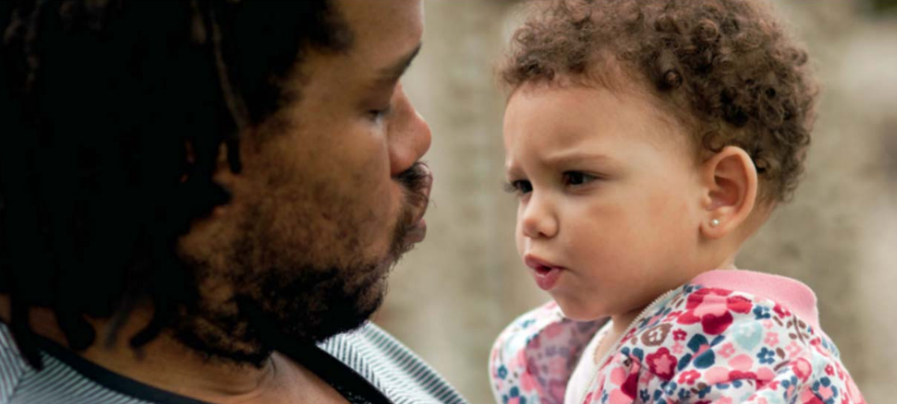
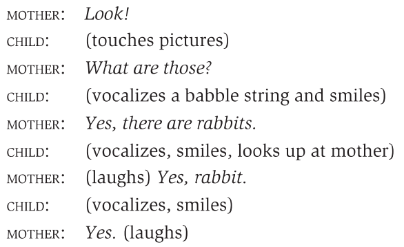
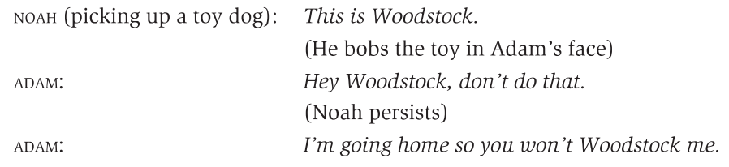
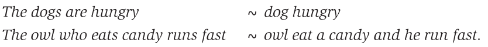
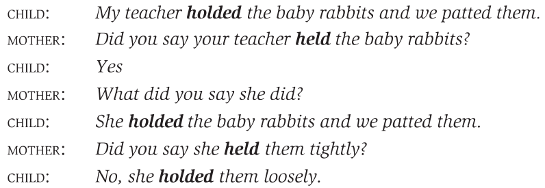

# First Language Acquisition

## 1 概述

儿童们在开始上学之前通常就已经是一名老练的语言使用者了。即便没有接受刻意的指导，身处不同的环境中，几乎所有儿童都有着习得语言的先天倾向。本章将介绍**母语习得（first language acquisition）**。

以下是本章中出现的部分语言学术语。

| 英文               | 中文     | 英文          | 中文     |
| ------------------ | -------- | ------------- | -------- |
| acquisition        | 习得     | input         | 输入     |
| overgeneralization | 过度泛化 | overextension | 过度延申 |

## 2 习得

语言习得的过程有一些基本的要求：

- 儿童必须在物理上具备发送和接收声音信号的能力，即可以说和听。
- 在成长的前两三年，儿童处在能够与其他语言使用者交流互动的环境。

通常，儿童们习得语言过程中都受益于长辈们提供的语言使用例子，即**输入 (input)** 。长辈们不会在儿童面前谈论成年人之间的话题，而是使用简化的言语与儿童互动。这种语言称为育儿语（caregiver speech），通常有如下特点：

- 使用简化的词汇，如tummy、nana。或者用简单重复的音节代表生活中的事物，如choo-choo、poo-poo。
- 频繁使用疑问句，且通常语调更夸张，声音更响亮，语速更慢，停顿更明显。
- 使用简单的句子结构和大量改述 (paraphrasing) ，且基本上只提及现在和眼前的事物。

 育儿语内置了一种对话结构将儿童视作互动中的一员。即便还没有学会说话，儿童也可以参与到好似对话一样的互动中。

## 3 习得时间表

就像所有儿童们在差不多的时期学会坐、趴、站和走等运动技能一样，语言习得似乎也大体上遵循着相同的时间表。

注意下文中的各个时间节点是研究者们基于大量案例得到的近似结果。个体之间可能会存在差异。

### 3.1 Cooing

儿童最早使用的类似语音的声音称为cooing。

在出生后的数月里，儿童逐渐能够发出一系列声音，尤其是类似 [i] 和 [u] 的高元音 (high vowel) 。

到4个月时，儿童可以发出类似 [k] 和 [g] 的软腭辅音 (也就有了cooing和gooing) 。

到5个月时，儿童已经能够区分元音 [i] 与 [a] 、音节 [ba] 与 [ga] 。

### 3.2 Babbling

6到8个月时，儿童已经可以发出一些不同的元音和辅音，以及诸如ba-ba-ba和ga-ga-ga的组合。这类声音称为babbling。

9到10个月时，儿童在发辅音元音 (consonant-vowel, CV) 组合时能够产生可辨识的语调 (intonation) ；可以发出一些不同的CV组合，如ba-ba-da-da；鼻音 (nasal sounds) 的出现也更加频繁，如ma-ma-ma。

10到11个月时，儿童能够发声来表达情感和强调；可以发出更复杂的音节组合，如ma-da-ga-ba；参与大量声音游戏 (sound-play) 和模仿。这一过程中，儿童通过使用"prelangauge"与成人互动，多少体会到了言语的社交功能。

12个月时，儿童在发声的同时能做出不同的肢体动作，如用手指着或拿着什么。

### 3.3 One-Word Stage

12到18个月时，儿童开始产生各种能辨识的单一语句 (single-unit utterance) 。该阶段中，儿童会用一个词来指某个物体，如milk、cookie、cat、cup、spoon等等；会用 [ʌsæ] 来表示What's that。这种用单个的形式 (form) 表示一个词、一个短语甚至整个句子意思的言语称为holophrasic speech。 

### 3.4 Two-Word Stage

18到20个月时，随着词汇量的扩充，儿童能够一起说出两个词，如baby chair、mommy eat、cat bad、big boat、doggie bark等等。

在这一阶段中，儿童不仅能说，还能从身边的长辈得到反馈，从而知道自己为互动做出了贡献 (contribution) 。此外，在2岁时，儿童虽然只能说出200至300个词，但能听懂的词汇量却是其5倍。

### 3.5 Telegraphic Stage

2岁到2岁半时，儿童开始能产生由多个单词组成的言语。这些语句不单单是词汇数目变多了，词的变形也开始出现。该阶段中，儿童能以正确的语序产生一连串由词汇形位 (lexical morpheme) 构成的短语或句子，如shoes all wet、cat drink milk、 daddy go bye-bye等等。此外，语句中还可能出现一些曲折变化 (inflection) 和介词 (preposition) 的使用。

到2岁半时，儿童的词汇量快速扩充并且会模仿更多其他人的讲话。

到3岁时，儿童的词汇量已经达到数百，其发音也变得更加清晰。

## 4 习得过程

至此，我们大致了解了儿童习得母语的各个过程。那么，成人在这一过程中又是如何影响儿童的呢？

观察上面的时间表可以发现，儿童通常不是通过成人的指导习得母语的。儿童会从周围其他人说的话中构建一些使用语言的可能方式，然后尝试说出它们并验证是否可行。

虽然儿童会经常模仿成人说话并且的确从听到的言语中积累了许多词汇，但许多表达方式并不会出现在成人的言语中。例如在下面的例子中，儿童们创造了一个新的动词woodstock。

### 4.1 通过模仿学习？

类似上面的例子，模仿 (imitation) 似乎不是儿童习得母语的主要途径。有研究发现，当儿童被要求复述成人所说时，他们通常只会复述单个词或短语，而忽略句子结构。也许儿童能明白成人说的话，但他们有着自己的表达方式。

### 4.2 通过纠错学习？

纠错 (correction) 似乎也不是儿童习得母语的主要途径。有时，即便成人试图反复纠正儿童的某些表达，儿童还是会坚持用自己独有的表达。

> **NOTE**
>
> 前阵子看到一个[类似上述场景的搞笑视频](https://www.douyin.com/video/7416597113938693427)。

### 4.3 可能的因素

使用声音和单词的组合似乎是帮助儿童习得母语的重要因素，例如研究发现有的儿童会独自玩词语接龙。

## 5 发展形态能力

到2岁半时，儿童在言语中使用曲折形位 (inflectional morpheme) 和功能形位 (functional morpheme) 。通常现在进行时态-ing会率先出现，如cat sitting、mommy reading book等等。这通常还会伴随介词in、on的出现。

接下来使用复数-s的形式也开始出现，如boys、cats。这一过程通常伴随着**过度泛化 (overgeneralization)** 的现象，如foots、mans。

不规则复数，如feet、men，和不规则过去时态，如came、went也相继出现。接着能观察到动词be的不同形式，如is、are。同时还能看到所有格-'s，如Karen's。此外冠词a和the也开始被使用。

随后，规则的过去时态-ed，如it opened、he walked的使用变得频繁，并可能伴随着一些过度泛化的现象，如he goed、wented。最后开始使用的曲折形位则是现在时态-s。它们首先出现在动词上，如comes、knows；然后在助动词上，如does、has。

| 阶段 | 形位             | 示例                            |
| ---- | ---------------- | ------------------------------- |
| 1    | 现在进行时态-ing | cat sitting, mommy reading book |
| 2=   | 介词in           | in bag, no in that              |
| 3=   | 介词on           | on bed, that on top             |
| 4    | 复数-s           | boys, cats                      |
| 5=   | 不规则过去时态   | he came, it went away           |
| 6=   | 所有格-s         | Karen's bad, mommy's book       |
| 7    | 动词be           | this is no, you are look        |
| 8    | 冠词             | a cat, the dog                  |
| 9    | 过去时态-ed      | it opened, he walked            |
| 10   | 现在时态-s       | it comes, she knows             |

注：相邻的"="表示顺序可以调换。例如上面阶段2和3可以调换，5和6可以调换。

## 6 发展句法能力

对儿童句法能力发展的研究有很多。下面将以英语为例，研究大多数儿童发展两种句法结构的过程。在这两个过程中，儿童们似乎都会经历三个阶段，大致时间节点为阶段一出现于18到26个月；阶段二出现于22到30个月；阶段三出现于24到40个月。其中各个阶段在部分时间上的重合反映了个体的差异。

### 6.1 形成疑问句

阶段一时，儿童会简单地将wh-疑问词置于句首，如Where kitty? 或使用上升语调来表达疑问。

阶段二时，儿童会使用更复杂的表达方式，并仍然使用上升语调表示疑问，如You want eat?。同时，更多的wh-疑问词会被用到，如what、why。

阶段三时，儿童开始将助动词倒装 (inversion) ，如Can I have ... ? 但不会运用在所有wh-的疑问句中，如Why Kitty can't do it ? 阶段三的疑问句已经非常接近成人的表达。

| 阶段   | 特点                | 示例1                    | 示例2             |
| ------ | ------------------- | ------------------------ | ----------------- |
| 阶段一 | 1到2个词 + 上升语调 | Doggie?                  | Sit chair?        |
|        | 加入where           | Where kitty?             | Where that?       |
| 阶段二 | 2到3个词 + 上升语调 | You want eat?            | See my doggie?    |
|        | 加入what和why       | What book name?          | Why you smiling?  |
| 阶段三 | 3到4个词 + 上升语调 | Can I have a piece       | Will you help me? |
|        | 加入who和how        | Who did you go?          | How is that open? |
|        | 很接近成人的表达    | Why kitty can't do that? | Did I caught it?  |

### 6.2 形成否定句

阶段一时，儿童会简单地在语句开头加no或not表示否定，如No doing it。

阶段二时，儿童开始使用其它否定形式，如don't和can't。同时，no和not更多被置于动词前而不是语句开头。

阶段三时，儿童开始使用didn't、won't等否定形式。同时，阶段一中的形式消失。而最晚习得的否定形式通常是isn't，其原因可能是阶段二的形式在很长一段时间仍被频繁使用，如This not ice-cream。

| 阶段   | 特点                      | 示例1              | 示例2            |
| ------ | ------------------------- | ------------------ | ---------------- |
| 阶段一 | 在语句开头加入no或not     | No mitten          | Not a teddy bear |
|        |                           | No doing it        | Not sit there    |
| 阶段二 | 在动词前加入no或not       | He no bite you     | That not touch   |
|        | 在动词前加入don't或can't  | I don't want it    | You can't dance  |
| 阶段三 | 在动词前加入didn't或won't | I didn't caught it | She won't let go |
|        | 很接近成人的表达          | This not ice-cream | He not taking it |

## 7 发展语义能力

处于holophrasic stage时，儿童似乎会使用有限的词汇来指代大量不相关的事物。如用how-wow指代狗、带有玻璃眼睛的毛绒玩具、一对袖扣、浴用温度计。对这个儿童而言，bow-wow似乎意味着"带有闪光部分的物体"。而其他儿童可能会用bow-wow指代猫、牛、马等。

这一过程称为**过度延申 (overextension)** 。其常见模式是儿童会基于形状、声音、大小、动作、纹理等过度延申某个词的意义。因此会导致ball被延申为各种圆的物体，如灯罩、门把手、月亮等。语义能力的发展中，儿童通常会先过度延申，然后随着词汇量的扩充逐渐缩减每个词的应用对象。

虽然过度延申现象在言语的产生中有充分的记录，但并不一定会出现在言语的理解中。例如一个儿童说话时可能会用apple指代西红柿和球这样圆的东西。但如果让其从许多圆的东西中挑出苹果，儿童通常不会出错。

从下义关系 (hyponymy，见第9章) 的角度看，儿童几乎都会使用中间层级的词汇。例如在animal-dog-terrier这个下义关系组中，逻辑上儿童应该会先学会更通用的animal。但所有的证据都表明儿童会使用过度延申的dog来表达接近animal的意义。这或许和成人在与儿童对话时的用词倾向有关，如使用介于中间的flower，而不是更通用的plant或更细致的tulip。

## 8 后期发展

某些类型的反义关系 (antonymous relations) 通常在很晚 (5岁以后) 才被习得，如more和less、before和after、buy和sell等等。产生某些类型的复杂语句结构和延申话语的能力也在非常后期的发展中。

尽管在此后的童年中，儿童们仍在不断地学习母语许多方面的知识，但通常认为到5岁时，他们已经完成了很大一部分的基础语言习得过程。他们已经是优秀的母语使用者并且适合开始学习第二门语言。

## 9 总结

本章主要介绍了儿童地母语习得，包括语言习得的基本条件、时间表和习得过程。儿童们习得的主要方式不是靠成人的刻意指导，而是通过与其他人的互动逐渐构建起了自己的体系。

## 参考

[Yule, G. (2020). *The Study of Language* (7th ed.). Cambridge: Cambridge University Press. doi:10.1017/9781108582889](https://www.cambridge.org/highereducation/books/study-of-language/433B949839A5A6F915EC185657564B16#overview)
