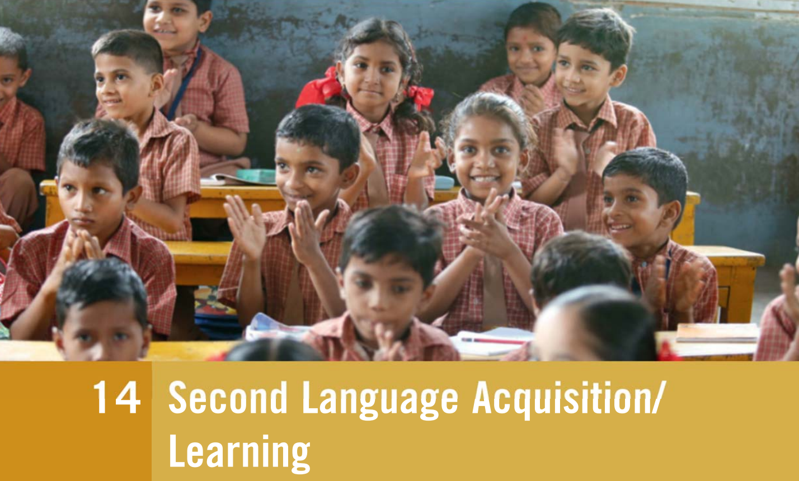
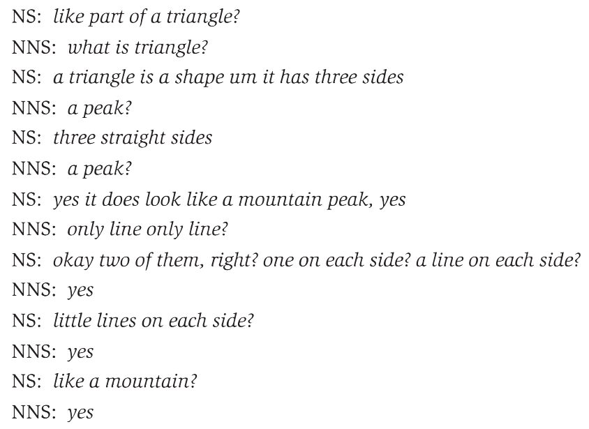

# Second Language Acquisition

## 1 概述

有些儿童成长于使用不止一种语言的社会环境中，并在以类似习得母语的方式习得二语。对于其他大多数人而言，接触二语往往在儿童时期以后。尽管经过多年的学习，也难以达到母语的水准。本章，我们将介绍二语习得。

以下是本章中出现的部分语言学术语。

| 英文                       | 中文         | 英文                    | 中文       |
| -------------------------- | ------------ | ----------------------- | ---------- |
| acquisition                | 习得         | learning                | 学习       |
| grammar-translation method | 语法翻译法   | audiolingual method     | 听说法     |
| communicative approach     | 交际法       | transfer                | 迁移       |
| positive transfer          | 正迁移       | negative transfer       | 负迁移     |
| interlanguage              | 中介语       | fossilization           | 僵化       |
| motivation                 | 动机         | instrumental motivation | 工具型动机 |
| integrative motivation     | 融入型动机   | task-based learning     | 任务型学习 |
| input                      | 输入         | negotiated input        | 协商输入   |
| foreigner talk             | 外国人语言   | output                  | 输出       |
| communicative competence   | 交际能力     | grammatical competence  | 语法能力   |
| sociolinguistic competence | 社会语言能力 | strategic competence    | 策略能力   |

## 2 二语习得

语言的学习像是一个谜团。不同于其它知识系统，我们二三岁时要比十三岁或三十岁时更容易学习语言。人们给出了若干理由来说明这一现象，也提出了多种不同的方法来帮助学习者在使用外语或二语 (second language，L2) 交流时能像使用其母语 (first language，L1) 那样高效。

有时会区分外语环境下的学习 (学习周围人们一般不使用的语言) 与二语环境下的学习 (学习周围人们使用的语言) 。例如，在日本英语课堂上的日本学生是在学习作为外语的英语 (English as a foreign language，EFL) 。而如果这批日本学生在美国的英语课堂上，则是在学习作为二语的英语 (English as a second language，ESL) 。不过，无论在哪种情况下，他们都是在学习另一门语言。因此二语学习 (second language learning) 这个术语通常用来描述这两种情况。

### 2.1 习得与学习

相比之下，**习得 (acquisition)** 与**学习 (learning)** 的区别更重要。习得指的是通过自然地与其他语言使用者交流，逐步发展语言能力的过程。习得一般不需要老师，也不需要关注习得知识的细节。相对而言，学习则是一个更有意识的过程，指的是通过分析词汇、语法等语言特征来积累知识。这通常发生在教学机构中并需要老师参与。

传统上，与学习相关的活动被用于学校里的二语教学。它们往往会使学生们获得关于该语言的知识，而不是流利交流的能力。而与习得相关的活动则是儿童时期所经历的，即在长时间与母语者的互动中不断使用该语言。这种差异有时也可以看作是不同的学习风格：
- 分析法 (analytic approach) ，即更偏向于学习 (learning) 的方式。
- 整体法 (holistic approach) ，即更偏向于习得 (acqusition) 的方式。

并且，后者往往更能发展出全面熟练的语言能力。

### 2.2 习得障碍

对于大多数人而言，接触二语的经历与接触母语的经历有着根本的不同，存在许多阻碍习得的因素。

- 他们通常在青少年或成年时接触二语，且每周只有几个小时在学校的时间能使用。
- 他们有许多其它事情要做。相反，儿童的空余时间则很多。
- 他们已经对母语的声音和结构形成了无意识的依赖。
- 母语已经满足了大部分日常交流的需求。

当然，仍有部分人能够克服这些困难，并发展出高效使用二语的能力。

然而，即使在理想的习得环境中，似乎也很少有成年人的二语能力能达到母语水平。有些人在书面表达上可以达到很高的水平，但在口语方面却存在欠缺。二语的一些特征，如词汇和语法，可能比发音等特征更容易学习。如果儿童时期缺乏二语发音和语调方面的练习，即使是高度熟练的成年学习者也可能会带有口音。

### 2.3 年龄因素

语言习得的关键期 (大约在青春期时) 过去之后，完全习得另一门语言将变得非常困难。这可能是因为我们内在的语言能力已经被母语的特征占据，导致难以再接收一门新的语言。母语对发音的影响尤为明显。

反对者则指出，青少年在课堂上学习二语要比儿童更高效。这可能是因为高效学习二语受多种因素影响。最佳学习年龄可能是在大约十岁到十六岁之间。此时，我们内在语言能力的灵活性尚未完全丧失，同时认知的成熟让我们能对二语的特征进行更有效的分析。

### 2.4 情感因素

即便处于上面提到的最佳时期，由于青少年往往比儿童有更强的自我意识，仍存在许多习得阻碍。

- 尝试发出另一门语言的声音可能会引起尴尬或抵制的情绪，从而压抑其生理和认知上学习语言的能力。
- 对二语背后的文化可能缺乏认同或共鸣，比如"我是A国人，为什么要听起来像B国人？"。
- 教科书太枯燥，课堂氛围不愉快，其它科目的学习很繁重。

## 3 关注教学方法

尽管存在诸多障碍，二语教学的需求依然催生了各种方法和手段。

### 3.1 语法翻译法

最传统的方法是照搬其它学科的教学方式。以词汇和语法为学习目标，鼓励记忆，并更注重书面语而非口语。这种方法起源于传统的拉丁语教学，称为**语法翻译法 (grammar-translation method)** 。该方法往往让学生对如何在日常对话中使用该语言知之甚少

### 3.2 听说法

**听说法 (audiolingual method)** 则更强调口语，于二十世纪中期开始流行。该方法会从简单到复杂系统地呈现二语的结构，并要求学生反复练习。该方法的理念为语言本质上是一种可以通过大量练习形成的习惯。例如，在语言实验室里花费数小时重复口语对话练习。该方法的变体仍用于当今的语言教学。但也有人指出，孤立的语言练习与实际的口语互动之间缺乏相似之处，还会很枯燥无趣。

### 3.3 交际法

**交际法 (communicative approaches)** 则与上述两种方法的理念不同。它强调语言的实用性而非语言的形式或结构。基于该方法的课堂可能会以"asking for things"等社会环境为主题开展。更进阶的例子则包括医学英语 (English for medicine) 和商务日语 (Japanese for business) 。

## 4 关注学习者

近年来，二语研究领域的关注点从教师、教材和方法转向学习者和习得过程。例如，大多数交际法的一个特点是容忍学生使用语言时犯错。传统上，犯错被视为负面行为，必须避免或消除。而近年对学习者使用二语时犯错的接受程度在逐渐提高。

犯错不会阻碍学生的进步，而可能是学生在尝试用新语言交流时取进展的线索。正如儿童在习得母语时会犯语法错误，二语学习者也会犯类似的错误。例如"womens"可视为一种对复数-s的过度延伸 (overextension) 。

### 4.1 迁移

有些错误可能是由于**迁移 (transfer)** 所致。迁移是指在使用二语时采用母语中的发音、表达或结构。如果母语和二语有相似的特征，那么学习者可能会从**正迁移 (positive transfer)** 中受益。另一方面，若将与二语完全不同的母语特征迁移则会导致**负迁移 (negative transfer)** ，使得二语表达难以理解。当母语和二语是完全不同类型的语言时，负迁移对交流影响会更大。例如，中国人比德国人更难精通英语。此外，负迁移在二语学习的早期阶段较为常见，随着学习者熟练程度的提高而减少。

### 4.2 中介语

二语学习者产生的语言包含大量似乎与母语或二语形式上无关的错误，即一些既不属于母语，也不属于二语的表达方式。证据表明，在二语习得过程中存在一个中间系统。它具有母语和二语的某些特点，但却是一个具有自身规则的内在可变系统。该系统称为**中介语 (interlangauge)** ，并被认为是所有二语产出的基础。

某些学习者可能会发展出一些固定的二语表达方式，其中包含许多与正确二语不匹配的表达。他们甚至会就此停滞不前。此时，可以认为其中介语已经**僵化 (fossilization)** 。发音的僵化被认为是导致外国人口音的最可能原因。

### 4.3 动机

**动机 (motivation)** 是许多二语学习者成功的关键因素。许多学习者有**工具型动机 (instrumental motivation)** ，即他们学习二语是为了达到其它目标，例如完成毕业要求或能够阅读科学出版物。但他们往往并不打算参与到使用二语的社交中。相比之下，有些学习者则有**融入型动机 (integrative motivation)** 。他们以社交为目的学习二语，并参与使用该语言的社交活动中。

值得注意的是，那些在二语交流中取得成功的人往往也是最具学习动机的。可见，动机可能是成功的原因和结果。鼓励学习者尝试使用二语进行交流的语言学习环境必然要比死磕纠错和追求完美的环境更高效。

### 4.4 输入和输出

**输入 (input)** 指的是学习者接触到的语言。只有可理解的输入才能促进学习者进步，因为我们无法处理不可理解的内容。使用更简单的词汇和结构能让输入变得可理解。例如，英语母语者可能会问国际学生"How are you getting on in your studies?"，如果对方没听懂，则可能会改问"English class, you like it?"。这种**外国人语言 (foreigner talk)** 不仅有利于即时交流，还能以输入的形式为二语学习者提供可理解的二语使用范例。

然而，随着学习者中介语的发展，他们将需要更多的互动和**协商输入 (negotiated input)** 。协商输入是学习者在注意力高度集中时，试图描述清楚自己的诉求时获得的输入。例如下面关于单词"triangle"的对话中，英语非母语者 (non-native speaker，NNS) 正在和母语者 (native speaker) 协商单词的意义。 

在这种互动中，二语学习者不仅能通过听母语者讲话获得输入，还能通过自己说来产生**输出 (output)** 。产生可理解的输出是二语学习者进步的另一重要因素，但同时也是大班课堂上最难提供的。

### 4.5 任务型学习

**任务型学习 (task-based learning)** 指的是创建不同类型的任务和活动，让学习者们以配对或小组的形式互动，参与问路、购物等任务中的方案。过程中，学习者们具有明确的目标，注重阐明自己的想法，从而提高其二语语言能力，尤其是流利度。该方法的目标不是让学习者更多了解更多关于二语的知识，而是让他们发展出使用二语的交际能力。

## 5 交际能力

**交际能力 (communicative competence)** 是指准确、恰当和灵活使用语言的综合能力。第一个组成部分是**语法能力 (grammatical competence)** 。这涉及到词汇和结构的准确使用。然而，仅专注于语法能力不会使学习者具备恰当理解或表达的能力。

第二个组成部分是使用恰当语言的能力，称为**社会语言能力 (sociolinguistic competence)** 。它使学习者知道在何种社会情境下说"Can I have some water?"而不是"Give me some water!"。如果学习者要发展社会语言能力，则需要熟悉二语所在文化中语用 (pragmatics) 方面的内容。

第三个组成部分称为**策略能力 (strategic competence)** 。在使用二语时，学习者不可避免地会遇到在难以描述自己意图的情形。部分学习者可能会就此放弃，而另一部分学习者则会尝试使用交际策略 (communication strategy) 来表达自己的想法。例如，一位荷兰语的学习者想在英语中说"een hoefijzer"，但不知道其对应英语单词。他会使用已经知道的词汇和沟通策略，改说"the things that horses wear under their feet, the iron things"。此时，听者能立刻明白他指的是马蹄铁。这种灵活性是交际成功的关键因素。

## 6 总结

本章主要介绍了二语习得。包括习得与学习的区别、阻碍习得二语的因素、教学方法的发展和影响学习者进步的因素。总的来看，偏科和闭门造车都难以帮助我们掌握综合的二语能力。最有效。同时最难实现的方式是创造使用二语交流互动的情景或环境。

## 参考

[Yule, G. (2020). *The Study of Language* (7th ed.). Cambridge: Cambridge University Press. doi:10.1017/9781108582889](https://www.cambridge.org/highereducation/books/study-of-language/433B949839A5A6F915EC185657564B16#overview)
