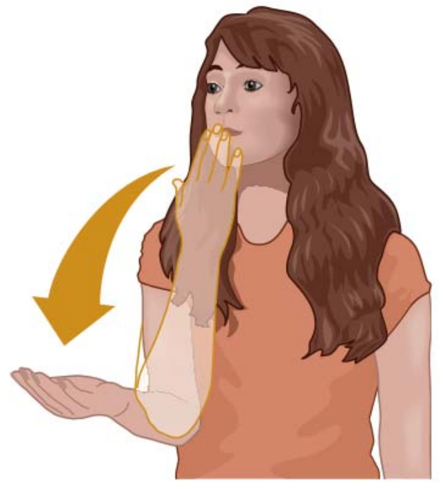
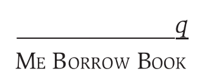

# Gestures and Sign Languages

## 1 概述

谈及语言习得时，我们通常认为大多数孩子学会的是说话。但这并不是习得母语的唯一途径。聋人群体的孩子们也能习得**手语 (sign language)** 。其中在美国，美国手语 (American Sign Language, ASL) 的使用者有五十到二百万之多。

以下是本章中出现的部分语言学术语。

| 英文                    | 中文       | 英文                    | 中文       |
| ----------------------- | ---------- | ----------------------- | ---------- |
| sign language           | 手语       | iconics                 | 意向性手势 |
| deictics                | 指示性手势 | beats                   | 节拍性手势 |
| alternate sign language | 替代手语   | primary sign langauge   | 主要授手语 |
| oralism                 | 口语法     | articulatory parameters | 发音参数   |

## 2 手势

虽然手语手势 (sign) 和普通手势 (gestures) 都会用到用手以及其他身体部位，但二者却有很大的不同。手语手势能顶替口语作为交流方式；而普通手势大多用于说话时辅助表达。例如试图描述拧瓶盖时，手会做旋转的动作。普通手势只是辅助达意的一种方式，在说话 (speaking) 和 打手语 (signing) 中都能观察到。

此外，在研究非语言 (non-verbal) 行为时，还要区分普通手势和象征符号手势 (emblems) 。象征符号手势承载着某种社会语境下约定俗成的含义。例如在英国，食指和中指竖起比出"V"字形时，手背朝向自己表示胜利；手背朝向他人则表示侮辱。

### 2.1 意象性手势

**意象性手势 (iconics)** 是在一定程度上与说话内容呼应的手势。它传递的意义和言语内容并不完全相同，但能增加一些意义。例如说"我在找一个小盒子"时会在空中用手指画出一个方形。

### 2.2 指示性手势

**指示性手势 (deictics)** 是能在特定语境下指向某物的手势。例如用手指着放有蛋糕的桌子问对方"要来点蛋糕吗？"之后待蛋糕吃完后又可以再次指着桌子说"蛋糕真好吃"。

### 2.3 节拍性手势

**节拍性手势 (beats)** 是伴随着讲话节奏的短促手部动作。它们通常用于强调说话的某段内容，或表示说话人从描述事件切换到发表评论。

> **NOTE**
> 首先想到的就是特朗普。

## 3 手语的类型

手语可分为**替代手语 (alternate sign language)** 和**主要手语 (primary sign langauge)** 。

替代手语是在特定情境中用于交流的手部信号系统，通常在无法使用口语的情况下使用。例如在一些宗教场所中，修道士会在静默期间使用替代手语交流。

主要手语是不使用口语群体的第一语言。例如英国手语 (British Sign Langauge, BSL) 用于英国聋人社区。不同的主要手语之间并不通用。英国手语与美国手语的差距差异较大。

## 4 口语法

直到19世纪60年代，美国手语才被视为一种自然语言。在20世纪的大部分时间里，**口语法 (oralism)** 主导了聋人教学。许多教师认为使用手语会阻碍聋儿学习英语，因而推行一种以英语口语和唇读 (lip-reading) 训练为主的教学方法。然而，这种方法收效甚微，仅有不到10%的学生清晰地说英语，仅有约4%学会了唇读。

与此同时，美国手语的使用却在蓬勃发展。许多聋儿从同龄人那学会了手语。由于大部分聋儿的父母是健听人，美国手语的传承实际上主要通过孩子之间的交流实现。

## 5 手语英语

近年来，聋人教育发生了重大变化。虽仍注重英语学习，但主要是书面英语而非口语英语。**手语英语 (Signed English)** 或手动编码英语 (Manually Coded English, MCE) 本质上是一种运用手部信号表达英语的系统。这些信号与英语句子中的单词对应，并遵循英语的词序。手语英语的设计是为了促进聋人与健听人群体之间的交流。

于聋儿的健听父母而言，学习这套系统的难度较低，还提供了一种可以与孩子有效交流的方式。教师们也能在授课中一边说英语一边打手语英语。对翻译人员而言，口语英语和手语英语的翻译更容易。同样地，聋人也更喜欢翻译人员使用手语英语，因为能更准确的理解信息。

## 6 手语的结构

使用美国手语时，手语者会运用四种**发音参数 ( articulatory parameters)** ：形状 (shape) 、方向 (orientation) 、位置 (location) 和动作 (movement) 。下图展示了美国手语中的"谢谢"。

### 6.1 形状

形状可能会依据使用的手指、手指的屈伸情况以及手的总体配置 (configuration) 而有所不同。"谢谢"的例子中，手的配置是"平手"，而不是"握拳"等。

### 6.2 方向

在表示"谢谢"时，手的方向是"手掌向上"。表示其他意思时，手的方向可能会有多种变化。例如表示"我的"时会使用的"平手，手掌朝向自己"的形式。

### 6.3 位置

每个手势都有与使用者头部和身体之间的相对位置。在"谢谢"中，手势从嘴附近开始，并在胸部结束。有些手势只能通过位置来区分。例如"夏天"在眼睛上方，"丑"在眼睛下方，而形状、方向和动作都相同。在一些双手手势中，还会出现一只手作为底座，另一只手在其上方移动的情况。

### 6.4 动作

"谢谢"中的动作是"向外且向下"朝向接受者。手势动作的快慢差异也会影响意义。例如某个手势慢速做表示"垂危"，而快速做则表示"死亡"。

### 6.5 面部表情与手语拼写

手语借助视觉媒介传递信息，因而很难在纸面上用语言准确地描述。有学者指出书写美国手语的唯一方式是使用动态影像。非手部动作，如头部、眼部运动以及面部表情都在手语中起着重要作用。例如表达"谢谢"时会配合点头和微笑的面部表情。

当遇到新词语时，使用者会用手指拼写。这是一种用于表示字母的手势系统。大多数手势位于颈部和头部周围。如果手势位于胸部或腰部附近，则通常是一个双手手势。

可见，视觉信息的一个关键特征是可以同时包含多种独立元素。口语的产生是线性的。而在视觉媒介中，多种成分则可以同时产生。

## 7 手势的表示

转写这种视觉信息的一大难点在于如何融入面部表情等信息。一种方案是用首字母大写的单词表示手势表达的信息，然后在其上方添加信息指示面部表情的性质和程度。如下图所示，"q"表示"扬起眉毛，睁大眼睛，前倾头部"的面部表情。这段转录文本可以翻译成"我可以借这本书吗？"

## 8 手势的意义

美国手语的手势有时会被误以为是简单的视觉表征或画面，而这种语言也被认为由一组有限的简单手势组成。

有趣的是，即便是不美国手语的使用者，当得知某个手势指代的事物时，我们有时也能建立手势和所指代事物之间的象征性 (symbolic) 联系。例如，"谢谢"的手势可以认为是"感谢"这一动作的象征。

然而大多数时候，我们会很难理解手势的意义，甚至无法在流利的手语中辨识出单独的手势。大部分日常使用的手势并不基于辨识象征性画面，而是基于辨识具有任意状态的语言形式。

上图中的手势中，手指交叉在胸前旋转。作为非美国手语使用者，我们可能会对其含义有不同的联想：
- 旗帜上的条纹
- 混合食材的锅
- 汇聚在一起

或许有手语使用者会用它表示"美国"。但这并不代表该使用者在看到该手势时会联想到上面的三种场景。手语系统中每种手势有其内部意义，而不是通过参考某个画面获得的。

> **NOTE**
> 这部分原书说的有点绕，不太好翻译。我个人理解是，作为非手语使用者，我们在接触到某种手势与其背后的含义时，会倾向于寻找手势动作与含义之间的象征性联系。但手语系统可能并不是基于这一原则建立的。手语使用者在做出或看到某个手势时，也不会通过联想某个画面来表达或理解意思。这或许是人类语言任意性的体现。

## 9 手语作为自然语言

从语言学的视角来看，口语中的一些特征都能在手语中有对应物，如第二章中具备人类语言的所有特征（自反性、移位性、任意性、传承性、生产性和二元性），也有类似音系、形态、句法的特征。例如美国手语的语序和英语一样是SVO，但形容词又类似法语会置于名词之后。

尽管遭受偏见、误解和糟糕的教学方法，美国手语的主要手语依旧展现强大的生命力。它们例证了人类天生就会使用语言，且每代人都会重新创造属于所在群体的语言。

## 10 总结

本章主要介绍了手势和手语。手势和手语都有分类。许多聋人群体以手语为母语交流。其使用的手语手势能顶替"说"的功能。而它们使用的手语也称为主要手语。手语的教学方法也类似于二语习得经历了许多阶段，逐渐被各方接受。以美国手语为例，手势依据其形状、方向、位置和动作这四个参数而具有不同含义。同时面部表情等因素也会影响表意。手语作为一种自然语言，具有与口语相仿的语言学特征。

> **NOTE**
>
> [线索语 (cued speech)](https://en.wikipedia.org/wiki/Cued_speech)也是一种在聋人群体中使用的视觉交流系统。与手语类似，它也会用到许多手部动作。但它并不是独立的语言系统，而是基于口语的。例如用某种动作表示某个音素。

## 参考

[Yule, G. (2020). *The Study of Language* (7th ed.). Cambridge: Cambridge University Press. doi:10.1017/9781108582889](https://www.cambridge.org/highereducation/books/study-of-language/433B949839A5A6F915EC185657564B16#overview)