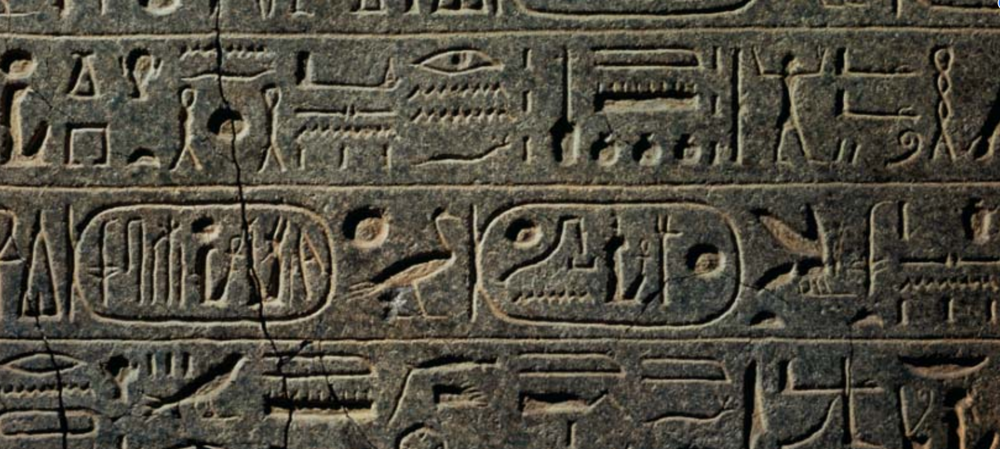
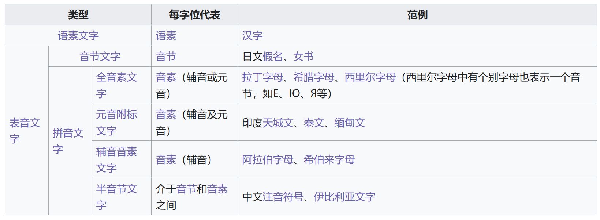

# Written Language

## 1 概述

前几章中，我们从口语 (spoken language) 的角度认识了语言习得的过程。本章，我们将了解书面语 (wrritten language) 。

> **NOTE**
>
> 原书中作者举了很多例子来帮助理解一些术语和概念，但有些很罕见的符号笔者没能找到就只能略过。本章中许多术语翻译也比较模糊暧昧，于是贴出了很多维基百科词条的一部分作为参考。因此**请读者对本文的一切内容保持谨慎**，如有谬误还望指正。强烈建议读者先看一遍原书。

以下是本章中出现的部分语言学术语。

| 英文      | 中文     | 英文      | 中文       |
| --------- | -------- | --------- | ---------- |
| pictogram | 象形文字 | phonogram | 表音文字   |
| ideogram  | 表意文字 | syllabary | 音节文字   |
| logogram  | 语素文字 | alphabet  | 全音素文字 |

## 2 文字

文字 (writing) 可定义为运用图形符号的语言象征表示。与言语 (speech) 不同，文字系统并不能习得，而需要刻意持续学习才能掌握。此外，并非所有语言都有文字形式。

纵观人类文明发展，文字实际上是相对近期的现象。早期人类试图以视觉方式记录信息的行为至少可以追溯到2万年前的洞穴壁画 (cave drawings) 或1万年前用于记账的泥牌 (clay tokens)。但这些人造物只能算是文字的前身。最早的文字系统是约5千年前刻于泥板上的**楔形文字 (cuneiform)** 。约3千年前出现铭文 (inscription) 的使用。铭文文字系统与现在的文字系统有着明显的联系。借助它们能追溯某种文字系统在几千年之间的发展历程。

### 3.1 象形文字

洞穴壁画虽然能用于记录某些事物，但一般不被视作具体的语言信息，而是一种绘画艺术 (pictorial art) 。

如果某些图画 (pictures) 始终表示特定的图像 (images) ，那么它们就称为**象形文字 (pictograms, picture-writing)** 。下图展示了一些现代的象形文字。不论处在哪种语言环境下都有着一致的含义。

> **NOTE**
>
> 维基百科对象形文字定义如下：
>
> A **pictogram** (also **pictogramme**, **pictograph**, or simply **picto**[[1\]](https://en.wikipedia.org/wiki/Pictogram#cite_note-1)) is a graphical [symbol](https://en.wikipedia.org/wiki/Symbol) that conveys meaning through its visual resemblance to a physical object. Pictograms are used in systems of writing and visual communication. A pictography is a [writing system](https://en.wikipedia.org/wiki/Writing_system)[[2\]](https://en.wikipedia.org/wiki/Pictogram#cite_note-2) which uses pictograms. 

### 3.2 表意文字

上面展示的图像侧重于反映物体真实的物理形状，但我们在解读时通常会联想到其他事物。例如看到杯子时会联想到杯中所盛之物，甚至想到与之搭配食用的甜点。换言之，看到这些图像时，我们不会将其解读为物体 (objects) ，而是象征该物体的符号 (symbols) 。并且这种符号关联的含义还可能与物体本身没有直接联系。

例如早期人们会使用符号"☼"指代"太阳"。随着时间推移，这个图画发展为更加固定的形式，如"⊙"。并且，其含义从"太阳"延申至"热"和"白天"，即符号从表示可见的物体转变为表示抽象的概念。那么，这样的符号可视为**表意文字 (ideograms, idea-writing)** 的一部分。

象形文字和表意文字的本质区别在于符号与其表示事物之间的联系：更具图画性质的是象形文字；更为抽象的则是表意文字。此外，二者一个相同的关键性质是都不代表某个单词或者读音。下图展示了"狗不得入内"的标识。其中狗的图画是象形文字，而红圈与斜杠组成的图画则是"不允许"这一概念的表意文字。

许多文字系统中的符号是象形或表意的。埃及圣书文 (Egyptian hieroglyphics) 系统使用符号"𓉐"表示房子，源于房屋平面图。中文字符"川"用于表示河流，源于河水在两岸之间流动的图画。要注意，二者并不是房子或河流的图画。它们比图画更抽象。实际上，当人们为某个文字系统创造符号时，都与真实的物理世界拉开了一段距离。

> **NOTE**
>
> 维基百科对表意文字的定义如下：
>
> An **ideogram** or **ideograph** is a [symbol](https://en.wikipedia.org/wiki/Symbol) that represents an [idea](https://en.wikipedia.org/wiki/Idea) or concept **independent of any particular language.** Some ideograms are more arbitrary than others: some are only meaningful assuming preexisting familiarity with some convention; others more directly resemble their [signifieds](https://en.wikipedia.org/wiki/Signified). Ideograms that represent physical objects by visually resembling them are called *[pictograms](https://en.wikipedia.org/wiki/Pictogram)*.
>
> - [Numerals](https://en.wikipedia.org/wiki/Numeral_system) and [mathematical symbols](https://en.wikipedia.org/wiki/List_of_mathematical_symbols) are ideograms, for example ⟨1⟩ 'one', ⟨2⟩ 'two', ⟨+⟩ 'plus', and ⟨=⟩ 'equals'.
>
> - The [ampersand](https://en.wikipedia.org/wiki/Ampersand) ⟨&⟩ is used in many languages to represent the word *and*, originally a stylized [ligature](https://en.wikipedia.org/wiki/Ligature_(writing)) of the [Latin](https://en.wikipedia.org/wiki/Latin) word *et*.
> - Other typographical examples include ⟨§⟩ 'section', ⟨€⟩ 'euro', ⟨£⟩ 'pound sterling', and ⟨©⟩ 'copyright'.
>
> Ideograms are not to be equated with [logograms](https://en.wikipedia.org/wiki/Logogram), which represent specific [morphemes](https://en.wikipedia.org/wiki/Morpheme) in a language. In a broad sense, ideograms may form part of a writing system otherwise based on other principles, like the examples above in the [phonetic](https://en.wikipedia.org/wiki/Phonetic) English writing system—while also potentially representing the same idea across several languages, as they do not correspond to a specific spoken word. There may not always be a single way to read a given ideograph. While remaining logograms assigned to morphemes, specific [Chinese characters](https://en.wikipedia.org/wiki/Chinese_characters) like ⟨中⟩ 'middle' may be classified as ideographs in a narrower sense, given their origin and visual structure.

### 3.3 语素文字

当符号和其表示实体之间的关系足够抽象时，其很可能在某种语言中表示一个单词。此时，称这些符号属于**语素文字 (logograms, word-writing)** 。

语素文字的早期案例之一是苏美尔人 (Sumerians) 使用的文字系统。约五千年前，苏美尔人生活在美索不达米亚 (Mesopotamia) 地区。其文字系统称为楔形文字 (cuneiform) ，指用楔形工具按压在软泥板上，待泥板干燥后留下永久性符号的文字，如"𒅴𒂠"。这种形式的符号让我们难以知道其指代的事物是什么，即文字与指代对象之间的关系是任意的。

> **NOTE**
>
> [一个利用神经网络翻译楔形文字的项目](https://github.com/praeclarum/CuneiformTranslators)

> **NOTE**
>
> [苏美尔楔形文字](https://en.wikipedia.org/wiki/Sumerian_language)和[古波斯楔形文字](https://en.wikipedia.org/wiki/Old_Persian_(Unicode_block))不同。二者的楔形文字在Unicode中也对应不同的编码。

现代英语中也有一些语素文字。每个符号代表一个单词。

| 语素文字 | 单词   | 语素文字 | 单词 |
| -------- | ------ | -------- | ---- |
| $        | dollar | &        | and  |
| 8        | eight  | @        | at   |

汉字是现今世界上唯一广泛使用的语素文字。许多汉字表示词或词的一部分。这种系统的一个优势在于，不同方言的汉语使用者仍然能够阅读同一文本。这种文字系统的主要缺点是需要大量不同的符号，加重了使用者的记忆负担。而其他大多数文字系统的发展则是由语素文字向表音文字演变。

> **NOTE**
>
> 维基百科对语素文字的定义如下：
>
> In a [written language](https://en.wikipedia.org/wiki/Written_language), a **logogram** (from [Ancient Greek](https://en.wikipedia.org/wiki/Ancient_Greek) *logos* 'word', and *gramma* 'that which is drawn or written'), also **logograph** or **lexigraph**, is a [written character](https://en.wikipedia.org/wiki/Written_character) that represents a [semantic](https://en.wikipedia.org/wiki/Semantic) component of a language, such as a [word](https://en.wikipedia.org/wiki/Word) or [morpheme](https://en.wikipedia.org/wiki/Morpheme). [Chinese characters](https://en.wikipedia.org/wiki/Chinese_characters) as used in [Chinese](https://en.wikipedia.org/wiki/Written_Chinese) as well as other languages are logograms, as are [Egyptian hieroglyphs](https://en.wikipedia.org/wiki/Egyptian_hieroglyphs) and characters in [cuneiform script](https://en.wikipedia.org/wiki/Cuneiform_script). 
>
> A [writing system](https://en.wikipedia.org/wiki/Writing_system) that primarily uses logograms is called a *logography*. Non-logographic writing systems, such as [alphabets](https://en.wikipedia.org/wiki/Alphabet) and [syllabaries](https://en.wikipedia.org/wiki/Syllabaries), are *phonemic*: their individual symbols represent sounds directly and lack any inherent meaning. However, all known logographies have some phonetic component, generally based on the [rebus principle](https://en.wikipedia.org/wiki/Rebus_principle), and the addition of a phonetic component to pure [ideographs](https://en.wikipedia.org/wiki/Ideographs) is considered to be a key innovation in enabling the writing system to adequately encode human language.

> **NOTE**
>
> 汉字有六种造字方法，称为六书。借此或许能更好地理解本章中的一些概念。
>
> - 象形 (pictograms) ：用图画描述物理世界的事物，如"日"、"月"。
> - 指事 (ideograms) ：用符号描述抽象的概念，如"上"、"下"。
> - 会意 (compound ideograms) ：由两个及以上的象形字或指事字构成，如"采"由"爪"和"木"复合而成。
> - 形声 (phono-semantic compounds) ：由表意的形符和表音的声符构成，如"例"由形符"人"和声符"列"复合而成。然而，极多形声字，声符同时兼有形符的作用，形声与会意（甚至象形）不分。如"趾"中的"止"不仅是声符，还是象形的形符。
> - 转注 (derivative cognates) ：本是可以互换的字，但随着语言发展开始代表不同的事物，如"老"和"考"。转注分为形转、义转和音转。
> - 假借 (rebus) ：即同音替代。口语中有的词语没有相应的文字。于是借用另一个同音但与本义不相关的字来表示，如"自"本来是"鼻"的象形字，后来借作"自己"的"自"。
>
> 详见[维基百科](https://zh.wikipedia.org/wiki/%E5%85%AD%E6%9B%B8)。

> **NOTE**
>
> 汉字是语素文字，Unicode中对汉字的统一编码却称为[中日韩统一表意文字 (CJK Unified Ideograph) ](https://zh.wikipedia.org/wiki/%E4%B8%AD%E6%97%A5%E9%9F%93%E7%B5%B1%E4%B8%80%E8%A1%A8%E6%84%8F%E6%96%87%E5%AD%97)。
>
> 另外，[维基百科中语素文字的词条](https://zh.wikipedia.org/wiki/%E8%AF%AD%E7%B4%A0%E6%96%87%E5%AD%97)中给出了语素文字与象形文字和表意文字之间的区别。
>
> - 语素文字是用来记录语言的文字，和语言有严格的对应关系。一般而言语素文字可以分解为[字位 (grapheme) ](https://zh.wikipedia.org/wiki/字位)，一个字位代表一个[语素 (morpheme) ](https://zh.wikipedia.org/wiki/语素)。与语素文字不同，象形文字只是用图画来表示物体，表意文字只是表达一种意思。二者都不一定用来记录语言。比如禁烟的标志可以看成表意文字，但不是语素文字。
> - 目前已知的语素文字都不局限于表形和表意，而是有表音的成分。因此，语素文字也称为意音文字。语素文字的出现代表人类文字史走出原始时期，进入古典时期。注意"意音文字"和汉字中的"形声字"是不同的概念。任何汉字，无论是否形声字，都是意音文字系统的字位，因为它在特定的方言里都有确定的一个或几个读音。

### 3.4 表音文字

从象形文字到语素文字的演变过程中，有些符号因为发音相似而用于不同单词。例如，一个箭头符号最初被用来表示"箭" (ti) 这个词。后因为发音相似，又被用于表示更抽象的概念""生命" (ti) 。在此过程中，符号用于表示词的发音，属于**表音文字 (phonograms, phonographic writing)** 。

> **NOTE**
>
> 维基百科对表音文字的定义如下：
>
> A **phonogram** is a [grapheme](https://en.wikipedia.org/wiki/Grapheme) i.e. one or more written characters which represent a [phoneme](https://en.wikipedia.org/wiki/Phoneme) (speech sound),[[1\]](https://en.wikipedia.org/wiki/Phonogram_(linguistics)#cite_note-1) rather than a bigger linguistic unit such as [morphemes](https://en.wikipedia.org/wiki/Morpheme) or words.

这种使用现成符号来表示单词发音的方式称为**画谜原则 (rebus principle)** 。在此过程中，用于表示某种实体的符号被拿来作为指代该实体单词发音的符号。并且，该符号随后被用于任何出现这种发音的词语中。

以英语词语"eye"的发音为例。假设最初使用象形文字"👁"表示眼睛，后来可能演变成了语素文字"⬭"且发音和"eye"一样。基于画迷原则，你可以使用"⬭"表示"I"。

类似地，现代英语会使用符号"2"代表发音/tu/，"8"代表发音/eɪt/，"c"代表发音/si/，"u"代表发音/ju/。由此，"nd2spk2u2nite"表示"need to speak to you tonight"，"cul8r"表示"see you later"。

可见，在这些过程中，一个符号能够在不同的单词中使用，大大减少了该语言系统中符号的数目。

### 3.5 音节文字

当一种文字系统使用一组符号，其中每个符号表示一种音节的发音时，该文字系统就称为**音节文字 (syllabary, syllabic writing)** 。

> **NOTE**
>
> 维基百科对音节文字的定义如下：
>
> In the [linguistic](https://en.wikipedia.org/wiki/Linguistics) study of [written languages](https://en.wikipedia.org/wiki/Written_language), a **syllabary** is a set of [written symbols](https://en.wikipedia.org/wiki/Grapheme) that represent the [syllables](https://en.wikipedia.org/wiki/Syllable) or (more frequently) [moras](https://en.wikipedia.org/wiki/Mora_(linguistics)) which make up [words](https://en.wikipedia.org/wiki/Word).

现今世界上没有还在使用的纯粹音节文字系统。现代日文可以用一组单独的符号，即假名，来表示口语的音节。因此日文部分拥有音节文字系统 。

> **NOTE**
>
> 现代日文不是纯粹的音节文字系统的原因之一是汉字还在日文中广泛使用。
>

十九世纪早期，住在北卡罗来纳州的切诺基人Sequoyah发明了一种音节文字系统。该系统在切诺基社区内广泛使用，用于通过书面文字传达口语内容。社区内的人们称这种书面文字为"会说话的树叶"。在下面的切诺基语例子中可以看到，每个符号都不对应单一的辅音或元音 ，而是对应一个音节。

> **NOTE**
>
> 刚开始看到"会说话的树叶"时联想到了日文的「言葉」。不过后者指的是"话"、"语言"，并且「葉」似乎也并不是最初的表记。详细内容可参考[言の葉の由来](https://yohak-u.net/kotonoha/)。

### 3.6 拼音文字

**全音素文字 (alphabet)** 是一组文字符号，每个符号代表语言中的一种发音 (sound) 或音素 (phoneme) 。

> **NOTE**维基百科对全音素文字的定义如下：
>
> An **alphabet** is a standard set of [letters](https://en.wikipedia.org/wiki/Letter_(alphabet)) written to represent particular sounds in a spoken language. Specifically, letters largely correspond to *[phonemes](https://en.wikipedia.org/wiki/Phoneme)* as the smallest sound segments that can distinguish one word from another in a given language.[[1\]](https://en.wikipedia.org/wiki/Alphabet#cite_note-1)

在闪米特语族 (Semitic langauges) 文字 (如阿拉伯语和希伯来语) 主要由表示词中辅音的符号组成。而读者需要根据上下文来补充适当的元音。

> **NOTE**
>
> 想到了Python库[tqdm](https://github.com/tqdm/tqdm)就来源于阿拉伯语：
>
> `tqdm` derives from the Arabic word *taqaddum* (تقدّم) which can mean "progress," and is an abbreviation for "I love you so much" in Spanish (*te quiero demasiado*).
>
> 此外，英语中有时也能看到只保留单词辅音的写法。如 pnt (point)、src (source)、txt (text)、cmd (command) 。

这种文字系统有时称为**辅音音素文字 (consonantal alphabet)** 。早期的闪米特字母系统，起源于腓尼基人 (Phoenicians) 的文字系统，是大多数其他字母系统的基础。经过改良后，该文字系统传播到东方的伊朗、印度和东南亚，以及西方的希腊。最早的字母顺序"A-B-C-D..."大约在三千年前由腓尼基人创造，并仍作为现代许多场景的排序手段，例如字典、电话簿、成绩。

早期的希腊人更进一步，使用独立的符号来表示元音，创造了一个包含元音符号的字母系统。这一改变使腓尼基语的辅音字母"Aleph"变成了表示元音的符号"A" (alpha) ，并与表示辅音的符号，如"B" (beta) 结合，形成了单一音素的文字方式，完全实现了拼音文字 (alphabetic writing) 。

这种改良后的字母系统通过罗马人传播到西欧。于是，今天使用的英语文字系统称为罗马字母表 (Roman alphabet) 。另一条发展路线则将希腊字母系统带入东欧，在斯拉夫语 (Slavic langauges) 地区传播。经过修改后，形成了西里尔字母表 (Cyrillic alphabet)，成为如今俄语文字系统的基础。

如下图所示，现代欧洲字母中若干字母的实际形状可以追溯到埃及圣书文。它们经过腓尼基和希腊，最终演变为今天使用的罗马符号。

## 4 书面英语

虽然字母文字系统的起源的确是基于单个符号与单个音素之间的对应关系，但如今的英语却存在着许多文字和发音不一致的情形，如"you know"与发音/ju noʊ/。其他语言 (如意大利语、西班牙语) 的文字系统则更贴近于"一音一符"的原则。

再比如，英语中元音音素/i/在有多种拼写方式。如下表的前两列所示；而辅音音素/ʃ/的多种拼写方式，如下表中后两列所示。

#### 英语正字法

从上面的例子可以看到，英语的**正字法 (orthography)** 存在许多变化。一个音素经常由一个以上的字母来表示。部分原因是英语中有大量从其他语言借用的词汇，并保留了原有的拼写。例如，希腊语借词中，用"ph"来表示发音/f/，并体现在英语汇"alphabet"和"orthography"中上。这种两个字母固定表示一个音的组合叫做二合字母 (digraph) 。

英语文字系统在很宽泛的意义上属于字母文字系统。音素和符号表示之间的不规则对应有许多历史原因。书面英语的拼写基本定型于15世纪英格兰引入印刷术的时期。很多其他语言（主要是拉丁语和法语）的借词拼写规则得以固定。例如，"qu"替代了古英语中的"cw"用于拼写"queen"这样的词。此外，当时的很多印刷商都是弗拉芒人 (Flemish) 。他们并未严格遵循英语原有的发音习惯和拼写规则，导致一些单词拼写的改变，如"gast"变成了"ghost"。

更重要的是，自15世纪以来，英语口语的发音发生了显著变化。例如，尽管人们不再发单词开头的"k"音或词中的"gh"音，但仍保留这些字母作为拼写的一部分，如"knight"、"thought"。这些字母称为哑字母 (silent letters) 。此外，许多单词末尾中的"e"不仅违反了一个音素对应一个符号的规则，还会影响前面元音字母的发音，如"hat"与"hate"、"not"与"note"。

此外，16世纪的一些拼写改革者为了让一些词的拼写与其拉丁语源相符，重新创造了一些旧词的拼写，如"dette"变了"debt"、"doute"变成了"doubt"、"iland"变成了"island"。

## 5 总结

[维基百科](https://zh.wikipedia.org/wiki/%E6%96%87%E5%AD%97)对世界主要文字系统的分类如下图所示。

> **NOTE**
>
> 有关character、glyph、grapheme、ideogram、logogram、pictogram等概念的辨析，可参考[Stack Exchange](https://chinese.stackexchange.com/questions/44097/character-vs-glyph-vs-grapheme-morphogram-vs-ideogram-vs-logogram-vs-pictog)。

## 参考

[Yule, G. (2020). *The Study of Language* (7th ed.). Cambridge: Cambridge University Press. doi:10.1017/9781108582889](https://www.cambridge.org/highereducation/books/study-of-language/433B949839A5A6F915EC185657564B16#overview)