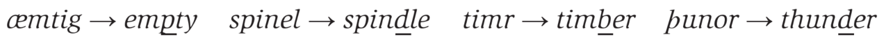

# Language History and Change

## 1 概述

> Fæder ure þu þe eart on heofonum,
> si þin nama gehalgod.
> Tobecume þin rice.
> Gewurþe þin willa on eorðan swa swa on heofonum.
> Urne gedæghwamlican hlaf syle us to dæg.
> And forgyf us ure gyltas,
> swa swa we forgyfað urum gyltendum.
> And ne gelæd þu us in costnunge,
> ac alys us of yfele.
>
> The Lord’s Prayer (c. 1000)

上面展示的是约一千年用Englisc语言撰写的《主祷文》（Lord's Prayer），与如今的英语有着很大区别。对语言历史与变化的研究称为**语文学（philology）**。

以下是本章中出现的部分语言学术语。

| 英文                | 中文       | 英文                               | 中文         |
| ------------------- | ---------- | ---------------------------------- | ------------ |
| philology           | 语文学     | family tree                        | 语言家谱树   |
| Proto-Indo-European | 原始印欧语 | Indo-European                      | 印欧语系     |
| language family     | 语系       | cognate                            | 同源词       |
| proto-language      | 祖语       | comparative reconstruction         | 对比重建     |
| majority principle  | 多数原则   | most natural development principle | 自然发展原则 |
| Great Vowel Shift   | 元音大推移 | external change                    | 外部变化     |
| internal change     | 内部变化   | metathesis                         | 音位变换     |
| epenthesis          | 插音       | prothesis                          | 词首增音     |

## 2 语言谱系树

在19世纪，语文学主导了语言研究，并提出了**语言家谱树（family trees）**的概念以展示语言之间的亲缘关系。

1786年，一位爵士的英国驻印度官员对梵语（Sanskrit）发表了如下看法：

> The Sanskrit language, whatever be its antiquity, is of a wonderful structure; more perfect than the Greek, more copious than the Latin, and more exquisitely refined than either, yet bearing to both of them a stronger affinity, both in the roots of verbs and in the forms of grammar, than could possibly have been produced by accident.
>
> 梵语，虽然年代久远，其结构都令人惊叹；它比希腊语更完美，比拉丁语更丰富，并且比二者都更加精致。然而，其在动词词根和语法形式上却与这两种语言有着很强的联系。这种联系显然不可能是偶然产生的。

他进一步指出：来自不同地理位置的语言必定有着共同的祖先。然而，这一共同祖先无法借助现存的任何文献描述，只能基于被认为是该语言的后代语言中相似的特征来假设。

## 2.1 印欧语系

在19世纪，学者们用**原始印欧语（Proto-Indo-European）**这一术语来描述印欧语系诸语的共同祖先。它是现代印度次大陆（Indian sub-continent, Indo）和欧洲（European）语言的原始形式（Proto）。下图展示了印欧语系家族树的一小部分分支。

**印欧语系（Indo-European）**是世界上使用人口最多、分布最广的**语系（language family）**。但它并不是唯一的语系。世界上大约有30个语系，每个语系包含大量不同的语言。世界上已知的语言有7000余种。其中许多都濒临灭绝，仅少数语言还在扩张。就母语使用者数量而言，中文拥有最多的母语人口（超过10亿），而西班牙语（超过4亿）和英语（超过3.3亿）在世界不同地区的使用范围更广。

现代意大利语和印地语似乎毫无共同之处，但上面的语言谱系图却告诉我们二者同属印欧语系。了解二者关系的方法之一是研究其早期语言，如拉丁语和梵语，并找出单词形式上的共同点。

**同源词（cognates）**指不同语言中原本来自一个共同**祖语（proto-language）**的一组词。一种语言中一个单词的同源词是另一种语言中具有相似形式和含义相同（或曾经相同）的单词。例如，英语单词mother、father和friend分别是德语单词Mutter、Vater和Freund的同源词。

下图展示了世界范围的语系分布（图源[维基百科语系属分类词条](https://zh.wikipedia.org/wiki/%E8%AF%AD%E8%A8%80%E7%B3%BB%E5%B1%9E%E5%88%86%E7%B1%BB)）。

## 3 比较重建

**比较重建（comparative reconstruction）**指利用来自不同但显然相关语言的同源词集合来重建其祖语。在此过程中，会运用两条非常普遍的原则：

- **多数原则（majority principle）**：如果在一个同源词集合中，三个词以音[p]开头，一个词以音[b]开头，那么可以猜测大多数词保留了原始音[p]。
- **自然发展原则（most natural development principle）**：如下表所示，某些类型的语音变化（sound change）非常常见，而相反方向的变化则极为罕见。

| 音变方向                           | 案例        |
| ---------------------------------- | ----------- |
| 词尾元音常常消失                   | vino → vin  |
| 清音变成浊音（通常发生在元音之间） | muta → muda |
| 塞音变成擦音                       | ripa → riva |
| 辅音在词尾变成清音                 | rizu → ris  |

### 3.1 比较同源词

如下图所示，从三种语言中选取一些同源词，我们可以通过比较来推测祖语中对应单词第一个音最可能的形式。

### 3.2 发音重建

语言A和语言B的词的第一个音均为[k]，而语言C中所有词的第一个音均为[ʃ]。根据多数原则，可以推断语言A和语言B的第一个音[k]比语言C的[ʃ]更古老。根据自然发展原则，[k]是一个塞音，而[ʃ]是一个擦音。音变的方向通常是从塞音变为擦音，因此[k]更可能是原始音。

### 3.3 词汇重建

考虑一个非印欧语言的同源词集合。假设一位语言学家从亚马逊某个偏远地区的探险中带回了以下数据。这些例子是三种相关语言中的同源词。

根据多数原则，较古老的形式可能基于语言2或语言3。如果推测正确，那么辅音的变化可能是[p]变为[b]、[t]变为[d]，[k]变为[g]，从而形成语言1中的形式。这些变化模式表明元音之间的清音变成了浊音。

根据自然发展原则中末尾元音通常会消失这一音变方向，可以推测语言3的单词丢失了语言2单词中仍然保留的末尾元音。由此，语言2的形式最接近三种语言的原始形式。

## 4 英语的历史

重建原始形式可以帮助我们确定在没有书面记录之前，一种语言可能是什么样子的。然而，即使是像英语这样有书面记录的语言，其早期阶段的书面形式可能与今天的形式完全不同。例如《主祷文》中有一些现代英语中不使用的字母：

- þ（thorn）和ð（eth）后来都被th替代，如þu变为thou，eorðan变为earth。
- æ（ash）简化为a，如to dæg变为today。

英语的历史通常可划分为以下四个时期：

1. 古英语（Old English）：1100年之前
2. 中古英语（Middle English）：1100年到1500年
3. 早期现代英语（Early Modern English）：1500年到1700年
4. 现代英语（Modern English）：1700年之后

### 4.1 古英语

英语的主要来源是日耳曼语族（Germanic languages），即盎格鲁人（Angles）、撒克逊人（Saxons）和朱特人（Jutes）的语言。他们在公元五世纪移居到不列颠群岛。盎格鲁撒克逊人（Anglo-Saxons）用来描述这些人，Englisc用来描述他们的语言，Engla-land用来描述他们的居住地。

许多基本词汇来源于古英语（Englisc，Old English）：

| 古英语  | 现代英语 | 古英语  | 现代英语 |
| ------- | -------- | ------- | -------- |
| mann    | man      | wīf     | wife     |
| cild    | child    | hūs     | house    |
| mete    | food     | etan    | eat      |
| drincan | drink    | feohtan | fight    |

从六世纪到八世纪，盎格鲁撒克逊人皈依了基督教。一些来源于拉丁语的宗教术语随之进入了英语：angel、bishop、candle、church、fever、martyr、priest、school和temple。

从八世纪到十世纪，北欧的维京人（Vikings）开始侵略并定居不列颠海岸地区。这一时期，英语吸收了大量来自古诺尔斯语（Old Norse）的词汇：die、flat、get、give、law、leg、skin、sky、take、they、their和them。此外，星期的名称Tiw's day和Thor's day也来源于他们的传统节日。圣诞节Yule源自维京人的冬季节日jól。

### 4.2 中古英语

中古英语时期始于1066年诺曼法军在黑斯廷斯战役中取胜后，诺曼法语随征服者威廉一世传入英格兰。这些讲法语的入侵者成为统治阶级后的两百年间，贵族、政府、法律和上层社会使用的主要语言是法语。来自法语的词包括：army、arrest、court、defense、faith、govern、marry、prison、punish和tax。而此时农民仍继续使用英语，如sheep、cows和swine来自古英语。这也导致现代英语中区分描述动物（on the hoof）和描述食物（on the plate）的现象。

| on the hoof | on the plate |
| ----------- | ------------ |
| sheep       | mutton       |
| cow         | beef         |
| swine       | pork         |

乔叟（Chaucer）是十四世纪晚期中古英语使用者的代表，他在《坎特伯雷故事集》中提到一位朝圣者能说英式法语（an English version of French）：

> **原文**
>
> And she was cleped madame Eglentyne.
> Ful wel she song the service divyne,
> Entuned in hir nose ful semely;
> And Frensh she spak ful faire and fetisly,
>
> **现代英语译文**
>
> She was known as Madam Eglantine.
> Full well she sang the services divine,
> Intoning through her nose, becomingly;
> And fair she spoke her French, and fluently

从1400年到1600年，英语经历了**元音大推移（Great Vowel Shift）**，形成了早期现代英语的发音：

- 长元音[o]变为[u]，如mōna变为moon。
- 长元音[e]变为[i]，如 hay变为he。

1476年印刷术的引入对英语标准化起到了重要作用。但由于印刷者倾向于以当时单词的发音来标准化拼写（如knee、gnaw），导致后来的语音变化通常不能从现代英语的拼写中体现。

外部因素导致的变化称为**外部变化（external change）**，如来自诺曼法语和古诺尔斯语的借词。内部因素导致的变化称为**内部变化（internal change）**，如语音变化。

## 5 语音变化

在中古英语到现代英语的诸多变化中，一些音消失于某些单词的发音中，即语音脱落（sound loss）。许多古英语单词中的第一个音[h]脱落，例如hlud变为loud，hlaford变为lord。但也有一些单词保留了脱落前的拼写。如现代英语中，词首的软腭塞音[k]和[g]在鼻音[n]前不再发音，但单词knee和gnaw中仍保留了拼写。

另一个例子是软腭擦音[x]，曾用于古英语单词niht（发音为 [nɪxt]）中，而在现代英语单词night（发音为 [naɪt]）中已经消失。这样的发音仍然存在于某些方言中，例如苏格兰单词loch的结尾，但已不再是大多现代英语方言的辅音。

### 5.1 音位变换

**音位变换（metathesis）**指在单词中两个音的位置对换。如下图所示，最常见的情形是相邻音位交换。

再比如牛仔读pretty good会听起来像purty good。在一些美式英语方言中，ask会发成aks。

> **NOTE**
>
> [一个出现了aks的搞笑段子](https://www.douyin.com/video/7432592785397533952)

音位变换还可能涉及不相邻音位的对换。

### 5.2 插音

**插音（epenthesis）**指向单词中插入一个音。

在鼻音[m]后添加音[p]的现象，也可以在一些人将something发音为sumphthing时听到。再比如将film发音为filum，将arithmetic发音为 arithametic。

> **NOTE**
>
> 插音会在某些位置增加发音，而[语音同化（assimilation）](https://zh.wikipedia.org/wiki/%E8%AA%9E%E9%9F%B3%E5%90%8C%E5%8C%96#%E9%84%B0%E8%BF%91%E5%90%8C%E5%8C%96)则听起来像"减少"了音。

### 5.3 词首增音

**词首增音（prothesis）**指在单词开头增加一个音。这种现象在英语中并不存在，但在拉丁语演化为西班牙语的过程中是一个常见特征。

一些以西班牙语母语者在开始学习英语作为第二语言时，可能会在一些英语单词的开头添加一个额外的元音，从而导致strange和story分别听起来像estrange和estory。

## 6 句法变化

古英语和现代英语在句子结构上有显著差异。在古英语文本中，有主语-动词-宾语（SVO）顺序，也即现代英语中最为常见的词序。但古英语也存在许多其他的词序。例如，主语可以跟在动词之后，如in ferde he（traveled he），宾语可以放在动词之前，如in he hine geseah（he him saw），甚至可以出现在句首，如in him man ne sealde（[to] him man not gave [any]）。

在最后一个例子中，否定的使用也与现代英语不同。因为not gave（ne sealde）在现代英语中不再是语法正确的表达方式。古英语中还可以使用双重否定（double negative）结构，例如ne sealdest þū næfre（not gave you never）。其中ne（not）和næfre（never）同时修饰同一个动词。现代英语中，我们会说You never gave，而不是You not gave never。

> **NOTE**
>
> 有些非正式情形还能看到双重否定的使用。例如歌曲Strip That Down中的一句：
>
> You know that I don't need no money when your love is beside me.
>
> Quora上也有[关于I don't need money与I don't need no money的讨论](https://www.quora.com/What-is-the-different-meaning-between-I-dont-need-money-and-I-dont-need-no-money)。

下图进一步展示了古英语与现代英语不同的句法特征导致的词序差异。该句的标准现代英语是and you never gave me a kid。

这一例子也反映出英语演变过程中的另一特点：屈折形式的大量丧失（loss of inflections）。许多词性后缀在这一变化中消失了。在前面的例子中，sealde（he gave）和sealdest（you gave）通过屈折后缀（-e, -est）来区分。而这些后缀在现代英语中已不再使用。名词、形容词、冠词和代词在古英语中都有不同的屈折形式，用于表示它们在句子中的语法功能。

## 7 语义变化

现代英语与古英语之间的最明显差异在于现代英语中大量引入了借词。其次，许多古英语词汇也已不再使用。例如，现在大多数人都不再携带剑，因此表示刺击的foin一词已经无人使用。再如古英语中表示人的常见词were已基本废弃，除了用作恐怖电影中的werewolf（狼人）时偶尔出现。

> **NOTE**
>
> [知乎上有关与马相关汉字的回答](https://www.zhihu.com/question/309064079/answer/16342413144?utm_psn=1841605850071961600)。

某些语义变化会导致词汇被赋予全新的意义。例如，awful、dreadful、horrible和terrible这些词，其含义从"引发敬畏、恐惧或恐怖"逐渐转变为现代英语中的副词用法，意为"非常"或"极其"。 例如The room was awfully small（房间非常小）和 He’s always terribly polite（他总是极其有礼貌）。

类似的转变也发生在literally这个词上。起初，该词表示"准确地按照字面意义"或"实际上"。然而，一位女士在描述某次经历时，可以说When he said that to me, I literally died inside。此时，她并不是在按照字面意思描述死亡，而是在传达一种隐喻（metaphorical）或比喻（figurative）意义。于是，根据语境的不同，literally既可以表达非比喻地（not figuratively），也可以表达比喻地（figuratively）。

### 7.1 意义扩展

一种相对不太剧烈的语义变化称为**意义扩展（broadening of meaning）**。

| 古英语   | 含义         | 现代英语 | 含义           |
| -------- | ------------ | -------- | -------------- |
| holy day | 圣日         | holiday  | 假日           |
| foda     | 动物饲料     | food     | 所有种类的食物 |
| dogca    | 特定品种的狗 | dog      | 所有品种的狗   |

古英语中的一些词汇，如luflic（loving），hræd（quick），不仅经历了语音变化，还发展出了更复杂的评价性意义。例如That’s a **lovely** idea, but I’d **rather** have the money。

### 7.2 意义缩小

与之相反的过程被称为**意义缩小（narrowing of meaning）**。

| 古英语 | 含义           | 现代英语 | 含义 |
| ------ | -------------- | -------- | ---- |
| hund   | 所有类型的狗   | hound    | 猎犬 |
| mete   | 任何种类的食物 | meat     | 肉类 |
| wife   | 任何女性       | wife     | 妻子 |

这种变化还可能发生在原本带有负面含义的词语上。例如，拉丁语中的nescius，由ne（不）和 sci（知道）构成，意为无知。后来逐渐发展出更为积极的现代含义，即nice。与之相反，一些词则变得负面：

| 单词      | 曾经的意义 | 现在的意义 |
| --------- | ---------- | ---------- |
| notorious | 广为人知的 | 臭名昭著的 |
| vulgar    | 普通的     | 粗俗的     |
| naughty   | 什么也没有 | 调皮的     |

## 8 总结

本章我们以印欧语系和英语为例了解了语言历史与变化。通过分析相似现存语言的同源词，我们能够基于一些原则推测并重建其在祖语中的形式。语言不是一尘不变的，而是动态发展的。从古英语到现代英语的发展历程中，有词汇、语音、句法和语义等方面的各种变化。这些语言变化并非一夜之间发生，而是逐渐形成的。

在本章中，我们主要从语言随时间变化的历史角度，即**历时地（diachronically）**研究语言的变异（variation）。另一种视角则是**共时地（synchronically）**研究的语言变异，即在同一时间内，同种语言内不同群体的差异。我们将在下一章中学习。

## 参考

[Yule, G. (2020). *The Study of Language* (7th ed.). Cambridge: Cambridge University Press. doi:10.1017/9781108582889](https://www.cambridge.org/highereducation/books/study-of-language/433B949839A5A6F915EC185657564B16#overview)