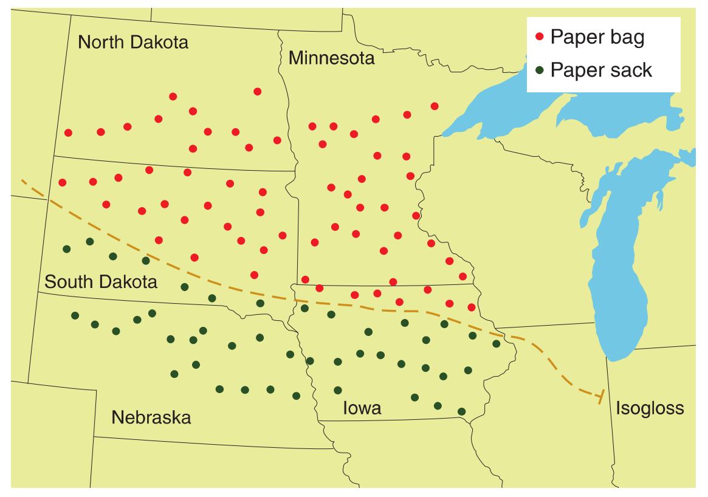
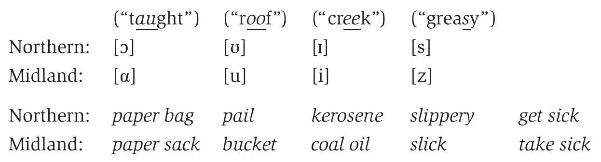
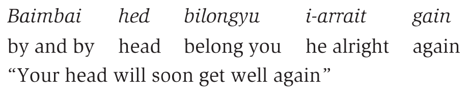

# Regional Variation in Language

## 1 概述

每种语言内部会因地理差异存在大量**变体（variation）**，如英国、美国、澳大利亚等国家的英语。以地理视角研究语言的变体可视为开展**语言地理学（linguistic geography）**研究。

以下是本章中出现的部分语言学术语。

| 英文              | 中文   | 英文                 | 中文       |
| ----------------- | ------ | -------------------- | ---------- |
| variation         | 变体   | linguistic geography | 语言地理学 |
| standard language | 标准语 |                      |            |
|                   |        |                      |            |

## 2 标准语、口音与方言

### 2.1 标准语

此前章节在讨论语言的词汇和结构时，我们通常关注的是一种特定的语言变体，即**标准语（standard language）**。标准语言实际上是一种理想化的变体，因为它不与任何特定的地区相关联，并通常与行政、商业和教育机构相关。

以标准英语（Standard English）为例，它通常指出现在教学和公共场景中的英语。相较于口语，其在词汇、拼写、语法等语言学特征上与书面语有更强的联系。具体到国家，美国、英国、加拿大、澳大利亚使用的变体分别称为标准美国英语（Standard American English）、标准英国英语（Standard British English）、标准加拿大英语（Standard Canadian English）和标准澳大利亚英语（Standard Australian English）。

### 2.2 口音与方言

无论我们认为自己讲的英语是否是标准英语的某种变体，我们都带有**口音（accent）**。每位语言使用者实际上都有口音，有些人的口音更容易察觉。在语言学中，口音这一术语专指发音方面的特征。这些特征能够反映使用者的地域或社会背景。而**方言（dialect）**则用于描述词汇、语法和发音方面的特征。

例如，美国人和英国人在读"You don’t know what you’re talking about"时会有明显的口音差异，但他们在书写时都会使用标准英语。而"Ye dinnae ken whit yer haverin' aboot"是某种苏格兰英语方言的近似转写，表达的意思与前一句相同。可以看到，其中不仅有发音上的差异（ye、whit、aboot），还有词汇（ken*、*haverin'）和语法形式（dinnae、yer）上的差异。

### 2.3 语法的变体

方言变体间词汇的差异很容易察觉，但语法结构不同导致含义不同的情形却记录较少。下面展示了两位英国英语使用者B和C与一位爱尔兰英语使用者A的对话。

看起来在A的方言中，"How long are youse here"指过去，意思与"How long have you been here"相近。而B将其理解成了指未来的"How long are you going to be here"。当C用表示过去的"We came on Sunday"补充后，A理解了C的意思并继续用现在时态"Youse're here a while then"回应。此外，注意到B和C都理解了他们方言中可能没有的Yourse。

##  3 方言学

尽管偶尔会出现理解上的困难，但总体上许多不同英语方言使用者之间多少能互通。在**方言学（dialectology）**中，区分同种语言中不同方言和两种语言的标准之一便是看使用者是否能互相理解。

从语言学的角度看，每种方言都值得研究分析。同种语言的不同变体之间也没有优劣之分。它们只是不同而已。但从社会学的角度看，一些变体的确更有优势。实际上，成为标准语的变体通常是一种在社会上享有声望的方言，通常与某个经济和政治权力中心相联系（伦敦的英语，巴黎的法语）。尽管如此，不同地区仍会使用其他变体。

### 3.1 地域方言

不同地域的有着不同方言。研究地域方言的学者们开展了大量调查研究，以识别某一地理区域的语言中存在的统一特征。此类方言调查通常需要极其细致的研究，并依据非常具体的标准来选择能代表该地区典型方言的调查对象。

20世纪的方言调查中，调查对象通常是**NORMS（non-mobile, older, rural, male speakers）**，因为他们的语言受外界影响的可能性较小。然而，该标准也有潜在问题：对方言的描述往往更加贴近调查前的历史时期，而不是调查时的语言状态。换言之，由于调查对象的年龄都比较大，他们所操的方言更能反映该地数十年前方言的特征。

### 3.2 同言线

我们可以通过美国上中西部语言图谱（Linguistic Altas）的调查研究，了解一些地域语言变体的例子。此类调查的目标之一是发现不同区域居民在语言上的差异，并绘制出这些区域的边界，即**同言线（isogloss）**。

例如，某一区域的大多数人把从商店带回家的东西装在paper bag里，而另一区域的大多数人称之为paper sack。此时，可以在地图上划一条线区分两个区域。如果其他用词也服从类似的分布（如北方人常用pail，南方人常用bucket），那么可以在地图上绘制更多的同言线。

### 3.3 方言边界

当多条同言线汇聚时，可以绘制一条更粗的实线来表示**方言边界（dialect boundary）**。上图中，红点表示使用paper bag的地区，黑点表示使用paper sack的地区。将两区域分隔的虚线同言线与其他基于语言特征的同言线重合，可归类为方言边界。

借助这些信息，可以知道美国上中西部地区有北部方言区和中部方言区。以下是北部和中部方言的一些显著差异：

需要注意，方言调查中的特征不一定适用于当前生活在该地区的所有说话者。  

### 3.4 方言连续体

绘制方言边界有助于从整体上了解某地方言的分布情况。但在边界地区，不同方言之间的过渡并不是急剧的，而是渐变的。这一现象称为**方言连续体（dialect continuum）**。类似的连续体现象也会出现在政治边界的两侧。例如，从荷兰进入德国时，会发现靠近边界的荷兰语（Dutch）和德语（Deutsch）逐渐融合。

在边界地区频繁切换方言的人称为**双方言使用者（bidialectal）**。其实，我们当中多数人也是在某种形式的双方言环境下成长的。比如在与亲朋好友交流时使用一种，而在学校学习另一种。

## 4 双语现象

在许多国家，地区的差异不仅体现在一种语言多种方言上，还可能涉及两种或更多完全不同的语言。例如，加拿大是双语国家，其法定语言是法语和英语。承认法语使用者语言权利的过程并非一帆风顺，而是经历了大量政治动荡。

加拿大历史上一直以英语为主导语言，而法语则是少数群体使用的语言。在这种情况下，**双语现象（bilingualism）**通常是少数群体的特征。少数群体的成员在一个语言社区中长大，主要使用一种语言。但为了融入主导语言的社区，他们需要学习另一种语言。

### 4.1 双层语言

在一些国家中存在一种特殊的语言现象，称为**双层语言（diglossia）**。此时，语言有两种变体：

- 低层变体（low variety）：通过日常生活的使用在本地习得（acquired），用于日常事务。
- 高层变体（high variety），通过正规教育学得（learned），用于正式场合或重要事务。

双层语言现象的一个典型例子见于阿拉伯语国家。高层变体（如古典阿拉伯语）常用于正式讲座、严肃的政治活动以及宗教讨论。而低层变体则是该语言的本地版本，即本地话（vernacular），例如埃及阿拉伯语或黎巴嫩阿拉伯语。

欧洲历史上的某个时期也存在类似的双层语言现象。当时拉丁语作为高层变体，而欧洲的一些本地语言（现代意大利语、法语和西班牙语的早期版本）则作为低层变体使用。

## 5 语文规划

双语现象主要出现在少数群体之中。许多国家通常是单语国家（monolingual country）。对于只会英语的人而言，美国似乎是一个单语国家。而对于其他人而言，情况却并非如此。他们生活在以英语不是家庭中第一语言的社区中。例如，在德克萨斯州的圣安东尼奥，大部分人更倾向于收听西班牙语广播。这也为地方政府和教育系统的组织带来了相当大的问题：小学教育应该使用西班牙语还是英语呢？

这类问题涉及到**语文规划（language planning）**。许多国家的政府、法律和教育组织需要计划使用哪一种或哪几种语言作为官方事务用语。在以色列，虽然希伯来语并非最常用语言，但被选为官方政府语言。印度则选择了印地语。但在许多非印地语地区却对这一决定爆发了抗议。菲律宾曾发生国家语言战争，最终选定菲律宾语作为国家语言。

当然，也有有条不紊实施语文规划的案例。以东非国家坦桑尼亚为例，虽然该国存在许多其他语言，但教育、法律和政府系统逐渐引入斯瓦希里语作为官方语言。语文规划的过程包括以下几个阶段：

- 标准的选择（selection）：选定一种官方语言。
- 标准的健全（codification）：通过基础语法、词典和书面模式来确立语言的标准形式。
- 标准的扩建（elaboration）：标准语用于社会生活的各个方面，并逐渐形成一套以标准语为书面语的文学作品体系。
- 标准的实施（implementation）：政府实施各种措施来鼓励人们使用标准语。
- 标准的接受（acceptance）：大部分人群使用并将其视为国家语言时，标准语在社会生活和国家认同中都扮演了重要角色。

## 6 皮钦语

在某些地区，标准语的变体可能是原本没有任何母语者的语言。例如，在巴布亚新几内亚这个拥有超过八百种不同语言的国家，大量官方事务使用Tok Pisin交流。其起源可以追溯到多年前一种即兴发展出来的语言形式，称为**皮钦语（pidgin）**。皮钦语通常是一种接触语言（contact language），用于语言不互通但需要大量接触的群体之间。因此，皮钦语没有母语者。

> **NOTE**
>
> 维基百科对pidgin语源的记录如下：
>
> pidgin一词可能来自中国汉葡混杂语中当地人对business一词的发音。

如果某种皮钦语以英语作为供词语（lexifier language），则称为英语皮钦语（English pidgin）。但这并不意味着英语词汇在该皮钦语中的发音或意义与英语完全一致。例如，grass在Tok Pisin中可指头发，词组mausgras意为胡子，gras bilong fes意为胡须。在Tok Pisin中，"我们"一词分为yumi（包括听者）和mipela（不包括听者）。而这种区分在标准英语中并不存在。

如今，仍有许多英语皮钦语被使用。这些语言缺少复杂的语法形态并且词汇量相对有限。在标准英语中，名词可能会使用表示复数的后缀或表示所属关系的后缀。但在英语皮钦语中，这些形态变化很少见。相反，像tu buk（two books）和di gyal place（the girl's place）这样的结构却很常见。标准英语中的-ed后缀也常常缺失。因此招牌上可能会出现诸如smoke meat（smoked meat）或pickle mango（pickled mango）这样的表达。功能形位（如介词）往往会取代源语言中的屈折形位（如名词所有格）。例如，英语短语your book在英语皮钦语中表达为buk bilong yu（book belong you）。如下图所示，皮钦语的句法可能与源语言显著不同。

## 7 克里奥尔语

当一种皮钦语发展为某个社会群体的母语时则称为**克里奥尔语（creole）**。Tok Pisin现已演变为一种克里奥尔语。夏威夷许多人的母语也是一种克里奥尔语，尽管在当地仍称作Pidgin。其准确称谓是夏威夷克里奥尔英语（Hawai'i Creole English）。克里奥尔语通常作为皮钦语社区中儿童的母语逐渐发展起来，并在服务更多交际需求的过程种变得愈发复杂。与皮钦语不同，克里奥尔语拥有大量母语使用者，其用途也没有任何限制。

皮钦语中独立的词汇元素可能发展为克里奥尔语中的语法元素。例如，早期Tok Pisin中的baimbai yu go（by and by you go）逐渐缩短为 bai yu go，并最终演变为yu bigo。其语法结构与其英语you will go相差无几。

### 7.1 后克里奥尔语连续体

在当今许多克里奥尔语的演变过程中，可以观察到另一种语言演变过程。皮钦语向克里奥尔语的演变称为**克里奥尔化（creolization）**。随着更多人接触到其他语言的标准变体（如标准英国英语），一些克里奥尔语使用者开始减少使用克里奥尔语。该过程被称为**去克里奥尔化（decreolization）**。在此情形下，一种极端是接近外部标准语的语言变体，另一极端则是保留更多本地克里奥尔语特征的基本变体。二者之间则存在一系列略有不同的变体。有些变体包含较多克里奥尔语特征，有些则较少。这些在克里奥尔语形成之后发展起来的变体称为**后克里奥尔语连续体（post-creole continuum）**。

例如在牙买加，一位使用者可能会用基本克里奥尔语表达a fi mi buk dat。一位使用者可能会用带有较少克里奥尔语特征的变体表达iz mi buk。而另一位使用者则可能选择用仅带有克里奥尔语口音的的变体表达it’s my book。

## 8 总结

本章中，我们从地域的角度了解了语言中的变体。虽然从语言学的视角出发，各种变体都值得研究分析，也不存在优劣之分。但从社会视角出发，变体之间的差异与社会价值观和社会身份紧密相关。下一章中，我们将探索社会因素如何影响和决定语言变体。

## 参考

[Yule, G. (2020). *The Study of Language* (7th ed.). Cambridge: Cambridge University Press. doi:10.1017/9781108582889](https://www.cambridge.org/highereducation/books/study-of-language/433B949839A5A6F915EC185657564B16#overview)