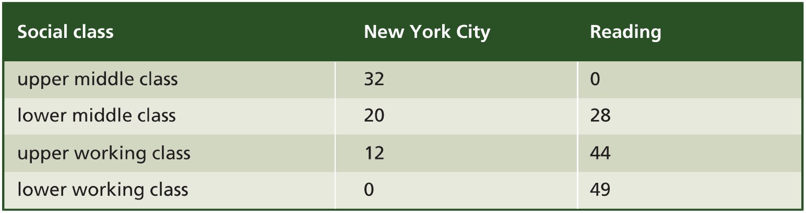

# Social Variation in Language

## 1 概述

在上一章中，我们从地理角度学习了语言的变体。然而，同一地理区域内的人们也会因场合、教育、经济地位等因素有不同说话方式。本章，我们将从社会角度了解同一地理区域内语言的变体。

以下是本章中出现的部分语言学术语。

| 英文                     | 中文           | 英文                 | 中文       |
| ------------------------ | -------------- | -------------------- | ---------- |
| speech community         | 语言群落       | sociolinguistics     | 社会语言学 |
| sociolect                | 社会方言       | social variable      | 社会变量   |
| linguistic variable      | 语言变量       | idiolect             | 个人方言   |
| social marker            | 社会标记       | speech style         | 语体       |
| style-shifting           | 语体转换       | overt prestige       | 显性声望   |
| covert prestige          | 隐性声望       | speech accommodation | 言语适应   |
| convergence              | 靠近           | divergence           | 分离       |
| register                 | 语域           | jargon               | 行话       |
| slang                    | 俚语           | taboo                | 禁忌语     |
| African American English | 非裔美国人英语 | vernacular           | 白话       |

## 2 社会语言学

上述社会因素导致的差异可能隐性或显性地作为区分不同社会群体或**语言群落（speech community）**的标志。语言群落是指有着共同语言规范（linguistic norms）和语言期望（linguistic expectations）的一群人。**社会语言学（sociolinguistics）**研究的是语言群落中具有社会意义的语言特征。社会语言学研究语言与社会的关系，涉及语言学（linguistics）与人类学（anthropology）、社会学（sociology）以及社会心理学（social psychology）等多个学科的交互。

### 2.1 社会方言

传统方言学通常聚焦于研究农村地区人群的语言，而**社会方言（sociolect，social dialect）**的研究则主要关注城市与城镇地区人群的语言。在社会方言研究中，会用社会阶级（social class）划分具有某些共同特征的说话人。其中最主要的两大群体是中产阶级（middle class）和工人阶级（working class）。中产阶级指受教育年限较长、从事非体力劳动的人群，而工人阶级则指受教育年限较短、从事体力劳动的人群。因此，经济基础，可以使用上层（upper）和下层（lower）进一步细分群体。工人阶级语言（working-class speech）、上层中产阶级语言（upper-middle-class speech）都属于社会方言。

如同其他方言研究，分析社会方言时，我们只关注语言中的部分特征，包括发音、词汇和结构。这些特征在工人阶级和中产阶级中以不同形式呈现。例如，在苏格兰爱丁堡，"home"在下层工人阶级（lower-working-class）中通常发音为[hɛm]，与"fame"押韵。而在中产阶级中则发音为[hom]，与"foam"押韵。这种差异虽小，却是社会地位的标志，甚至被人刻意作为区分于他人的某种社会标识。例如，"ain't"更常见于工人阶级语言。

促成各种社会方言的因素可以归为两类：

- **社会变量（social variable）**，如阶级。
- **语言变量（linguistic variable）**，如发音和词汇。

通过统计每个阶级每种语言变量的出现频率，能够系统地调查不同社会方言的差异。

### 2.2 教育和职业

不同的生活经历使每个人都形成了一种个性化的说话方式，即**个人方言（idiolect）**。但我们的说话方式通常会向拥有相似教育背景和职业的人靠拢。

20世纪60年代，社会语言学家威廉·拉波夫（William Labov）通过观察纽约市三家百货公司销售员的发音差异，将职业地点和社会经济地位因素相结合。这三家百货公司分别是Saks Fifth Avenue（出售高价商品，代表上层中产阶级地位）、Macy’s（出售中等价格商品，代表中产阶级地位）和Klein’s（出售廉价商品，代表工人阶级地位）。拉波夫询问这些店铺的销售员一些特定问题。例如询问"Where are the women’s shoes?"促使其回答"fourth floor"。该回答中出现了两次处于元音之后的/r/。调查发现，店铺社会经济地位越高，销售员回答中出现/r/发音的次数越多。因此，该语言变量的频率标志着说话人所处阶级。

彼得·特鲁杰（Peter Trudgill）在英国雷丁市开展的一项研究却得到与上述调查相反的结果。在雷丁市，/r/在工人阶级的出现频率更高。上层中产阶级的说话人甚至几乎完全不发该音。他们的发音类似"Oh, that’s mahvellous, dahling!"。下表展示了两项调查的结果。

### 2.3 社会标记

从上面的调查可以看到，特定发音的使用能够作为一种**社会标记（social marker）**。我们说话中的一些特征能将我们标记为特定社会群体的一员。

在英语世界中，较低阶层的说话人读-ing时结尾发音为[n]而不是[ŋ]，如"sittin"（sitting）和"thinkin"（thinking）。另一个社会标记是"[h]-dropping"，即不发单词开头的[h]。如"ungry"（hungry）和"orse"（horse）。其他社会标记的例子如下表所示。

## 3 语体和语体转换

拉波夫的调查还涉及到语言使用的另一社会特征：**语体（speech style）**。语体可分为正式语体（formal speech style）和非正式语体（informal speech style）。说话人切换不同语体的行为称为**语体转换（style-shifting）**。

在拉波夫的调查中，他在得到销售员的第一次答复后会假装没听清并说"Excuse me?"再次询问。调查发现，三组销售员重复"fourth floor"时，/r/的出现频率均有上升，其中以Macy’s（出售中等价格商品，代表中产阶级地位）最为显著。可见，中产阶级的说话人在使用正式语体时，其说话风格会明显向上层中产阶级靠拢。

此外，还可以通过更清晰的引导观察到更细致的语体变化过程。例如，朗读一段文本时，人们往往会比单纯问答时更注意言语表达。如果朗读单独的词时，则发音会更加谨慎，语体也变得更为正式。

拉波夫实验发现，通过更清晰的引导，所有群体发出音节后/r/音的频率均有上升。尤其是下层中产阶级，其频率甚至超过了上层中产阶级。该现象属于**矫枉过正（hypercorrection）**，即说话人为了"说的更好"，会在转换语体时产生不同的语言形式或奇怪的发音。

### 3.1 声望

在社会语言学中，声望形式（prestige form）有时可以解释一些语体转换现象。然而，不同语言群落对声望有着不同认知标准。

说话人转向代表较高社会地位的语体的现象称为**显性声望（overt prestige）**。与之相对的是**隐性声望（covert prestige）**，即某些非正式表达具有更高的声望。例如，工人阶级的语体由随意转向谨慎的幅度远不及下层中产阶级。他们可能更重视所处社会群体的身份认同，而非社会地位。换言之，他们更重视群体凝聚力而非向上流动。

在年轻的中产阶级中，隐性声望往往与发音和语法特征相关。例如他们更常用"I ain’t doin’ nuttin'"等社会地位较低群体使用的语言形式。

### 3.2 言语适应

语体变体不仅与说话人的社会地位和说话的注意程度有关，还与其交谈对象相关。这种变体称为**言语适应（speech accommodation）**，即根据交谈对象调整语体。

### 3.3 靠近

**靠近（convergence）**指使用能缩短与交谈对象之间社会距离的语体。下例展示了一位男孩与朋友和朋友妈妈交谈时的语体差异。

### 3.4 分离

与靠近相反的是**分离（divergence）**，指使用与交谈对象明显不同的语言形式来扩大社会距离。下例展示了一位青年与老师交谈时的语体转换过程。

## 4 语域

另一影响语体且与社会身份相关的因素是**语域（register）**。语域指在特定情境中恰当使用语言的方式。这些情境可以是场合性的（如在教堂）、职业性的（如律师之间）或主题性的（如讨论语言）。

- 宗教语域：Ye shall be blessed by Him in times of tribulation.
- 法律语域：The plaintiff is ready to take the witness stand.
- 语言学语域：In this dialect there are fewer inflectional suffixes.

### 4.1 行话

语域的一个显著特征是**行话（jargon）**的使用。行话是一种特殊的技术词汇，通常是某一特定职业或兴趣领域的名词（如plaintiff，suffix）。在社会层面，行话帮助内部人建立并维持联系，同时"排斥"外部人。然而，也有不少人诟病行话引起的行话病（jargonitis），例如医学语域中的表达"Zanoxyn is a nonsteroidal anti-inflammatory drug for arthritis, bursitis and tendonitis"。

## 5 俚语

行话是某些社会群体内部人员使用的专业词汇，并且通常由高社会地位的专业人士定义。而**俚语（slang，colloquial speech）**则更常用于高地位群体之外的人之间。俚语指年轻人或某些群体用于替代日常用语的词汇或短语。在美国，"bucks"是"dollars"的俚语，已经有一百多年的历史。而"megabucks"的用法在最近才兴起。类似的还有"dead presidents"（纸币上的已故总统）和"benjamins"（百元美钞上本杰明·富兰克林总统）。

俚语是一种高度非正式且非传统的表达。与服饰、音乐一样，俚语是社会生活的一个方面，易受潮流影响，在青少年中尤甚。俚语常用于某些拥有相似想法的群体中来彰显与他人的不同。俚语表达很容易过时。例如曾经会用"groovy"、"hip"和"super"表示"very good"。然后被"awesome"、"rad"和"wicked"取代。后来又被"dope"、"kickass"和"phat"取代。

不同年龄群体在俚语使用上的差异表明年龄是影响语言社会变体的一个重要因素。

### 5.1 禁忌语

年轻人会使用更多**禁忌语（taboo）**。禁忌语通常是一些涉及身体部位、生理功能和性行为的表达。一般情况下，人们会出于宗教、礼仪、社会规范等方面的考虑而回避禁忌语。公共广播中也会对它们做消音处理，如"What the bleep are you doing? You little bleep!"。书面形式中则会用星号替代，如"S\*\*t! F\*\*\*k off!"、"f\*\*\*ing a\*\*hole!"。

一项对某所高中的调查发现，处于较低地位的学生不论男女都常使用禁忌语。而处于较高地位的学生中，只有男生之间会使用禁忌语，女生则完全不使用。可见，在俚语使用方面，青春期就有了社会阶级的分别。

## 6 非裔美国人英语

**非裔美国人英语（African American English，AAE）**或黑人英语（Black English，Ebonics）是许多非裔美国人使用的英语变体。其许多特征汇聚在一起，形成了一套独特的社会标记。

地理屏障使得不同地区形成了各自的语言。而歧视、隔离等社会屏障也导致了社会方言之间的显著差异。AAE长期以来被污名化为不好的语言。不过在某些年轻群体中，AAE却拥有隐性声望，如流行音乐。也有许多非非裔美国人在表达社会身份时使用AAE的某些特征。

### 6.1 白话

AAE最常被研究的形式是**非裔美国人白话英语（African American Vernacular English，AAVE）**。**白话（vernacular）**这一术语最早见于中世纪欧洲，最初用于描述拉丁语（高地位）的地方变体（低地位）。这些地方变体发展成为法语、意大利语和西班牙语。后来白话用来指代地位较低群体使用的非标准口语。

### 6.2 白话的发音

AAVE和其他英语白话的一个普遍语音特征是倾向于简化词尾的复辅音（consonant cluster）。以两个辅音结尾的单词通常只发一个辅音，如"left hand"听起来像"lef han"。该特征也见于上一章提到的皮钦语（pidgin）和克里奥尔语（creole）。

齿音（dental consonants）也常常发成齿龈塞音（alveolar stop），如"think"和"that"分别听起来像"tink"和"dat"。此外，所有格和第三人称单数的-s也会被忽略，如"John girlfriend"、"two guy"。

### 6.3 白话的语法

AAVE和一些白话遭污名化最严重的是其语法。其中饱受批评的一点是双重否定的使用，如"He don't know nothin"、"I ain't afraid of no ghosts"。然而，双重否定可以在许多英语方言和其他语言（如法语）中找到。其在古英语中也很常见。

另一个遭受批评的点是缺少"to be"动词，如"You crazy"、"She workin now"。准确而言，"to be"可以缩写的情况（You're、She's）在AAVE中不发音。此外，AAVE会使用"be"来表示经常发生的事，如"She be workin downtown now"。而表达过去发生或开始的事，AAVE会使用"bin"。这些动词的否定形式则是在前面加"don't"，如"She don't be workin"符合AAVE的语法，而"She doesn't be workin"和"She ben't workin"都不符合语法。

## 7 总结

本章我们了解了不同社会群体使用方言的语言特征。然而，群体的区别不仅在于语言，还在于其所处的文化。在最后一章，我们将探索语言与文化。

## 参考

[Yule, G. (2020). *The Study of Language* (7th ed.). Cambridge: Cambridge University Press. doi:10.1017/9781108582889](https://www.cambridge.org/highereducation/books/study-of-language/433B949839A5A6F915EC185657564B16#overview)
