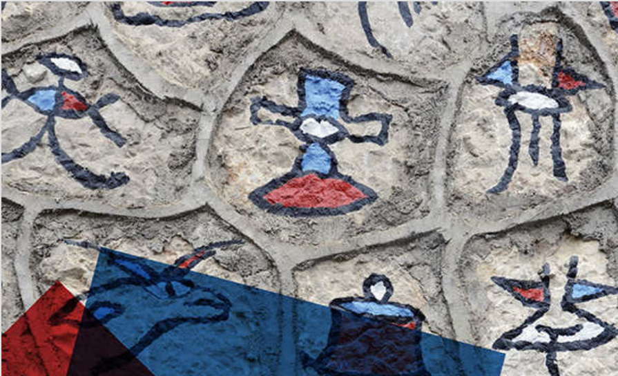

# The Study of Language

## 0 前言
《语言研究》 (The Study of Language) 是由英国语言学家George Yule编写的语言学入门书籍。第七版全书共二十章，全面详尽地介绍了语言学中的各个领域。作者的行文语言朴实易懂而又不失严谨，十分适合初学者学习。
一直以来，我对语言，尤其是语音很感兴趣，但也仅仅是停留在学习和运用某一门特定的语言上，对语言学理论知识的了解可谓相当匮乏。之前有调研到《语言研究》一书十分适合我这种外行入门，于是购入了第七版英文原书。年初时走马观花看了百来页，之后迫于课业只好暂时放下。如今暑假有了一些空闲时间，便打算从头开始研读并做笔记。由于目前我只窥探到语言学的一隅，在笔记时只能尽可能做到保持原文的意思对其做一些简单的翻译和总结工作。期待之后对语言学的全貌有一定了解后能够在读书的同时有一些自己的感触与想法。此外，在学习完这本书后，我打算着重阅读一些语音学相关的书籍，并同样以笔记的形式来记录学习历程。

## 1 目录

[Chapter1: The Origins of Language](01-the-origins-of-language/content.md)

[Chapter2: Animals and Human Language](02-animals-and-human-language/content.md)

[Chapter3: The Sounds of Language](03-the-sounds-of-language/content.md)

[Chapter4: The Sound Patterns of Language](04-the-sound-patterns-of-language/content.md)

[Chapter5: Word Formation](05-word-formation/content.md)

[Chapter6: Morphology](06-morphology/content.md)

[Chapter7: Grammar](07-grammar/content.md)

[Chapter8: Syntax](08-syntax/content.md)

[Chapter9: Semantics](09-semantics/content.md)

[Chapter10: Pragmatics](10-pragmatics/content.md)

[Chapter11: Discourse Analysis](11-discourse-analysis/content.md)

[Chapter12: Language and the Brain](12-language-and-the-brain/content.md)

[Chapter13: First Language Acquisition](13-first-language-aquisition/content.md)

[Chapter14: Second Language Acquisition](14-second-language-acquisition/14-second-language-acquisition.md)

[Chapter15: Gestures and Sign Langauges](15-gestures-and-sign-langauges/content.md)

[Chapter16: Written Langauge](16-written-langauge/content.md)

[Chapter17: Langauge History and Change](17-language-history-and-change/content.md)

[Chapter18: Regional Variation in Language](18-regional-variation-in-langauge/content.md)

[Chapter19: Social Variation in Langauge](19-social-variation-in-language/content.md)

[Chapter20: Language and Culture](20-language-and-culture/content.md)

## 参考

[Yule, G. (2020). *The Study of Language* (7th ed.). Cambridge: Cambridge University Press. doi:10.1017/9781108582889](https://www.cambridge.org/highereducation/books/study-of-language/433B949839A5A6F915EC185657564B16#overview)