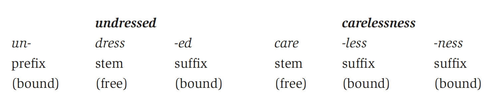
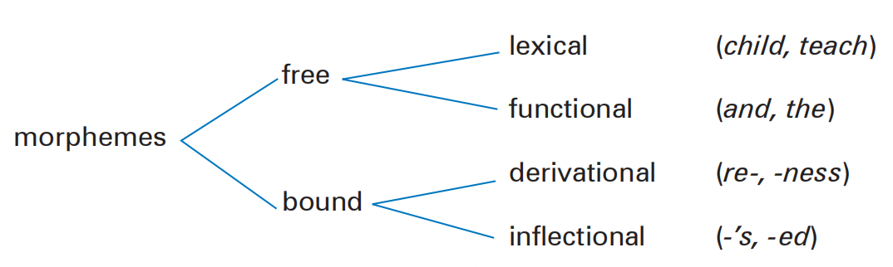
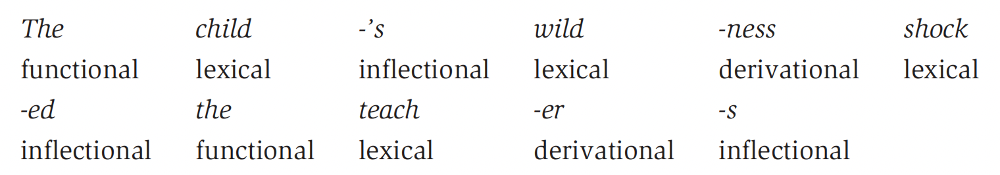

# Morphology


## 1 概述

在第5章中，我们以词 (word）为单位探究了构词 (word formation）的过程。接下来我们将进一步研究词的内部构造。

以下是本章中出现的部分语言学术语。

| 英文                  | 中文     | 英文                   | 中文     |
| --------------------- | -------- | ---------------------- | -------- |
| morphology            | 形态学   | morpheme               | 形位     |
| free morpheme         | 自由形位 | bound morpheme         | 黏着形位 |
| lexical morpheme      | 词汇形位 | functional morpheme    | 功能形位 |
| derivational morpheme | 派生形位 | inflectional morpheme  | 曲折形位 |
| morph                 | 形       | allomorph              | 同位异形 |
| root                  | 词根     | stem                   | 词干     |
| base                  | 词基     | morphological analysis | 形态分析 |

> **NOTE**
>
> 网上对于morpheme、morph、allomoph等术语的翻译很多版本。以morpheme为例，有"词素"、"语素"、"形态素"、"形位"等等。为了与第4章的phoneme等术语的翻译格式保持一致，我选择使用"形位"。

## 2 形态学

在许多语言中，有些独立的形 (single forms）实际上是由若干像词一样的 (word-like）元素构成的。例如日语的「負けず嫌い」是一个单词，对应的英语可以是hating to lose。由此能够看出这个单词实际上是由几个比单词更小且具有含义的单位构成的。

因此，我们在研究不同语言的语言形 (linguistic forms）时，应当关注上面这些比词更小的单位，或基本形 (basic forms）。对它们的研究就称为**形态学 (morphology)** 。

> **NOTE**
>
> 以下是维基百科对形态学的定义。
>
> In linguistics,  morphology is the study of words, how they are formed, and their relationship to other words in the same language.

## 3 形位

上面提到的基本形式在语言学中称为**形位 (morphemes)** 。形位是具有含义或者语法功能的最小单位。其中，语法功能单位可以是时态、复数等等。例如，talks、talker、talked和talking这几个单词中包括了具有含义的形位talk和其他具有语法功能的形位-s、-er、-ed和-ing。基于形位，我们可以将单词进一步拆分。以renewed和tourists为例。

| 具有含义的最小单位                                   | 具有语法功能的最小单位 |
| ---------------------------------------------------- | ---------------------- |
| **re** (again) **new** (recently made)               | **-ed** (past tense)   |
| **tour** (travel for pleasure) **-ist** (person who) | **-s** (plural)        |

回到上面的日语单词「負けず嫌い」，使用[MeCab](https://taku910.github.io/mecab/)对其做形态分析 (morphological analysis）得到的结果如下。可以看到它由3个形位构成，每个形位有各自关于词性、变形、发音等信息。

```bash
負け	動詞,下一段-カ行,未然形-一般,負ける,マケ,マケ,0
ず	助動詞,助動詞-ヌ,連用形-一般,ぬ,ズ,ズ,*
嫌い	名詞,*,*,嫌い,キライ,キライ,0
```

### 3.1 自由形位与黏着形位

可以单独成词的形位称为**自由形位 (free morphemes)** 。在英语中，自由形位一般是一些基本的名词、动词、形容词等。通常不能单独成词，需要依附于其它形 (forms）的形位称为**黏着形位 (bound morphemes)** ，如re-、-ist、-ed、-s等词缀。在英语中，所有的词缀都是黏着形位。当自由形位与黏着形位共同构成单词时，这些自由形位也称为**词干 (stems)** 。



需要注意，在英语中还存在**黏着词干 (bound stems)** 。它们虽然是词干，但不能单独成词，也就不是自由形位。许多源自拉丁语的单词中就含有黏着词干。如在receive中，我们可以发现re-是一个黏着形位，但-ceive不是单词，自然就不属于自由形位。

> **NOTE**
>
> 关于如何辨识词根 (root）、词干 (stem）和词基 (base）的部分见第6节。
>

### 3.2 词汇形位与功能形位

下面对自由形位进一步分类。携带内容的自由形位称为**词汇形位 (lexical morphemes)** ，也称为**内容形位 (content morphemes)** 。它们通常是名词、动词、形容词等**实词 (content word)** 。由于我们会经常向词典中加入词汇形位，它们被视为**开放类 (open class)**词。

与之相对的是**功能形位 (functional morphemes)** 。它们通常是冠词、连词、介词、代词等**虚词 (function word)** 。由于我们几乎不会向词典中添加功能形位，它们被视**为封闭类 (closed class)** 词。

### 3.3 派生形位与曲折形位

下面对黏着形位进一步分类。能够基于词干创造新词或改变其语法类型 (grammatcial category）的黏着形位称为**派生形位 (derivational morphemes)** ，如第5章提到的类似re-、-ful、-ness等的词缀。用于指示语法功能的黏着形位称为**曲折形位 (inflectional morphemes)** ，如复数、时态等。英语中仅有8种曲折形位，且全部都是后缀。

| 英文                                        | 中文               | 英文                                        | 中文             |
| ------------------------------------------- | ------------------ | ------------------------------------------- | ---------------- |
| plurality of nouns                          | 名词复数           | possessive case of nouns                    | 名词所有格       |
| third person singular present               | 第三人称现在时单数 | past tense                                  | 过去式           |
| past participle                             | 过去分词           | present participle                          | 现在分词         |
| comparative degree of adjectives or adverbs | 形容词或副词比较级 | superlative degree of adjectives or adverbs | 名词或副词最高级 |

下表展示了派生形位和曲折形位的案例。

|          | 名词               | 动词           | 形容词         |
| -------- | ------------------ | -------------- | -------------- |
| 派生形位 | critic-ism   | critic-ize | critic-al  |
|          | encourage-ment | class-ify  | wonder-ful |
| 曲折形位 | Jim-'s        | laugh-ing | quiet-er   |
|          | sister-'s     | enjoy-ed   | loud-est   |

### 3.4 形态描述

派生形位与曲折形位之间一大区别在于前者会改变单词的语法类型而后者不会。例如动词teach加上属于派生形位的后缀-er得到的teacher是名词。而形容词old加上属于曲折形位的后缀-er得到的older仍然是形容词。此外，派生形位通常会先于曲折形位被添加。例如teach先变为teacher，再变为teachers。

形位的分类可以总结成下面的树状图。



对The teachers's wilderness shocked the girls' parents做形态分析，得到13个形位。



## 5 形与同位异形

之前对形位的讨论中是从书写和含义的角度出发，而淡化了其另一性质：它是一个音义结合体。例如，cats包括词汇形位/kæt/和曲折形位/-s/两部分。dogs包括词汇形位/dɔg/和曲折形位/-z/。horses包括词汇形位/hɔrs/和曲折形位/-əz/。可以发现，同一个曲折形位名词复数会对应到不同的实际实现 (actual realization）。由此，类比音系学相关概念，我们把这些形位的实际实现称为**形 (morphs)** ，把同一个形位对应的不同形称为**同位异形 (allomorphs)** 。

> **NOTE**
>
> 以下是维基百科对同位异形的定义。
>
> In linguistics, an allomorph is a variant phonetic form of a morpheme, or, a unit of meaning that varies in sound and spelling without changing the meaning.


| 形位           | 同位异形 | 示例       |
| -------------- | -------- | ---------- |
|                | /-s/     | cat**s**   |
| 复数 (plural） | /-z/     | dog**s**   |
|                | /-əz/    | hors**es** |

此外，英语中还有一些特殊情况 (special cases）。如sheep是单复数同形的，man的复数men属于不规则变形等等。对于单复数同形的情况，我们可以为复数添加一个空的同位异形/Ø/，那么sheep的复数就由/ʃip/和/Ø/构成。对于不规则变形的情况，我们可以添加表示元音变化的同位异形，如/æ/变为/ɛ/。不过，多数情况是这些不规则变形的单词已经被收录到了词典中作为词汇形位了。

## 6 词根、词干与词基

### 6.1 词根

语言学教程第四版对词根 (roots）的定义如下。

> A root is the base form of a word that cannot be further analyzed without destroying its meaning. That is to say, it is that part of the word that remains when all the affixes are removed.

由此可以总结出词根的三个要点：

- 词根是单词中携带含义的最小部分，无法进一步分析和改变；
- 词根是单词去掉所有词缀 (派生与曲折）后留下的部分；
- 每个单词都有一个词根形位 (root morpheme），包括自由词根形位 (free root morphemes）和黏着词根形位 (bound root morphemes）。

例如classmates曲折词缀-s和派生词缀class-后得到词根class。由于可以单独成词，它属于自由词根形位。相对地，receive去掉派生词缀re-后得到词根-ceive。由于无法单独成词，它属于黏着词根形位。

### 6.2 词干

语言学教程第四版对词干 (stems）的定义如下。

> A stem is any morpheme or combination of morphemes to which an inflectional affix can be added.

由此可以看出，词干是单词去掉曲折词缀后留下的部分。例如take是takes、took、taken、taking的词干。此外，词干还具有如下三个特点：

- 词干可以由一个词根形位构成，如sweeter中的sweeter；
- 词干可以由两个词根形位构成，如classrooms中的class和room；
- 词干可以由一个词根形位和派生形位构成，如hanfuls中的handful。

### 6.3 词基

相较于词根和词干，词基是一个更通用 (all-purpose）的概念，它指的是任何可以被加上词缀 (派生与曲折）的形 (forms）。例如workers的词基是worker，practical的词基是practice。

### 6.4 区别与联系

给定一个单词，要寻找：

- 词根：去掉所有词缀，直到不可进一步分析。
- 词干：去掉曲折词缀。
- 词基：去掉一个词缀。

由此可以发现，相较于词根，词基有时是可以继续分析的。例如memberships去掉曲折词缀-s得到词基membership。它仍然包含一个词根和一个派生词缀。因此去掉-ship可以得到其词根member。当然，有时也会出现彼此相同的情况。

| 单词      | 词根 | 词干     | 词基     |
| --------- | ---- | -------- | -------- |
| works     | work | work     | work     |
| workers   | work | worker   | worker   |
| workshops | work | workshop | workshop |

有的单词可能会有多个派生词缀。在寻找它们的词基时，应当按照添加词缀的反方向来逐步拆解单词。例如denationalizing的构词顺序如下：

- nation与-al结合得到national；
- national与-lize结合得到nationalize；
- nationalize与de-结合得到denationalize；
- denationalize与-ing结合得到denationalizing。

因此，denationalizing的词基是denationalize，denationalize的词基是nationalize，以此类推。

需要注意的是，在确定构词顺序时，通常要考虑词缀的功能和限制。例如nation不能和de-结合，因为de-通常作为动词的前缀，表示相反的动作。出于相同的原因，national也不能与de-结合。

## 7 总结

本章主要介绍了形态学的基本概念。类似于音系学，我们首先引入了形位的概念。它是一个音义结合体，是语言中具有含义或者语法功能的最小单位。按照是否能独立成词，它们可以分为自由形位和黏着形位。自由形位按又可以分为词汇形位和功能形位；黏着形位又可以分为派生形位和曲折形位。接着继续类比音和同位异音，介绍了形和同位异形。形是某个形位的具体实现而同位异形则是同一个形位对应的不同具体实现。最后，我们追加了词根、词干和词基的定义以及它们的区别与联系。

## 参考

[Yule, G. (2020). *The Study of Language* (7th ed.). Cambridge: Cambridge University Press. doi:10.1017/9781108582889](https://www.cambridge.org/highereducation/books/study-of-language/433B949839A5A6F915EC185657564B16#overview)

[Panpan Cao (2022). Identification and Distinction of Root, Stem and Base in English Linguistics Teaching. In *Proceedings of the 2nd International Conference on Education: Current Issues and Digital Technologies (ICECIDT 2022)* (pp. 698-706). Atlantis Press.](https://www.atlantis-press.com/proceedings/icecidt-22/125976703#AFF1)

[Hu, Zhuanglin. 2011. *Linguistics: A Course Book (Fourth Edition)*, 53–54. Beijing: Peking University Press.](https://www.pup.cn/bookDetail?name=%25E8%25AF%25AD%25E8%25A8%2580%25E5%25AD%25A6%25E6%2595%2599%25E7%25A8%258B%28%25E7%25AC%25AC%25E5%259B%259B%25E7%2589%2588%29&id=f803d039185f11e9805800163e0a6607&0.6424433712171043)

