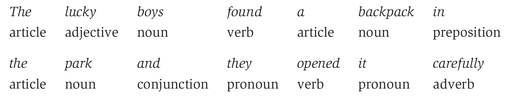
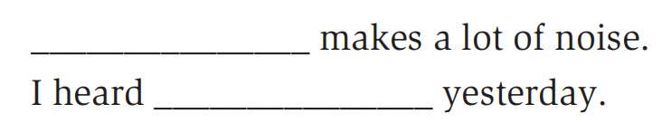
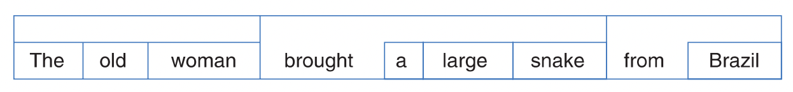
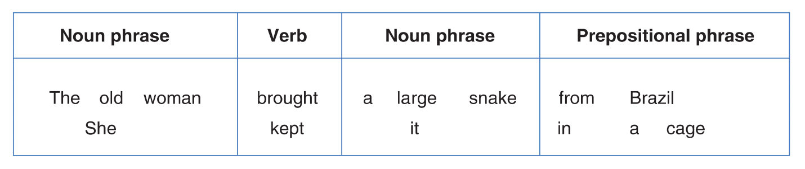
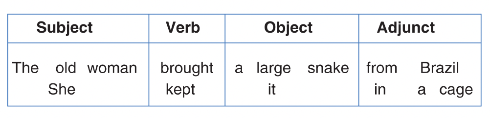

# Chapter7: Grammar

## 1 概述

通过前面章节的学习，我们已经可以从声和形两个层面来研究语言了。本章和下一章，我们的研究视角将转换到结构（structure）。

以下是本章中出现的部分语言学术语。

| 英文                 | 中文       | 英文                  | 中文       |
| -------------------- | ---------- | --------------------- | ---------- |
| grammar              | 语法       | grammar category      | 语法范畴   |
| part of speech       | 词性       | agreement             | 一致关系   |
| grammar gender       | 语法性     | prescriptive approach | 规范性方法 |
| descriptive approach | 描述性方法 | structural analysis   | 结构分析   |
| constituent analysis | 成分分析   | subject               | 主语       |
| object               | 宾语       | adjunct               | 修饰语     |
| word order           | 语序       | language typology     | 语言类型学 |

## 2 英语语法

在之前的学习中，我们都是以良构的（well-formed）短语或句子为例，即它们中单词的排列是按照一定顺序的。例如the lucky boys显然是一个良构的短语。相反，boys the lucky、lucky boys the等组合则是非良构的（ill-formed）。

由此可以看到，英语在连词成句时遵从着严格的规则。正如上例中，**冠词（article）**必须在**形容词（adjective）**lucky的前面，而lucky又必须在**名词（noun）**boys的前面。因此，为了符合语法规范（be grammatical），这种短语必须是"冠词-形容词-名词"的顺序。

像这样描述短语或句子的结构并以某种规则来鉴别哪些符合语法规范的过程，称为该语言的**语法（grammar）**。

> **NOTE**
>
> 维基百科对语法的定义如下。
>
> In linguistics, the grammar of a natural language is its set of structural rules on speakers' or writers' usage and creation of clauses, phrases, and words. The term can also refer to the study of such rules, a subject that includes phonology, morphology, and syntax, together with phonetics, semantics, and pragmatics.

### 2.1 传统语法

使用冠词、形容词、名词等术语来标注（label）短语或句子中单词的**语法范畴（grammatical categories）**的习惯源自对拉丁语、希腊语等语言的描述。由于对拉丁语语法的描述已经有一套比较完备的体系，加上它经常被用于哲学、宗教、学术等领域，其语法体系对其它语言的语法来说是很好的模型。英语从中继承了许多术语来描述基本的语法成分（grammatical components），称为**词性（parts of speech）**，以及单词之间的相互联系，称为**一致关系（agreement）**。

### 2.2 词性

下面展示了英语中各种词性的简单定义。

| 词性                 | 定义                                                         |
| -------------------- | ------------------------------------------------------------ |
| 名词（nouns）        | 名词是指代人、物、事、时、地、情感、概念、方位等实体或抽象事物名称的词。特别地，专有名词（proper nouns）的首字母大写。 |
| 冠词（articles）     | 冠词是与名词一同使用形成名词短语（noun phrases），以限定名词的词，包括了定冠词（definite articles）和不定冠词（indefinite articles）。 |
| 形容词（adjectives） | 形容词通常与名词一同使用，是用来为名词所指代事物提供更多信息的词。 |
| 动词（verbs）        | 动词是指代各种动作或状态的词。                               |
| 副词（adverbs）      | 副词通常与动词一同使用，是用来为动作、状态和事件提供更多信息的词。有些副词可以与形容词一同使用，用来进一步修饰名词的信息。 |
| 介词（prepositions） | 介词通常与名词一同使用，用于提供动作或事物有关时间、地点、联系等的信息。 |
| 代词（pronouns）     | 代词是用于代替已知的人或事物的名词或名词短语的词。           |
| 连词（conjunctions） | 连词是用于在事件之间建立联系和表明关系的词。                 |

### 2.3 一致关系

在传统的语法分析中，除词性外，语法范畴还包括**数（number）**、**人称（person）**、**时态（tense）**、**语态（voice）**和**性（gender）**。虽然我们可以像上面的词性一样单独讨论它们，但在一致关系的语境下，其在语言结构中扮演的角色将会变得更清晰。例如，在句子Cathy loves her dog中，我们认为动词loves与名词Cathy保持一致（agree with）。

一致关系部分基于数和人称。数包括单数（singular）和复数（plural）。人称包括第一人称（first person）、第二人称（second person）和第三人称（third person）。英语代词的不同形式可以按照数和人称来描述。例如用I表示第一人称单数（first person singular），用you表示第二人称复数（second person plural）以及she表示第三人称单数（third person singular）。因此，在句子Cathy loves her dog中，名词Cathy是第三人称单数，我们使用动词loves来与其保持一致。

此外，一致关系还基于时态和语态。例如上例中loves是现在式时态（present tense）而不是过去式时态（past tense）；是主动语态（active voice）而不是被动语态（passive voice）。其中，主动时态用于描述Cathy干了什么（what she does），而被动语态则是描述在Cathy身上发生了什么（what happens to her）。

最后，一致关系还基于性。更准确地说是**自然性（natural gender）**，即生物层面上的男性与女性。性别使得我们能描述Cathy和her之间的一致关系。

### 2.4 语法性

相比于英语中的自然性，**语法性（grammatical gender）**导致的用词区别在其它语言中更为常见。自然性是基于生物意义上的性别（sex），而语法性则是基于名词的阳性（masculinie）和阴性（feminine）且与性别无关。在这个体系中，冠词和形容词会有不同形式来与名词的语法性保持一致。

> **NOTE**
>
> 语法性的个数以2到4个居多，常见有有：
>
> - 阳性（masculine）和阴性（feminine）
> - 阳性（masculine）、阴性（feminine）和中性（neuter）;
> - 有生性（animate）和无生性（inanimate）。

## 3 规范性方法

在18世纪，语法学家为所谓正派英语（proper English）设计了一系列规则，使其与拉丁语的结构相似。这种研究语法的方式称为**规范性方法（precriptive approach）**。下面展示了两条规则：

- 句子不能以介词结尾。

- 动词不定式（infinitive）不能被分开。

由此，根据第一条规则，Who did you go **with**? 会被“纠正”为**With** whom did you go? 根据第二条规则，to **solemnly** swear会被“纠正”为to swear **solemnly**。然而，这些违背规则的短语或句子实际上在英语使用者中经常被使用。因此，即使它们不遵循拉丁语的“规范”结构，但并不能以此认为英语的形式是糟糕的。这也就引出了与规范性方法相对的研究方式。

## 4 描述性方法

**描述性方法（descriptive approach）**并不是根据一些既有的观点来规定语言的结构应该是怎样的，而是通过收集和分析某种语言在实际使用中的样本（samples），从而描述其结构的规律。

### 4.1 结构分析

**结构分析（structural analysis）**是描述性方法的一种。它主要关注的是语言中各种形式（forms）的分布情况。该方法会使用一些留空的句子，称为测验句式（test-frames）。

上面是两个测验句式。很多形式都可以填入其中，如car、child、dog等等。由此，我们可以推测出适用于同一测验句式的形式很可能属于同一语法范畴中。上例中，它们都属于名词。

可以发现Cathy、the car、a dog等形式不适用于上面的测验句式，但适用于下面的测验句式。因此我们可以推测出它们属于名词短语。

### 4.2 成分分析

**成分分析（constituent analysis）**是描述性方法的一种。它关注的是句子中较小的成分（constituents, components）如何结合成更大的成分。其中一个基本的步骤是划分短语。例如句子The old woman brought a large snake from Brazil中共有9个成分。一种划分短语的方式如下，即The old woman（名词短语）、brought（动词）、a large snake （名词短语）、from Brazil（介词短语）。

由此我们可以决定哪些形式可以在不同结构层级之间相互替换。借此我们能很清晰地发现，虽然it、she等代词和Brazil、London等专有名词只包含一个单词，但它们可以像the old woman这样较长的短语一样充当名词短语。下面展示了对一种英语中常见的成分结构的分析。

## 5 主语和宾语

上图中展示了较小的成分如何结合成更大的成分，即短语。接下来我们将进一步确定这些短语的语法功能（grammatical functions）。例如，对于拥有一个名词或代词的短语，我们用名词短语来描述其形式，用**主语（subjects）**或**宾语（objects）**来描述其功能。

英语会使用位置（position）来表明短语的语法功能。通常，主语是位于动词之前的名词短语，而宾语则是位于动词之后的名词短语。此外，from Brazil这样介词短语称为**修饰语（adjunct）**。它们的作用一般是提供主语对宾语施加动作时的时间、地点、方式等额外信息。

除了位置之外，英语中还有其它方法来判断一个名词短语是主语还是宾语：

- 通常，主语是执行（perform）动作的一方、而宾语是承受（undergo）动作的一方。
- 主语决定了动词的单复数形式，而宾语对动词没有影响。
- 代词用于主语和宾语时有区别，如he和him。

## 6 语序

英语中成分的基本线性顺序（linear order）是"名词短语-动词-名词短语"或"NP VNP"。它们的语法功能通常是"主语-动词-宾语"或"SVO"。虽然这是对句子中成分顺序的描述，但按传统其称为**语序（word order）**。英语的语序并不是最普遍的。相反，"主语-宾语-动词"或"SOV"这样的模式更为常见，如日语。像日语这样把动词放在后面的语言称为verb-final language。当然，也存在与之相对将动词放在前面（VSO）的语言称为verb-initial language，如苏格兰语。

| 语序 | 成分     | 成分       | 成分        |
| ---- | -------- | ---------- | ----------- |
| SVO  | John     | saw        | the big dog |
| SOV  | ジョンが | 大きい犬を | 見た        |

依据语序模式的不同来对语言进行分类属于**语言类型学（language typology）**中的一个领域。常见的语序模式包括SVO、SOV、VOS和VSO。而OSV、OVS则比较少见。

## 7 总结

本章主要以英语为例介绍了语法的概念及其研究方法。首先我们从传统语法引入，介绍了词性、一致关系等从拉丁语语法中继承而来的术语。效仿拉丁语研究英语的方法称为规范性方法。与之相对的则是基于样本的描述性方法。在描述性方法中，我们介绍了结构分析和成分分析。结构分析通过许多测验句式来得到某种语言中各种形式的分布。成分分析则关注的是句子中较小的成分如何结合成更大的成分。随后我们学习了英语中主语和宾语的定义及区分方法，并基于此介绍了几大基本语序。

## 参考

[Yule, G. (2020). *The Study of Language* (7th ed.). Cambridge: Cambridge University Press. doi:10.1017/9781108582889](https://www.cambridge.org/highereducation/books/study-of-language/433B949839A5A6F915EC185657564B16#overview)