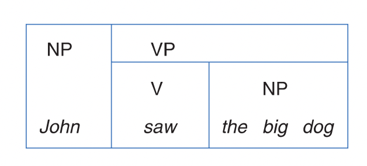
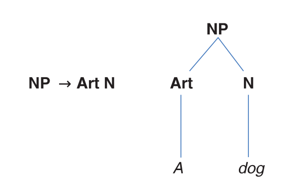
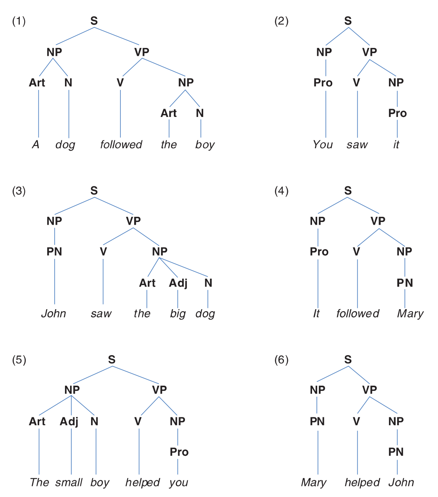
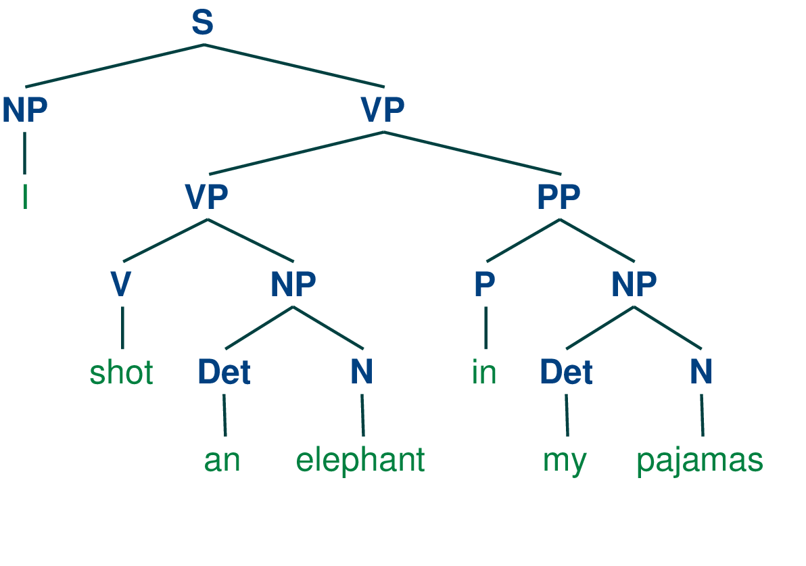
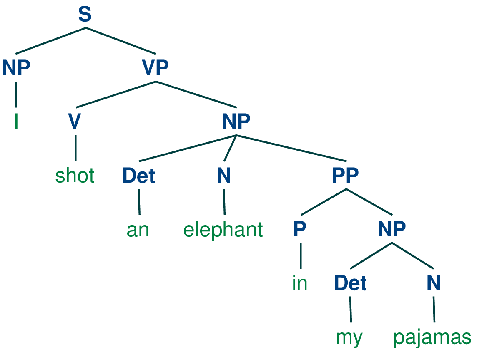
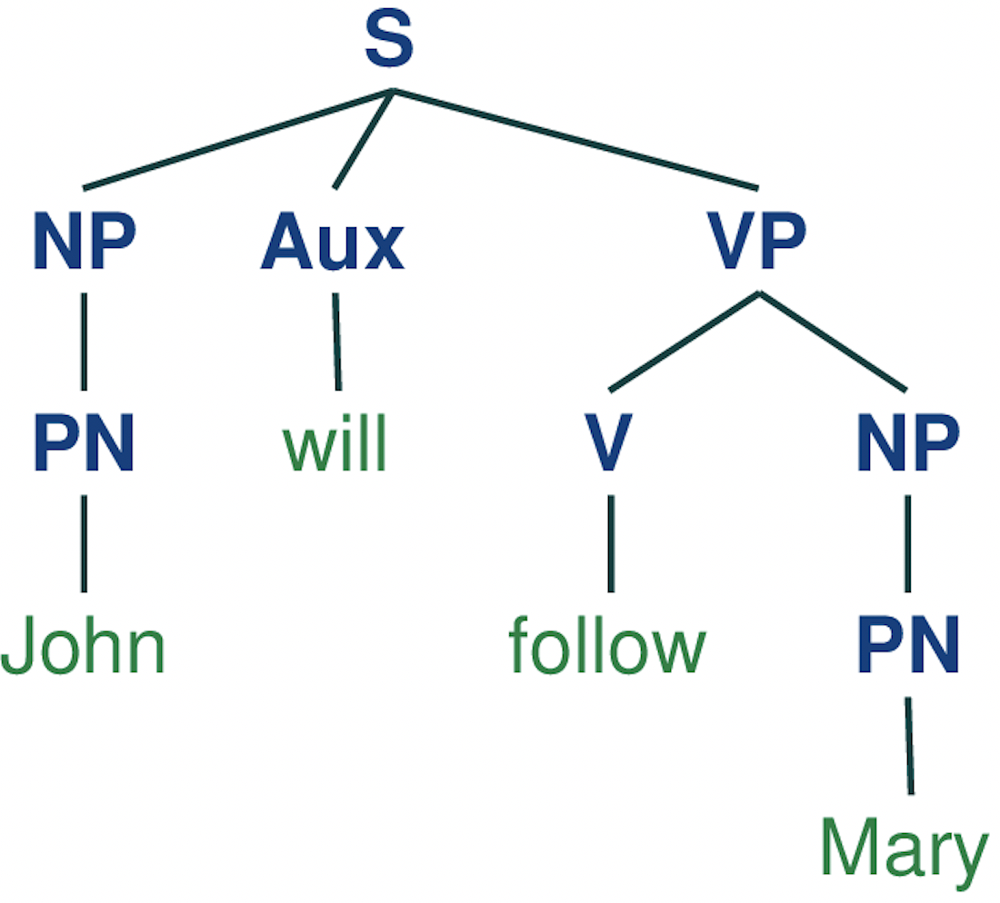
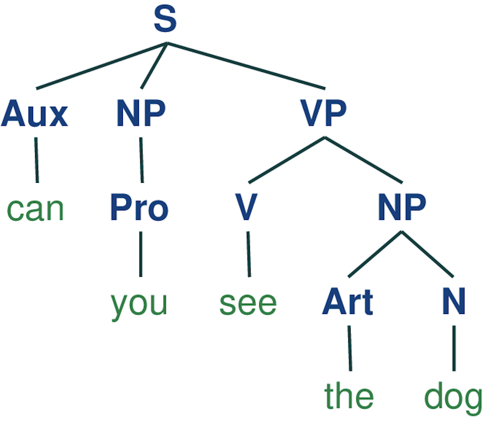
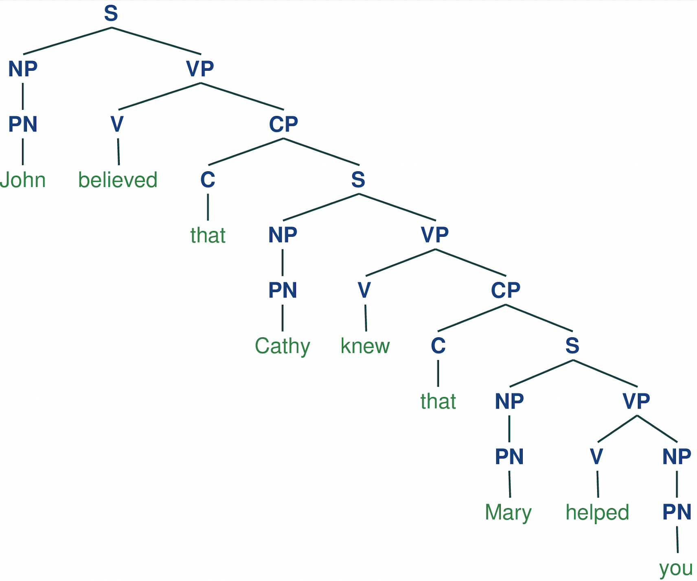

# Chapter8: Syntax


## 1 概述

> Time flies like an arrow; fruit flies like a banana.

乍一看上面的两句话，二者表面上看起来很像。但尝试解读其含义后会发现，第一句中的flies是动词，而第二句的flies是名词。两句话的大意分别是"时间像箭矢一样飞逝"和"果蝇喜欢香蕉"。由此看出，这两句话的底层结构 (underlying structure) 是不同的。当我们关注句子中各个成分 (components) 的结构和顺序时，我们就是在研究**句法 (syntax)** 。

以下是本章中出现的部分语言学术语。

| 英文                   | 中文         | 英文               | 中文     |
| ---------------------- | ------------ | ------------------ | -------- |
| syntax                 | 句法         | generative grammar | 生成语法 |
| surface structure      | 表层结构     | deep structure     | 深层结构 |
| structural ambiguity   | 结构歧义     | syntactic analysis  | 句法分析 |
| phrase structure rules | 短语结构规则 | lexical rules      | 词法规则 |

> **NOTE**
>
> 在开始之前，需要记住语法 (grammar) 和句法 (syntax) 是不同的。句法研究的是短语和句子中各个成分的结构和顺序；而语法则包含了音系学、形态学和句法。

## 2 句法规则

当分析某种语言的句法时，我们会遵循all and only准则。我们的分析必须适用于所有 (all) 语法正确的短语和句子，且只能 (only) 适用于它们。换言之，如果要写一些规则来创造良构的结构 (well-formed structures) ，那么我们必须确保这些规则不会得到非良构的结构 (ill-formed structures) 。

在英语中，我们经常会将介词置于名词之前来构成介词短语，如near London。这描述了许多短语的结构，但并不适用于所有 (且仅适用于) 介词短语。例如near tree、with dog这样的表达是非良构的。在上一章中我们已经了解到专有名词和代名词可以算做名词短语。因此，这条规则更准确的说法是"将介词置于名词短语之前构成介词短语"。它也就可以产生near London、with me、near a tree等良构的结构了。

### 2.1 生成语法

可以看到，上面的规则可以产生 (produce) 无数的介词短语。句法分析的一个潜在目标就是构建一组数量有限的规则来产生无数良构的结构。这套规则有时会被称为**生成语法 (generative grammar)** ，因为它可以生成 (generate) 一些句子结构而不只是描述它们。这种语法还能够解释另外两个现象：

- 表面上不同的短语和句子是如何紧密相连的；
- 表面上相似的短语和句子是如何不同的。

## 3 表层结构和深层结构

直觉告诉我们，Charlie broke the window和The window was broken by Charlie表面上不同，但一定有深层次的相似处。在传统语法中，前者称为主动句，关注的是Charlie干了什么；后者称为被动句，关注的是window出了什么事。二者的表**层结构 (surface structures)** 不同，即它们作为单独的句子时有着不同的句法形式 (syntatic forms) 。

然而，二者的**深层结构 (deep structures)** 却是一样的，都可以用 (名词短语+动词+名词短语) 的结构表示。它也是It was charlie who broken the window和Was charlie broken the window?等不同表层结构对应的深层结构。由此可以看到，语法的功能之一是让抽象的深层结构变成不同的表层结构。

### 3.1 结构歧义

不同的深层结构可能会对应到相同的表层结构，造成**结构歧义 (structural ambiguity)** 。例如"Annie带着伞撞到了一个男人"和"Annie撞到了一个带着伞的男人"的表层结构都可以是"Annie bumped into a man with an umbrella"。另一个经典的例子是"我穿着睡衣射杀了一头大象"和"我射杀了一头在我睡衣中的大象"。二者的表层结构都是"I shot an elephant in my pajamas"。我们将在第7节展现二者各自的深层结构。

注意区分结构歧义和词汇歧义 (lexical ambiguity) 。词汇歧义是由于某个单词具有多个含义，如Their child has grown another foot中的foot。

### 3.2 句法分析

在**句法分析 (syntactic analysis)** 中，我们沿用上一章中一些词性的缩写，如N (noun) 、Art (article) 、Adj (adjective) 和V (verb) ，以及短语的缩写，如NP (noun phrase) 、VP (verb phrase) 和PP (prepositional phrase) 。我们可以用这些词性和短语的范畴 (categories) 来标注句子中的成分。



在上图中，我们可以看到NP由John构成；VP由V和NP构成。我们可以用一种更灵活方式来表示相同的句法信息。使用一个箭头表示"由……构成 (consist of)"或"重写为 (rewrite as)"。这样，我们可以用简单的公式来表示"将冠词置于名词之前构成名词短语"。

```bash
NP -> Art N
```

当然，有时冠词和名词之间还可以插入一个形容词。对于可选的 (optional) 成分，用圆括号将其括起。

```bash
NP -> Art (Adj) N
```

我们知道，名词短语还可以由单独的专有名词或代名词构成。

```bash
NP -> Art (Adj) N
NP -> Pro 
NP -> PN
```

可以使用花括号来表示"多者选其一"，从而简化公式。

```bash
NP -> {Art (Adj) N, Pro, PN}
```

## 4 短语结构规则

我们可以构建一组句法规则来表示某种类型短语的成分和顺序，即**短语结构规则 (phrase structure rules)** 。

```bash
S -> NP VP
NP -> {Art (Adj) N, Pro, PN}
VP -> V NP
```

上面的规则表示：

- 句子 (S) 可重写为名词短语和动词短语；
- 名词短语可重写为冠词+可选的形容词+名词或代名词专有名词；
- 动词短语可重写为动词和名词短语。

## 5 词法规则

短语结构规则可以生成结构。为了将这些结构转化成可以识别的英语，我们还需要**词法规则 (lexical rules)** 。词法规则规定了哪些单词可以别用来重写PN这样的成分。例如我们可以规定PN只能被重写为John或Mary。

```bash
PN -> {John, Mary}
Art -> {a, the}
N -> {girl, dog, boy}
Adj -> {big, small}
V -> {followed, helped, saw}
Pro -> {it, you}
```

利用上面的短语结构规则和词法规则，我们可以生成一系列符合语法的句子：

- A dog followed the boy
- You saw it
- John was the big dog
- It followed Mary
- The small boy helped you
- Mary helped John

但无法得到类似Dog followed boy等不符合语法的句子。

> **NOTE**
>
> 在编译原理中，类似这样的一组规则称为上下文无关语法 (context free grammar, CFG) 。CFG的规则可以适用于任何上下文，而不依赖周围的其他符号和上下文。CFG主要有四个要素组成：
>
> - 终结符 (terminals) ：表示该语言中的基本符号或词汇，不可再分。例如英语中的终结符可以是cat、dog等单词。
> - 非终结符 (non-terminals) ：表示语法规则的符号，可以进一步展开为终结符或非终结符。
> - 产生式规则 (production rules) ：规定了一个非终结符如何重写为一个符号串 (由终结符或非终结符组成) 。
> - 开始符号 (start symbol) ：表示语法开始的符号，是一个特殊的非终结符。

## 6 树状图

我们可以使用**树状图 (tree diagrams)** 来可视化句法规则对应的结构。



基于之前展示的短语结构规则和词法规则，我们可以可视化一些英语句子的句法结构。



## 7 编程实操

下面我们将基于[NLTK (natural language toolkit) ](https://www.nltk.org/)等Python库完成设计语法、解析句子和可视化。代码详见[github仓库](https://github.com/sophiefy/linguistics/blob/main/introductions/the-study-of-language/08-syntax/syntax.ipynb)。

```python
import nltk
```

### 7.1 设计语法

这里的 (上下文无关) 语法实际上就对应着一组短语结构规则和词法规则。NLTK允许我们使用熟悉的格式来定义语法。下面的代码中，`|`表示"或"，与之前提到的花括号功能相同。

```python
grammar ="""
    S -> NP VP
    PP -> P NP
    NP -> Det N | Det N PP | 'I'
    VP -> V NP | VP PP
    Det -> 'an' | 'my'
    N -> 'elephant' | 'pajamas'
    V -> 'shot'
    P -> 'in'
"""

grammar = nltk.CFG.fromstring(grammar)
```

### 7.2 定义解析器

NLTK已经提供了各种解析器 (parser) 。我们简单封装常用的ChartParser作为解析器。

```python
class SimpleParser(nltk.ChartParser):
    def __init__(self, grammar):
        super().__init__(grammar)
    
    def parse_sent(self, sent, print_tree=False):
        trees = []
        for tree in self.parse(sent):
            trees.append(tree)
            if print_tree:
                tree.pretty_print()
        
        return trees
    
parser = SimpleParser(grammar)
```

### 7.3 解析句子

下面我们就可以解析I shot an elephant in my pajamas了。

```python
sent = ['I', 'shot', 'an', 'elephant', 'in', 'my', 'pajamas']
trees = parser.parse_sent(sent, print_tree=True)
```

我们可以得到两棵结构不同的树。



上面这棵树对应的含义是"我穿着睡衣射杀了一头大象"。因为in my pajamas对应的PP与shot an elephant对应的VP在树的同一层，即前者是后者的修饰语。



上面这棵树对应的含义是"我射杀了一头在我睡衣中的大象"。因为in my pajamas对应的PP与elephant对应的N在树的同一层，即前者是后者的修饰语。

### 7.4 课后练习：倒装

在某些版本的句法分析中存在一些移动规则 (movement rules) 。它们可以将句子结构中的某些部分移动到其它位置。例如You can see it可以变成疑问句Can you see it?。这里将助动词 (auxillary verb) can移动到了句子的开头。在某些描述中，这样的改变称为倒装 (inversion) 。

```bash
NP Aux VP -> Aux NP VP
```

基于NLTK，我们可以设计下面的上下文无关语法。

```python
grammar = """
    S -> NP Aux VP | Aux NP VP
    PP -> P NP
    NP -> Art N | Pro | PN
    VP -> V NP
    PN -> 'Mary' | 'John'
    Art -> 'a' | 'the'
    N -> 'girl' | 'dog' | 'boy'
    V -> 'follow' | 'help' | 'see' | 'helped'
    Pro -> 'it' | 'you'
    Aux -> 'can' |"can't"| 'will' | 'could' | 'should' | 'would' 
"""
```

解析练习中的部分句子。

| 句子                  | 树状图                               | 是否使用倒装规则 |
| --------------------- | :----------------------------------- | ---------------- |
| John will follow Mary |  | 否               |
| can you see the dog   |  | 是               |

### 7.5 课后练习：递归

句法中的递归 (recursion) 是指重复地将某条规则运用于其输出。以英语中的补语标记 (complementizer, C) 和补语短语 (complement phrase) 为例，Mary helped you可以单独成句；而在Cathy knew that Mary helped you中，that为补语标记，that Mary helped you为补语短语。与之对应的规则如下。

```bash
CP -> C S
```

基于NLTK，我们可以设计出下面的上下文无关语法。

```python
grammar = """
    S -> NP VP
    NP -> PN
    PN -> 'John' | 'Mary' | 'Cathy' | 'you'
    VP -> V CP | V NP
    CP -> C S
    V -> 'believed' | 'knew' | 'helped'
    C -> 'that'
"""
```

解析John believed that Cathy knew that Mary helped you的结果如下。



## 8 总结

本章主要介绍了句法及其研究方法。句法研究的是短语和句子中成分的结构和顺序。一条合理的句法规则应当遵循all and only准则。接着我们通过几个经典的例子学习了表层结构与深层结构。不同的表层结构可以对应到同一种深层结构；而不同的深层结构也可以得到相同的表层结构。然后我们依次介绍了短语语法规则和词法规则。前者规定了短语和句子中成分的结构和顺序；后者规定了各个成分可以对应到哪些具体的词。二者相结合就能够得到一套上下文无关语法。最后，我们基于NLTK编程实现了对一些经典案例和部分练习题的句法解析。

至此，我也大致明白了为什么编译器会报错syntax error而不是grammar error。

```python
def learn_syntax()
    print("Syntax is interesting!")
```

```bash
  Cell In[27], line 1
    def learn_syntax()
                      ^
SyntaxError: expected ':'
```

编译器检查的是代码的结构是否符合该语言的句法规范，如上面定义函数时就必须以`:`结尾。但它不会关心这个函数是叫`learn syntax`还是`study syntax`，也不会关心函数内部的逻辑是什么样的。它只在意每一行代码的结构是否符合既定的句法规范。

## 参考

[Yule, G. (2020). *The Study of Language* (7th ed.). Cambridge: Cambridge University Press. doi:10.1017/9781108582889](https://www.cambridge.org/highereducation/books/study-of-language/433B949839A5A6F915EC185657564B16#overview)

[8. Analyzing Sentence Structure](https://www.nltk.org/book/ch08.html)


