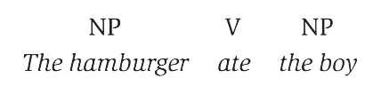
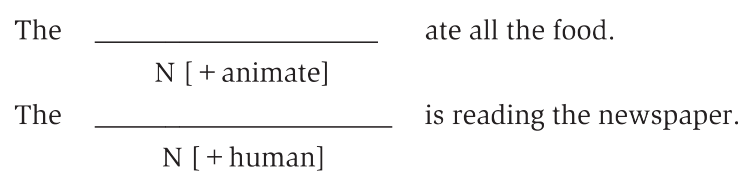
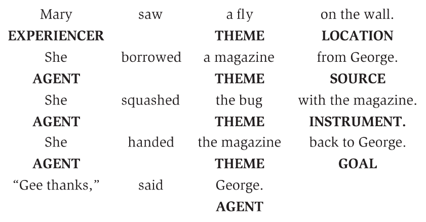
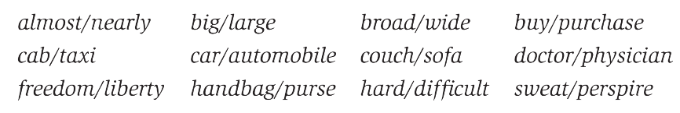
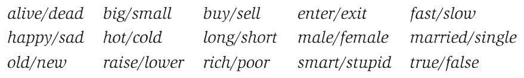
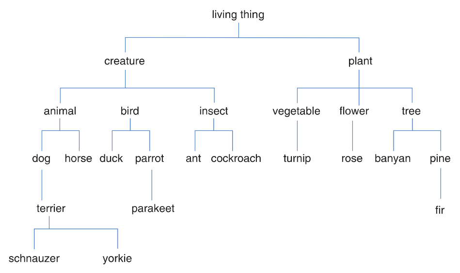
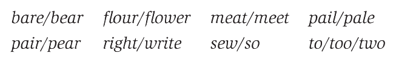
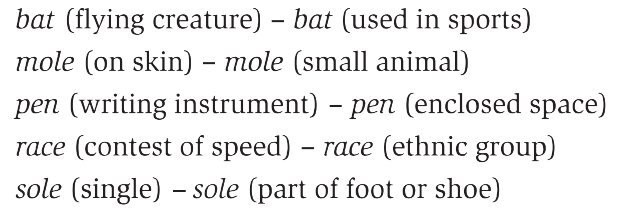
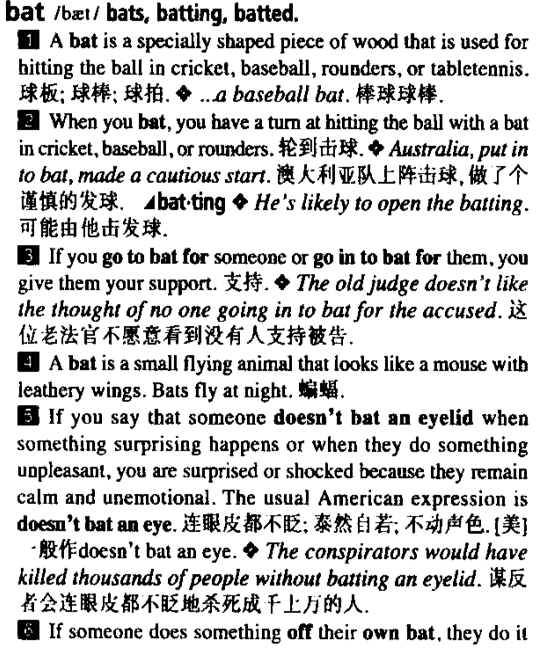
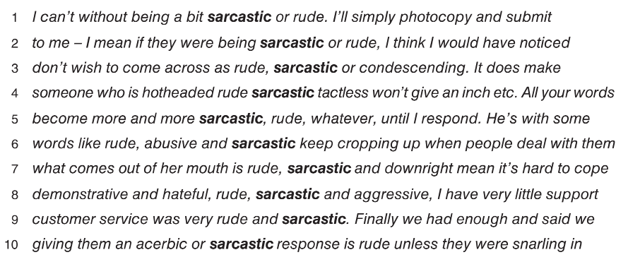

# Semantics

## 1 概述

**语义学 (semantics)** 是对单词、短语和句子意义的研究。在语义分析 (semantic analysis) 中，我们通常倾向于关注单词常规的 (conventional) 意义，而不是某个说话人在某种场合下以为的意义。也就是说，我们关心的是单词在该语言的所有合格使用者之间共享 (shared) 的意义。

以下是本章中出现的部分语言学术语。

| 英文                  | 中文           | 英文                | 中文           |
| --------------------- | -------------- | ------------------- | -------------- |
| semantics             | 语义学         | referential meaning | 参考意义       |
| associative meaning   | 联想意义       | semantic features   | 语义特征       |
| componential analysis | 成分分析       | semantic roles      | 语义角色       |
| lexical relations     | 词汇关系       | synonymy            | 同义关系       |
| antonymy              | 反义关系       | hyponymy            | 下义关系       |
| prototypes            | 原型           | homophones          | 同音异形异义词 |
| homonyms              | 同音同形异义词 | polysemy            | 一词多义       |
| metonymy              | 转喻           | collocation         | 词汇索引       |

## 2 意义

正如开篇提到的，语义学关注的是单词所被广泛接受的客观 (objective) 意义而不是个体认为的主观 (subjective) 意义。通常，前者称为**参考意义 (referential meaning)** 而后者称为**联想意义 (associative meaning)** 或情感意义 (emotive meaning) 。

参考意义涵盖了单词最为基本和重要的意义成分，通俗而言就是"字面意思"。字典上收录的就是单词的参考意义。例如needle，其参考意义的基本成分可能包括thin、sharp和steel instrument。但不同人的解读可能不尽相同。有人会联想到pain或illness；有人会联想到blood或drug；还有人会联想到thread或hard to find等等。这些联想不能成为参考意义的一部分。

研究参考意义能够帮助解释某些句子的奇怪之处 (oddness) 。

- The hamburger ate the boy.
- The table listens to the radio.
- The horse is reading the newspaper.

这些句子的奇怪并不是源于句法结构，因为它们都是良构的。

上面这句话在句法上是正确的，但在语义上是奇怪的。相反，The boy ate the hamburger则是完全可接受的。问题的根源在于同是名词的hamburger和boy在参考意义上有很大的区别。能够做出ate这一动作的应当是有生命的 (animate) 实体。显然，hamburger不可以而boy可以。

## 3 语义特征

我们可以用**语义特征 (semantic features)** 来分析单词的意义。例如boy的特征为[+animate, +human]；horse的特征为[+animate, -human]。

我们可以为某个动词的主语设定必须具备的语义特征。这样可以帮助我们预测哪些名词放入句子中会合适，哪些会奇怪。在下例中，horse和boy都可以放在第一句中，但只有boy可以放在第二句中。

### 3.1 成分分析

像上面使用[+human]等特征来分析单词意义的过程称为**成分分析 (componential analysis)** 。

|        | boy  | girl | man  | Woman |
| ------ | ---- | ---- | ---- | ----- |
| human  | +    | +    | +    | +     |
| adult  | -    | -    | +    | +     |
| female | -    | +    | -    | +     |

> **NOTE**
>
> 在语法中，我们也遇到过成分分析 (constituent analysis) 。它研究的是句子中的较小的成分 (通常是单词) 如何结合形成更大的成分 (通常是短语) 。如冠词和名词结合能够形成名词短语。

### 3.2 单词作为意义的容器

上面这样的研究方法会将单词视为一种填装了基本意义成分的容器。但在这种框架下我们会比较难设计一些区分抽象概念的语义特征，如advice、threat和warning。单词的意义并不局限于这些基本的特征。

## 4 语义角色

我们可以着眼于单词在句子所描述场景中扮演的**语义角色 (semantic roles)** 。例如在The boy kicked the ball中，动词描述了动作而名词短语描述了参与动作的实体 (entities) 。

### 4.1 施事与主事

施加动作的实体称为**施事 (agent)** ；受到动作影响的实体称**主事 (theme)** 或**受事 (patient)** 。上例中，the boy为施事而the ball为主事或受事。此外，主事也可以是被描述的实体，如The ball was red中的the ball。

- The boy kicked the ball.
- The wind blew the ball away.
- A car ran over the ball.
- The dog caught the ball.
- The dog chased the boy.

可以看到施事和主事都可以是人类或非人类的实体。

### 4.2 工具与感事

施事在施加动作时使用到的实体称为**工具 (instrument)** 。在The boy cut the rope with an old razor中，an old razor就是工具。

当感受、听取或享受某种事物时，我们并没有主动地对其它实体施加动作，而是被动地接受某种情绪或感觉。此时，我们扮演的是**感事 (experiencer)** 。

- The woman feels sad.
- Did you hear the noise?

在第一句话中，the woman的唯一语义角色是感事；在第二句话中，you是感事而noise是主事。

### 4.3 处所、起点与终点

另外一些语义角色用于指派 (designate) 实体在事件描述中所处的位置。实体动作发生的地点称为**处所 (location)** ，动作的来源称为**起点 (source)** ，动作的指向称为**终点 (goal)** 。在transfer money from Chicago to New Orleans中，from Chicago是起点而to New Orleans是终点。

> **NOTE**
>
> 更多语义角色的定义详见[维基百科](https://zh.wikipedia.org/zh-hans/%E8%AF%AD%E4%B9%89%E8%A7%92%E8%89%B2)。

## 5 词汇关系

单词不仅可以视为意义的容器或事件中的角色，还可以与其它单词有所关联。我们经常会用单词之间的关系来解释某个单词的意义。例如conceal的意思和hide差不多；shallow与deep相反；pine是一种tree。依据词汇之间的关系来描述单词的意义的过程就是对**词汇关系 (lexical relations)** 的研究。前面的例子分别展示了**同义关系 (synonymy)** 、**反义关系 (antonymy)** 和**下义关系 (hyponymy)** 。

### 5.1 同义关系

两个及以上有着相似意义的单词称为**同义词 (synonyms)** 。在许多语境下，它们之间可以相互替换。

当然，同义词之间并不总是能够相互替换。例如answer与reply虽然都有"回答"的意思，但在考试的情境中，answer the test是合适的而reply the test就显得奇怪。同义词的区别还可以体现在地区上。例如英美英语中的sweet和candy、petrol和gasoline、rubbish和trash等等。此外，正式与非正式场合下也有对应的同义词。例如My father purchased a large automobile与My dad bought a big car的意思相同，但前者更为正式，后者更为随意。

### 5.2 反义关系

两个有着相反意义的单词称为**反义词 (antonyms)** 。

反义词通常主要有三类：**互补反义词 (complementary antonyms)** 、**层级反义词 (gradable antonyms)** 和**反向动词 (reversives)** 。

互补反义词也称为互补对 (complentary pairs) 或二元对 (binary pairs) 。一对互补反义词之间没有任何"缓冲"，是完全对立的。例如daed和alive之间并不存在其它状态。

层级反义词之间则存在过渡。例如My car isn't old并不意味之My car is new。又如hot和cold之间还有warm和cool。

反向动词是描述相反动作的动词。例如dress的意思是"穿"。其反向动词undress并不是"不穿"，而是"穿"的反响动作"脱"。又如entry和exit、lengthen和shorten、pack和unpack等等。

> **NOTE**
>
> 不同人对反义词类型的划分和定义似乎并不一致。[维基百科](https://en.wikipedia.org/wiki/Opposite_(semantics))没有把反向动词视为反义词的一大类。[Stack Exchange](https://english.stackexchange.com/questions/543682/what-type-of-antonym-pair-is-borrow-and-lend-and-more-generally-whats-the-re)上有对此的讨论。

### 5.3 下义关系

下义关系指的是一个单词的意义被另一单词包含。例如animal和horse，horse一定是animal。此时我们说horse是animal的**下义词 (hyponyms)** 。

在下义关系的框架下，单词意义之间呈现出**层级关系 (hierarchical relationship)** 。

如上图所示，horse是animal的下义词。此时，animal称为**上级 (superordinate)** 。或者说animal是horse的**上义词 (hypernyms)** 。拥有相同上级的单词称为**共下义词 (co-hyponyms)** 。此外，动词之间也会有这样的层级关系。例如stab、shoot、punch都是injure的共下义词。

下义关系简单理解就是"xx is a kind of xx"。当使用下义关系来解释某个词时，我们能获取的信息只有该词是另一个词的下义词。假设我们从来没听过pine。有人解释说pine is a kind of tree时，我们除了知道pine是tree的一种之外无法获取任何其它信息。

### 5.4 原型

**原型 (prototypes)** 指的是某个范畴中最具代表性的实例 (instance) 。例如canary (金丝雀) 、cormorant (鸬鹚) 、dove (鸽) 、duck (鸭) 、flamingo (火烈鸟) 、parrot (鹦鹉) 、pelican (鹈鹕) 和robin (知更鸟) 都是上级bird的共下义词，但它们并不都被认为是能很好代表bird的实例。据某些研究者称，最能代表bird的实例是robin。

借助原型解释某些词的意思时，我们并不是在考虑其是否具备某些语义特征 (如"has wings"、"has feathers") ，而是看其与原型的接近程度。例如提到penguin (企鹅) 时，我们可能会思考它是否属于bird；但提到sparrow (麻雀) 时，我们会不假思索地认为它是bird。这是因为sparrow要比penguin更接近原型robin。要注意的是不同的人由于经历不同，心中的原型也不尽一致。

### 5.5 同音异形异义词与同音同形异义词

**同音异形异义词 (homophones)** 是发音相同但书写形式和意义不同的词。

**同音同形异义词 (homonyms)** 是发音和书写形式相同但意义不同的词。这些词有着各自的意义和历史，只是形式上恰好相同。

### 5.6 一词多义

**一词多义 (polysemy)** 是发音和书写形式相同且有着多个相关意义的词。例如head可以指身体的头、啤酒上的泡沫、公司的领导等等。

当然，也存在两个单词是homonym而其中的一个单词又是polysemy的情况。例如date (椰枣) 和date (一个时间点) 是homonym。当date指的是时间点时，又有多个相关的意义，如日期、约会、约会对象等等。因此，how was your date?就有很多不同的理解。

> **NOTE**
>
> 原书中作者提到，如果不确定某个词是homonym还是polysemy，可以查阅词典。多数词典会将homonym分成多个词条，而polysemy则是用一个词条列出多个相关的意思。
>
> 但我翻阅了扭矩高阶词典和柯林斯高阶词典，似乎并没有这样的划分。
>
> 
>

### 5.7 文字游戏

前面提到的三种词汇关系是很多**文字游戏 (word play)** 的基础。

| 词汇关系  | 示例                                          | 备注                                |
| --------- | --------------------------------------------- | ----------------------------------- |
| homophone | Why is 6 afraid of 7?                         | Because seven **eight (ate)** nine. |
| homonym   | Why are trees always mistaken for dogs?       | Because of their **barks**.         |
| polysemy  | What has four **legs** but only one **foot**? | Bed.                                |

### 5.8 转喻

上面的polysemy在意义上的关联很大程度建立在相似性上。如head of a company与head of a person在功能上很相似。

另一种关联则建立在单词间紧密的联系上。这种联系可以是容器-内容 (container-content) 关系，如bottle和water、can和juice；整体-部分 (whole-part) 关系，如car和wheels、house和roof；代表-象征 (representative-symbol) 关系，如king和crown、the President和the White House。像这样用一个词来指向另一个词的用法称为**转喻 (metonymy)** 。这种词汇关系能帮助我们理解give me a hand、the White House announced、drink the whole bottle等字面上看起来奇怪的表达方式。

## 6 搭配

某种的语言合格使用者能够知道哪几个词会经常一起出现，即**搭配 (collocation)** ，如table和chair、needle和thread、salt和pepper。

### 6.1 词汇索引

**词汇索引 (concordance)** 是列出某个词在语料库 (corpus) 中出现的地方，并带上周围的词。被研究的词称为**上下文关键词 (key word in context, KWIC)** 。

下图为词汇索引的一个示例，上下文关键词为sarastic。可以看出sarcastic是对行为的评估，因为它和abusive、condescending、hateful一同出现。同时，rude经常作为其搭配出现。故可以知道它用于表达某种行为不礼貌。值得注意的是，sarcastic的参考意义是"讥讽的"、"挖苦的"。而"不礼貌的"则是作为一种人际关系中的意义添加到sarcastic上。

## 7 总结

本章主要介绍了语义学。它是对单词、短语和句子意义的研究。在语义学中，我们关注的是单词被广泛接受的参考意义而不是个人理解的联想意义。接着我们介绍了几种研究语义的视角和方法。从语义特征的角度出发，单词可以视为装有许多具有意义的成分的容器；从语义角色角度出发，单词在事件中会扮演不同的角色，如施事与主事；从词汇关系的角度出发，单词间有同义、反义、上下义等关系；从搭配的角度出发，某些单词会经常一同出现，我们可以根据与之相伴的单词来推测出上下文关键词的作用和意义。

## 参考

[Yule, G. (2020). *The Study of Language* (7th ed.). Cambridge: Cambridge University Press. doi:10.1017/9781108582889](https://www.cambridge.org/highereducation/books/study-of-language/433B949839A5A6F915EC185657564B16#overview)

